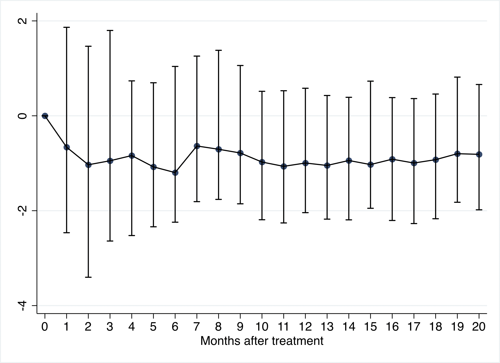

# Evaluating The Impact of Privacy Regulation on E-Commerce Firms: Evidence from Apple's App Tracking Transparency
**Guy Aridor, Yeon-Koo Che, Brett Hollenbeck, Maximilian Kaiser, Daniel McCarthy**

*Management Science.* Forthcoming.

---

# Introduction

Digital advertising comprises the largest share of advertising spending at U.S. firms, surpassing both TV and print advertising in 2019 and reaching \$506 billion in total spending worldwide in 2021.[^7] Its growth is driven by two factors: precise targeting using consumer data and real-time performance measurement.[^8] These capabilities reduced customer acquisition costs for the e-commerce industry and fostered the rise of direct-to-consumer (DTC) firms by efficiently matching these firms to their audiences. This technology, therefore, has potentially large positive welfare ramifications by enabling the existence of these firms.

However, many consumers and privacy advocates have raised concerns about the tracking of user behavior by online platforms and advertising intermediaries, including third parties not explicitly authorized by users. In response, privacy protection measures such as the EU's General Data Protection Regulation (GDPR) and Apple's App Tracking Transparency (ATT) have sought to limit firms' access to consumer data. These policies may harm firms by reducing their ability to target consumers, potentially leading to welfare losses for both firms and customers.

In this paper, we quantify the economic costs of one such privacy protection measure -- Apple's App Tracking Transparency (ATT) -- which allows Apple iOS users to opt out of data sharing across their apps (third-party data sharing) by prompting users to either allow or disallow data sharing. The vast majority (80--85%) of users opted out when prompted ([@baviskar2024att], [@chen_nyt_optout], [@flurry_optout]), disrupting platforms' ability to measure and target ads effectively. Our analysis focuses on three key questions. First, how did ATT impact advertising effectiveness across Meta and Google?[^9] In principle, other mobile app advertising platforms such as Snapchat and TikTok are also impacted by the ATT policy change, but as Meta and Google are the dominant players in this industry, we focus on them. Second, how did firms reallocate advertising spending between these platforms? Finally, how did these changes affect firm revenues? By quantifying revenue impacts and understanding the corresponding effects in the advertising market that contribute to it, we provide a comprehensive assessment of ATT's economic consequences.

We combine two unique sources of data on firm advertising performance and revenue to answer these questions. One comes from an anonymous data provider that enables a granular view of advertising spending and performance across Meta, Google, and TikTok for 1,221 firms, which we denote throughout as the *advertising* dataset. The other comes from Grips Intelligence,[^10] a leading data analytics and market intelligence firm, providing transaction and revenue data for 773 firms, which we denote throughout as the *revenue* dataset.

Regarding the effects of ATT on advertising performance, we show that sales conversions observed by Meta drop in line with the gradual adoption of the iOS version that includes ATT. We then perform a within-firm analysis to estimate the causal effect of ATT on forms of advertising that are reliant on off-platform data. We compare Meta campaigns optimized for off-platform conversions (which were impacted by ATT) versus on-platform clicks (which were not) and find a 36.6% relative reduction in click-through rates for conversion-optimized campaigns (95% CI: 18.2% to 54.5%). Additionally, Meta's online advertising spending share declined by 4.4%, with the majority of this shift benefiting Google, which was less affected by ATT. Together, these analyses show that, for an important class of e-commerce firms, the performance of conversion-optimized Meta advertising was significantly degraded due to ATT and that there was some equilibrium adjustment as a result.

We then explore the downstream implications of this on firm revenues using the revenue dataset. While measuring this impact is important, we face several significant empirical challenges. First, ATT impacts all firms simultaneously. There is no staggered rollout across advertisers or set of fully-exempted firms that could be used as a control group. Second, there is substantial variation in revenue across e-commerce firms as well as within these firms over time, making even clean designs subject to noisy estimates. And third, the extent to which firms were exposed to the policy shock is determined by the extent to which they rely on targeted advertising and iOS consumers, both of which are measured with different degrees of measurement error.

We approach this challenge by making a set of comparisons of revenue before and after ATT by more vs less exposed firms. Rather than attempting to identify a single point estimate, we use different estimation approaches and two different measures of ATT-exposure to construct a set of bounds for the plausible range of the average treatment effect. We construct two measures of treatment for each firm based on exposure to ATT. The first is their pre-ATT reliance on Meta, measured as the average share of revenue attributable to Meta advertising in the year before ATT. The second is the average share of their revenue that comes from iOS users in the pre-period. Both iOS and Meta reliance expose firms more to the ATT policy change, but as these measures are not highly correlated, they capture ATT exposure in different ways. We begin by stratifying firms based on median splits of these treatment measures and conducting difference-in-differences analyses. We find that after ATT went into effect, firms that were more Meta-dependent saw a decrease in overall revenue by 37.1% relative to less Meta-dependent firms (95% CI: 12.4% to 55.1%) and firms that were more iOS-dependent saw a decrease in overall revenue by 40.1% relative to less iOS-dependent firms (95% CI: 18.0% to 57.1%).[^11]

Next, we consider a specification that more explicitly addresses the concern that virtually all firms have at least some exposure to ATT by implementing the heterogeneous adoption design estimator of @de2024two, which is specifically developed for settings where all units are treated but with different intensities. When using the Meta revenue share as the treatment variable, this method produces estimates that imply that relative to below-median treated firms, above-median treatment is associated with a post-ATT decrease in revenue of 8.1% (95% CI: -11.2% to -5.1%).[^12] When using iOS-dependence as the treatment variable, the HAD coefficients imply an 18.5% relative revenue reduction for the more ATT-exposed firms (95% CI: -26.9% to -10.1%). Because it is difficult to precisely attribute revenue to specific types of advertising (or mobile device), these treatment variables are subject to measurement error which may result in substantial attenuation bias pushing estimates towards zero.[^13] While not formally bounding the true effects, we believe these sets of estimates provide a reasonable range for the magnitude of ATT's impact on firm revenues.

Our results have several important policy and managerial implications. The large and negative impact on revenues indicates that opt-in privacy protection measures have a significant economic cost for firms that rely on targeted advertising for revenue generation, especially for smaller firms. The magnitude of the revenue reductions suggests that privacy protection measures can threaten the viability of business models, such as those of DTC firms that rely on targeted advertising, and that the cost of starting up such a business is now substantially higher because of ATT. While recognizing the potential welfare gains associated with added privacy protection, our results suggest there may be a countervailing effect on consumer welfare through this change in the composition of firms that can succeed in the product market. In addition, our results on the value of user data for targeted advertising have implications for the potential costs of the European Commission's prosecution of Meta's "pay or OK" practices for consumer data and lower-funnel tracking restrictions by Meta for health and wellness brands which went into effect in January 2025. Finally, while we do not directly observe Apple's advertising platform in our data, our results also speak to ongoing antitrust concerns around the potentially anticompetitive impacts of ATT [@sokol2021harming; @cma2022mobile] by showing the impact on competing advertising platforms, especially Meta and Google.

#### Related Literature

We contribute to a growing literature studying the economic costs of privacy protection measures [@acquisti2016economics; @goldfarb2023economics; @dube2024intended]. This includes work on the cost to publishers and advertisers of the EU's General Data Protection Regulation (GDPR) [@johnson_bookchapter_privacy; @goldberg2024regulating; @aridor2023effect; @lefrere_gdpr], the potential impact of limitations on cookies [@goldfarb2011privacy; @johnson2020consumer; @miller2023economic; @kobayashi2024privacy], the iOS privacy nutrition labels [@bian2021supply], and the use of ad blockers [@yan_miller_skiera; @todri_adblockers].

Our work is most closely related to several papers that also study the impact of ATT. @wernerfelt_jmp use internal access to Meta to run large-scale field studies studying the effectiveness of ad targeting in which they compare the performance of "offsite conversion-optimized" ad campaigns utilizing offsite data with the performance of ad campaigns treated with "link-click optimization" that make no use of offsite data. They find that removing the offsite data from targeting decreases targeting effectiveness and increases the median cost per incremental customer by 37%, with large effects for small businesses. We extend and complement these findings by measuring the comprehensive effects of ATT using observational data and thus directly incorporating possible equilibrium adjustments by firms and platforms after ATT. Indeed, we find comparable effect sizes on revenue and, as with several recent papers in the literature on the economic effects of privacy protection measures, similarly find that the negative effects are larger for smaller firms [@korganbekova2023balancing], as summarized in [@dube2024intended].

In contemporaneous work, @cecere2023have also study the effect of ATT on predicted, aggregated ad outcomes and find that ATT reduced targeting efficiency on Meta. We complement this work by using platform-observed advertising data to similarly find a reduction in targeting efficiency and use our revenue data to quantify the downstream economic costs of reduced targeting efficiency. Another contemporaneous paper is @deisenroth2024digital, who study the industry-level effects of ATT, highlighting impacts on market entry/exit and producer prices for industries with higher exposure to ATT. We complement this work by using more granular firm-level data that provides information on advertising spending across all major online advertising platforms, not just Meta, directly observe firm revenue, and focus specifically on e-commerce retailers rather than broader cross-industry comparisons. Several other papers [@li2022mobile; @kesler2022impact; @kollnig2022goodbye; @leyden_etal_att; @kraft2023att] also study the impact of ATT, but largely focus on the supply-side response of iOS applications to the regulation. These papers find that ATT reduced app downloads and the incentives to develop new applications and that some applications shifted from relying on advertising revenues to charging for their apps. We complement these papers by studying the effect on the advertisers themselves -- as opposed to the application's advertising revenues.

# Data and Context {#sec:data}

## Background on App Tracking Transparency

Apple announced in late 2020 that its new mobile operating system, iOS 14.5, would be rolled out the following year with a feature prompting users to explicitly consent to tracking by each app. This feature officially launched on April 25, 2021.[^14] Before this update, app publishers had access to an "identifier for advertisers" (IDFA), which was available by default on Apple devices. The update removed default access to this and instead prompted users, "Allow \[app name\] to track your activity across other companies' apps and websites?" (see Figure [1](#fig:att_prompt)). For users selecting "Ask App Not To Track," the app can no longer use tracking to observe what those users did after leaving the app.[^15]

<figure id="fig:att_prompt" data-latex-placement="ht">

 

<figcaption>ATT Data Sharing Prompt</figcaption>
</figure>

The IDFA had two primary uses for mobile display advertising via platforms such as Meta. First, it provided a view of consumer activity across applications, which could serve as an input for targeting. Second, it enabled Meta to link conversions to advertisements more easily.[^16] If a consumer opts out through ATT, however, Meta is unable to link ad impressions or clicks to purchases. This also means that Meta is limited in its ability to accurately report conversions to firms. Indeed, following ATT, Meta attempted to mitigate the impact by transitioning from deterministic to probabilistic attribution models, such as Aggregated Event Measurement, where they replaced actual observed conversions with "modeled\" conversions for users that opted out.[^17] Thus, both the loss in off-platform data and conversion measurement issues contribute to an overall degradation in targeting by reducing the data observed by firms [@runge2021apple; @johnson_seufert].

## Data Overview

We use detailed data on advertising and revenues for thousands of firms for our analyses. These data come from two distinct sources, both of which contain granular data from a set of firms that opt into our data providers for the purpose of analytics.

The first data source we denote as the *advertising* dataset, which comes from an anonymous advertising analytics provider, and provides granular data on Meta, Google, and TikTok advertising spending and performance for 1,221 firms. The second data source we denote as the *revenue* dataset, which comes from Grips Intelligence and contains first-party Google Analytics traffic and revenue data for 773 firms across the globe at the firm-device-OS level. In the next two subsections, we provide detailed information on each dataset. We specify which data are used in each analysis in relevant table or figure notes.

### Advertising Dataset (Anonymous Analytics Provider)

The advertising dataset contains weekly firm performance data for a separate set of firms. These firms, whose identities are anonymized, contract with the data provider and share their relevant performance data from Meta, Google, and TikTok. For each of the advertising platforms, we observe the total amount of dollars (spend), the number of times the advertisements were seen (impressions) and clicked on (clicks), and the total number of conversions associated with the advertising campaign (conversions). The measurement of the first three variables (spend, impressions, clicks) is not affected by ATT; they are measured accurately and consistently before and after ATT. However, conversions measurement is potentially affected by ATT as this is typically collected through a pixel that the firm embeds within its website or application that requires a consistent identifier across the platform of interest and the third-party website/app.[^18] Within each advertising platform, we observe these data at different levels of granularity. For Meta, we observe performance broken down based on campaign objectives (e.g., off-platform conversions, on-platform clicks). For Google, we observe performance broken down based on Google product (e.g., Google Search or Display). We present a set of summary statistics for the advertising dataset in Table [1](#tab:summary_stats_monthly_domain), indicating that the mean online advertising spending is \$98,770 per month and that the online advertising share across different platforms heavily skews towards Meta.

### Revenue Data (Grips Intelligence Data)

The revenue dataset consists mostly of classical online retailers in fashion, consumer electronics, beauty and cosmetics, and general e-commerce retail. Its data are derived from the firm's Google Analytics tracking, which relies only on first-party data to track relevant metrics. As a result, the measurement methodology for this dataset remains consistent and accurate regardless of ATT implementation. From the available firms, we selected a subset of variables -- transactions, sessions, and revenue -- aggregated at the device-operating-system-traffic-source-day level. The traffic source is determined using last-touch attribution.[^19]

::: {#tab:summary_stats_monthly_domain}
  --------------------- --------------------------- --------- ------ ------ ---------
  3-6 Dataset           Metric                      Mean      25th   50th   75th
  Revenue dataset       Revenue (\$1,000)           ,896.95                 ,349.32
                        iOS share
                        Android share
                        Mobile share
                        Meta share
  Advertising dataset   Online ad spend (\$1,000)
                        Meta Share
  --------------------- --------------------------- --------- ------ ------ ---------

  : Dataset Summary Statistics
:::

[Notes]{.smallcaps}: Revenue figures are reported in U.S. dollars and are computed using the revenue dataset over April 2020-April 2021. The revenue row presents the summary statistics across firms, where each firm is a single data point represented by its average monthly revenue. The "share" variables for the revenue dataset each refer to the share of revenue associated with each traffic source. Advertising statistics are computed using the advertising dataset over September 2020-April 2021. The online ad spend row presents the summary statistics across firms, where each firm is a single data point represented by its monthly average online advertising spending. The "Meta share" variable for the advertising data refers to the share of monthly average online advertising spending on Meta from the set of Meta, Google, and TikTok advertising.

We present firm-month level summary statistics for the revenue dataset during the pre-ATT period (April 2020 to April 2021) in Table [1](#tab:summary_stats_monthly_domain). The distribution of monthly revenue exhibits significant right skewness, with a median of \$359,000 and a mean of \$4.9 million. For the median firm, iOS sessions generate 25% of revenue compared to 18% from Android. Meta's revenue share averages 0.04, though the attribution methodology used to calculate this measure understates Meta's true contribution to revenue, as the revenue dataset uses last-touch attribution with a 30-minute window to assign credit for conversions to advertising channels. While this short attribution window affects the absolute magnitude of Meta's revenue contribution, it does not impact measures of relative platform dependence.[^20]

### Data Representativeness

As both datasets contain firms that opt into data sharing, a natural question arises regarding the set of participating firms and the broader population they represent. In Online Appendix E, we provide additional details about the incentives driving firms to opt into both the advertising and revenue datasets. We then benchmark our datasets against three "population-level\" external sources that are minimally affected by firm-side selection: cohort-level public disclosures from Shopify (a widely used e-commerce platform), data from SimilarWeb (a provider of web traffic and performance metrics), and data from Kantar-Vivvix (an advertising intelligence company). Each of these external benchmarks is constructed to reflect a broad cross-section of e-commerce retailers. We compare the variation in firm size and temporal trends in our datasets to those observed in these external benchmarks.

We find that both datasets include firms spanning a wide range of the e-commerce size spectrum, although the advertising dataset includes relatively more smaller firms, while the revenue dataset includes relatively more larger firms. These differences in sample composition are important for interpretation, which is why we conduct heterogeneous treatment effect analyses in Section [4](#sec:revenues) that explicitly examine how ATT's impact varies with firm size. These analyses provide transparency about how effects may differ across various segments of the e-commerce industry.

Given these datasets and their respective compositions, our analyses proceed as follows. First, we use the advertising dataset to assess the impact of ATT on the efficacy of ad campaigns reliant on off-platform data through a within-firm comparison of off- versus on-platform ad campaign performance while controlling for unrelated factors (e.g., firm size and type). Next, we use the advertising dataset to provide evidence of how firms adapted their strategies in response to these changes. Finally, we analyze the revenue dataset to understand the downstream consequences of these changes on revenue within the e-commerce sector.

The effect sizes from these two sets of analyses are not directly comparable. The first component of the analysis quantifies degradation in the effectiveness of the affected forms of advertising. How these changes translate into firm-level revenue declines depends on the magnitude of each firm's reliance on the affected forms of advertising and their ability to adapt.

# Impact on Advertising Effectiveness {#sec:advertising}

We use the advertising dataset to investigate the effect of ATT on advertising performance.

<figure id="fig:conversions_event_study" data-latex-placement="ht">
<figure>
<embed src="ads_figures/fb_plots/lcpp_event_study_w_adoption.pdf" />
<figcaption>Event Study for log(Cost per Conversion)</figcaption>
</figure>
<figure>
<embed src="ads_figures/fb_plots/lconversions_event_study.pdf" />
<figcaption>Event Study for log(Conversions)</figcaption>
</figure>
<figcaption>Notes: The figures plot the event study coefficients for log(cost per conversion) on the left and log(conversions) on the right using specification <a href="#eq:event_study_spec" data-reference-type="eqref" data-reference="eq:event_study_spec">[eq:event_study_spec]</a>. We note that both of these variables have measurement issues after ATT. Table <a href="#tab:event_study_meta_performance" data-reference-type="ref" data-reference="tab:event_study_meta_performance">[tab:event_study_meta_performance]</a> presents the associated aggregate post-ATT estimates. Standard errors are clustered at the firm level. The red dotted line in the left figure represents the estimated percentage of iOS devices that updated to iOS 14.5 over time. The first vertical dotted line represents April 25, 2021, when Apple first introduced iOS 14.5. Source: Gupta Media, <a href="https://lookerstudio.google.com/u/0/reporting/3d5dda40-37ea-4b9f-bd91-bb8df8e12620/page/aDUJC?s=kTs6iab_AhQ" class="uri">https://lookerstudio.google.com/u/0/reporting/3d5dda40-37ea-4b9f-bd91-bb8df8e12620/page/aDUJC?s=kTs6iab_AhQ</a></figcaption>
</figure>

#### Descriptive Evidence on Meta Conversion-Optimized Campaign Performance:

We first examine suggestive evidence of ATT's impact on the number of conversions and cost per conversion for conversion-optimized Meta advertisements. We document in Tables OA1 and OA2 that these campaigns make up 95.7% of spending on Meta advertising within our sample before ATT.[^21] We restrict attention to a balanced panel of firms with Meta advertising spending from September 2020 until October 2022 and estimate the following specification: $$
\label{eq:event_study_spec}
Y_{it} = \sum_{t} \beta_t \cdot \text{Week}_t + \alpha_{i} + \epsilon_{it}
$$ where $\alpha_{i}$ denotes the firm fixed effects.

Figure [2](#fig:conversions_event_study) plots the estimated $\beta_{t}$ for each week. Leaving aside the spikes around the holiday season, it is clear that after ATT the number of conversions drops dramatically and the cost per conversion increases.[^22] As suggestive evidence that this increase was caused by ATT, Figure [2](#fig:conversions_event_study) also plots the fraction of iOS devices that had installed iOS 14.5.[^23] The gradual adoption of iOS 14.5 coincides with a gradual increase in the cost per conversion that then nearly discontinuously increases as Apple nudged a large portion of users to adopt iOS 14.5 in early June, resulting in an overall 73.2% increase (95% CI: 66.9% to 79.7%) in cost per Meta-observed conversion.

While these results suggest that ATT had a dramatic effect on ad performance, it is important to note that these outcome variables are subject to measurement issues as a result of ATT. The observed decrease in conversions is a mixture of both real reductions in conversions and the degraded ability to link advertisements to conversions. This highlights the challenge that both firms and Meta face after ATT, as accurately attributing conversions to advertisements plays a key role in measuring performance and learning effective targeting rules by enabling Meta to "close the loop." Another limitation of this event study is that it lacks a control group of unaffected companies, making it difficult to isolate ATT's impact. For us to determine whether there were real degradations in targeting caused by the introduction of ATT, we next exploit the fact that the ability to measure advertising clicks is not affected by ATT, unlike the ability to measure conversions.

#### Causal Effect on Conversion-Optimized Meta Advertising:

We focus on quantifying the reduction in the effectiveness of campaigns that rely on off-platform data. To do so, we conduct a within-firm difference-in-differences analysis, comparing the relative performance of conversion-optimized to click-optimized advertising campaigns. This is the observational analog of the experimental comparison conducted in @wernerfelt_jmp. Click-optimized campaigns serve as a reasonable control group because (1) they optimize for the last point in the customer acquisition lifecycle that the platform can reliably measure after ATT, (2) they are the most popular campaign objective which can be reliably measured after the implementation of ATT,[^24] and (3) clicks are positively correlated with conversions.[^25]

By focusing on a within-firm comparison, we isolate the effect of ATT on the affected form of advertising while controlling for differences across firms -- for instance, their size or frequency of conversions -- that are orthogonal to the treatment effect of interest, as well as possible adjustments to the targeting algorithm by Meta over time. We consider the following specification for firm $i$, advertising campaign objective $j$, and month $t$: $$
\label{eq:within_ad_diff_in_diff}
  Y_{ijt} =  \sum\limits_{t} \beta_{t} \Big ( \textrm{Month}_{t} \times T_{j} \Big ) + \alpha_{ij} + \kappa_{t} +  \epsilon_{ijt}

$$ where $T_{j}$ is an indicator for whether the campaign $j$ is a conversion-optimized campaign, $\alpha_{ij}$ denotes firm-campaign fixed effects, and $\kappa_{t}$ denotes month fixed effects.

<figure id="fig:within_advertiser_ctr_did" data-latex-placement="ht">

<embed src="ads_figures/fb_plots/ctr_did_MONTHLY.pdf" />

<figcaption>Notes: This figure shows the relative performance of the click-through rates of conversion-optimized campaigns (which were affected by ATT) compared to click-optimized campaigns (which were not) over time, using specification <a href="#eq:within_ad_diff_in_diff" data-reference-type="eqref" data-reference="eq:within_ad_diff_in_diff">[eq:within_ad_diff_in_diff]</a>. It uses data from a balanced panel of firms that used both types of campaigns pre-ATT in the advertising dataset. Standard errors are clustered at the firm level. Associated aggregate post-ATT estimates are in Table <a href="#tab:within_adv_did" data-reference-type="ref" data-reference="tab:within_adv_did">[tab:within_adv_did]</a>.</figcaption>
</figure>

One possible threat to this identification strategy is if firms reallocate their advertising spending between conversion-optimized campaigns and campaigns optimized for on-platform objectives. In Online Appendix Section C.1 we investigate this possibility and find minimal substitution between campaign types. Specifically, off-platform campaigns continued to dominate advertiser spending on Meta, accounting for 95.7% of total spend before ATT and 95.0% afterward (Table OA2). Our firm-level analysis shows some substitution on the extensive margin (i.e., some firms beginning to use on-platform objectives that were not previously used) but no significant adjustment on the intensive margin (i.e., spending levels across campaign types). Therefore, to ensure the validity of our approach, we focus our primary analysis on the subset of firms that spent on both click-optimized and conversion-optimized campaign objectives before ATT. The stability in campaign mix among these firms provides evidence against Stable Unit Treatment Value Assumption (SUTVA) violations stemming from cross-objective substitution and supports the validity of our within-firm comparison.[^26]

As such, we estimate specification [\[eq:within_ad_diff_in_diff\]](#eq:within_ad_diff_in_diff) using the click-through rate for firm $i$ and campaign objective $j$ for each month $t$ as $Y_{ijt}$ and on a balanced panel of firms that utilized both click-optimized and conversion-optimized campaigns pre-ATT.[^27] Figure [3](#fig:within_advertiser_ctr_did) shows identical performance between campaign types before ATT, followed by a sharp decline in click-through rates for conversion-optimized campaigns after ATT's introduction. The reduction in click-through rates is 0.004 for conversion-optimized campaigns, representing a 36.6% decrease from the baseline rate of 0.011 (95% CI: 18.2% to 54.5%).[^28] While we cannot directly characterize the impact of ATT on conversions due to the inability of Meta to reliably measure this after ATT, column (1) of Table [\[tab:clicks_conversions\]](#tab:clicks_conversions) shows that a 1% increase in pre-ATT clicks was associated with a 0.61% increase in pre-ATT conversions, suggesting that the causal reduction in clicks will likely be associated with a decline in conversions. Indeed, the decline in click-through rates may understate the true decline in conversions because ATT could also degrade the quality of clicks -- ATT not only reduces the ability to measure conversions but also impacts targeting quality, which could affect the alignment between the clicked ad and consumer purchase intent. This evidence implies that ATT significantly degraded the effectiveness of conversion-optimized advertising on Meta.

## Budget Reallocation {#sec:reallocation}

Given that ATT negatively impacted the effectiveness of Meta advertising, it is natural to ask whether and how firms adapted by reallocating their advertising spend, as this could influence the overall effect on revenue. To explore this, we focus on Google, the other prominent online advertising platform observed in our data. Although our measures of advertising performance changes on Google are not as precise as those for Meta, we show in Online Appendix C.2 that conversions across various Google services do not exhibit the same abrupt decline post-ATT as observed in Figure [2](#fig:conversions_event_study). This suggests that firms could potentially mitigate the impact of ATT by shifting their advertising spending to Google.

<figure id="fig:google_ad_spending" data-latex-placement="!htbp">
<figure id="fig:meta_share">
<embed src="ads_figures/substitution/meta_spend_share_MONTHLY_balancedTRUE.pdf" />
<figcaption>Event Study for Meta Advertising Spending Share</figcaption>
</figure>

 

<figure id="fig:meta_ad_spending">
<embed src="ads_figures/substitution/meta_spend_logs_WEEKLY_balancedTRUE.pdf" />
<figcaption>Event Study for Meta Advertising Spending</figcaption>
</figure>
<figure id="fig:google_ad_spending">
<embed src="ads_figures/substitution/google_spend_logs_WEEKLY_balancedTRUE.pdf" />
<figcaption>Event Study for Google Advertising Spending</figcaption>
</figure>

Notes: Panel (a) represents event study estimates for Meta online advertising spending share, defined as spending on Meta advertising as a proportion of advertising spending on Meta, Google, and TikTok, using specification <a href="#eq:event_study_spec" data-reference-type="eqref" data-reference="eq:event_study_spec">[eq:event_study_spec]</a>. Table <a href="#tab:event_study_meta_performance" data-reference-type="ref" data-reference="tab:event_study_meta_performance">[tab:event_study_meta_performance]</a> presents the associated aggregate post-ATT estimates. Panels (b) and (c) consider the dependent variable as the log of online advertising spending for Meta and Google, respectively. Results use a balanced panel of firms with non-zero online advertising spending in the advertising dataset. Standard errors are clustered at the firm level.

<figcaption>Event Study for Google Advertising Spending</figcaption>
</figure>

Measuring the equilibrium effects of ATT on the advertising market is challenging as ATT induces an exogenous reduction in quality for targeted advertising and thus simultaneously impacts quality, quantity, and prices. As our primary goal is to understand the downstream impact on revenue, we focus primarily on reduced-form reallocations to the online advertising platforms of interest since this may impact downstream outcomes. Nonetheless, we specify a micro-founded model of advertising allocations in Online Appendix F that makes a clear prediction -- relative demand for Meta should decrease compared to Google -- and also highlights the theoretical ambiguity of other key market outcomes in equilibrium.

To empirically validate this, we compute each firm's online advertising spending share on Meta, calculated as their advertising spending on Meta in a month divided by their total advertising spending on Meta, Google, and TikTok during the same month. We then estimate specification [\[eq:event_study_spec\]](#eq:event_study_spec) and present the estimates in Figure [\[fig:market_shares\]](#fig:market_shares). They show little change in market share before the onset of ATT and a gradual decrease in the share of Meta after ATT. Figures [5](#fig:meta_ad_spending) and [7](#fig:google_ad_spending) present the event study estimates for the log of advertising spending on Google and Meta, respectively, which show that this result arises from a mixture of continued increase in Google advertising spending and a drop off in Meta advertising spending.[^29] The mean market share for Meta ads was 0.75 in the baseline period. The average decline across the post-treatment period was 0.014 (SE: 0.003) or 1.4 percentage points (95% CI: 0.8 to 2.0 percentage points), while by the end of our sample period this effect grew to approximately 3.3 percentage points (4.4% reduction), as shown in Figure [\[fig:market_shares\]](#fig:market_shares).

While other market factors could influence platform-specific advertising spending during this period, several aspects of our analysis mitigate these concerns and suggest that this was a result of ATT. First, the timing of the divergence aligns precisely with ATT implementation. Second, the pre-ATT parallel trends in spending across platforms suggest comparable growth trajectories absent intervention. Third, in Online Appendix C.2, we conduct an across-firm difference-in-differences analysis to show that this reallocation was more pronounced for firms with higher pre-ATT Meta dependence.

These results indicate a meaningful reallocation of advertising spending, suggesting that to characterize ATT's full impact on these firms, we need to understand the impact on total revenue. We turn to this in the next section.

# Impact on Firm Revenues {#sec:revenues}

This section contains our main results, in which we estimate the impact of ATT on firm revenues using the revenue dataset. Our primary empirical strategy employs an across‑firm difference‑in‑differences (DiD) design to compare pre‑ and post‑ATT revenue for firms differing in their vulnerability to ATT. We consider two complementary exposure metrics: the firm's pre‑ATT revenue share attributable to Meta traffic or to iOS devices. While the former follows naturally from Section [3](#sec:advertising) (degraded conversion‑optimization on Meta), the latter captures vulnerability across all channels on devices directly affected by ATT. Because iOS share is based on device‑level tags, it is measured more accurately than Meta attribution, which relies on 30‑minute last‑touch windows and systematically under‑counts Meta's true contribution (see Section [2](#sec:data)). These two measures are only weakly correlated,[^30] allowing us to triangulate ATT's impact from two distinct angles.

To measure these forms of dependence, we calculate the average share of revenue coming from Facebook/Instagram sessions or iOS devices, respectively, over the one-year period before ATT's introduction (April 2020 to April 2021) for each firm. Recall from Table [1](#tab:summary_stats_monthly_domain) that this share is, for the average firm in our sample, 0.04 for Meta and 0.25 for iOS.

There are two key challenges in measuring the causal effect on revenue: most firms are at least partially treated under either measure of exposure and reported exposure potentially has measurement error. As mentioned above, we expect reported Meta dependence to be systematically lower than true dependence on Meta across firms, while reported iOS exposure is likely to have significantly less systematic bias. Unlike classical measurement error with random variation that typically attenuates treatment effect estimates, the systematic under-attribution of Meta exposure is a directional bias.

<figure id="fig:log_rev_diff_in_diff" data-latex-placement="H">
<figure id="fig:log_rev_diff_in_diff_meta">
<embed src="figures/grips_ltotal_revenue_meta.pdf" />
<figcaption>Meta Treatment</figcaption>
</figure>
<figure id="fig:log_rev_diff_in_diff_ios">
<embed src="figures/grips_ltotal_revenue_ios.pdf" />
<figcaption>iOS Treatment</figcaption>
</figure>
<figcaption>Notes: The estimates present the time-varying treatment effects for log(total revenue) using specification <a href="#eq:across_ad_diff_in_diff" data-reference-type="eqref" data-reference="eq:across_ad_diff_in_diff">[eq:across_ad_diff_in_diff]</a>, with data from the revenue dataset. The treatment indicator is a dummy variable equal to 1 if the firm-level pre-ATT share of revenue from Meta traffic is above the median, and 0 otherwise. Standard errors are clustered at the firm-level.</figcaption>
</figure>

Rather than relying on a single estimation approach, we employ two estimation methods, with different strengths and weaknesses, using the two treatment variables to construct a range of plausible estimates for ATT's impact. First, we use a median split of exposure to classify firms into 'high exposure' (treatment) and 'low exposure' (control) groups. The median split approach provides a straightforward interpretation and shows consistent patterns across treatment variables. Second, we consider an alternative specification following [@de2024two], the heterogeneous adoption design (HAD) estimator, which measures the causal effect of an additional unit of measured exposure. The HAD estimator offers more generalizable, policy-relevant interpretations. However, it produces estimates with substantially wider confidence intervals, making precise interpretation more challenging.[^31]

#### Relative Dependence Treatment

We first consider the specification that relies on measuring exposure via relative dependence by classifying treated and control units based on median exposure levels. Using Meta (iOS) attributable revenue as the measure of exposure this results in a treatment group where 8.17% (36.51%) of their pre-ATT revenue is attributed to Meta (iOS) traffic, compared to 0.42% (11.84%) for the control group. To assess this, we estimate the following specification for results in this section: $$
\label{eq:across_ad_diff_in_diff}
        Y_{it} = \sum\limits_{t} \beta_{t}\Big ( \textrm{Month}_{t} \times T_{i} \Big ) + \alpha_{i} + \kappa_{t} +  \epsilon_{it},

$$ where $T_{i}$ indicates whether they are more vulnerable to ATT, $\alpha_{i}$ denotes firm fixed effects, and $\kappa_{t}$ denotes month fixed effects. We also run a robustness check in which we include category-month fixed effects. As before, we cluster our standard errors at the firm level.

Results for the primary specification are shown in Figure [10](#fig:log_rev_diff_in_diff) with Figures [8](#fig:log_rev_diff_in_diff_meta) and [9](#fig:log_rev_diff_in_diff_ios) displaying the time-varying treatment effects for Meta and iOS treatment assignment, respectively. Under both measures, estimated monthly treatment effects for revenue remain statistically insignificant during the pre-ATT period, confirming parallel trends. Following ATT implementation, we observe a gradual decline in revenue for treated firms, with point estimates becoming statistically significant approximately 4 months after ATT's introduction. This is again consistent with the gradual timing of adoption of iOS 14.5 among consumers documented in Figure [2](#fig:conversions_event_study). These results suggest that the rollout of ATT substantially lowered revenue of the e-commerce firms most exposed to it. Notably, despite the relatively weak correlation between these two treatment measures, we observe remarkably consistent effect estimates over time across measures. This is supportive of the notion that the estimated revenue effects reflect the true impact of ATT and are not artifacts of a particular exposure metric.

Table [\[tab:baseline_revenue_combined\]](#tab:baseline_revenue_combined) provides the aggregated coefficient estimates for the Meta and iOS dependence measures. The coefficient estimates in columns (1) and (5) suggest a decrease in revenue of 37.1% (95% CI: 12.4% to 55.1%) for more Meta-dependent firms relative to less Meta-dependent firms and of 40.6% (95% CI: 18.0% to 57.1%) for more iOS-dependent firms relative to less iOS-dependent firms.[^32] We focus our discussion on the Meta dependence measure results for the rest of this discussion as the results are consistent across both specifications. Column (2) reveals that the negative revenue effect strengthens over time, with a small and statistically insignificant effect in the initial three months post-implementation ($-0.138$, or $-12.9$% in percentage terms), followed by a larger and statistically significant effect in the subsequent months ($-0.499$, or $-39.3$% in percentage terms). This pattern aligns with the gradual adoption of iOS 14.5, as shown in Figure [2](#fig:conversions_event_study), where the ATT opt-out rate increased steadily and then jumps in June 2021, when Apple began actively prompting users to update their devices through notifications and automatic update settings. Columns (3) and (4) show that this effect is driven by small firms, which are defined as those with below-median pre-ATT average monthly revenue.[^33] Additional analyses in Table [\[tab:add_revenue_combined\]](#tab:add_revenue_combined) in the Online Appendix show that including category-by-month fixed effects yields similar results, with a 32.7% decline for Meta-dependent firms and a 29.7% decline for iOS-dependent firms. We include this as a specification check while noting that category and treatment may be correlated, as some categories are inherently more reliant on targeted digital advertising than others. The same table also shows that the number of transactions declined by approximately 21% under both treatment definitions.

::::: adjustbox
max width=1.0

:::: threeparttable
+:---------------------------------------+:---------------:+:---------------:+:---------------:+:---------------:+:---------------:+:---------------:+:---------------:+:---------------:+
|                                        |                 |                 |                 |                 |                 |                 |                 |                 |
+----------------------------------------+-----------------+-----------------+-----------------+-----------------+-----------------+-----------------+-----------------+-----------------+
|                                        | *Dependent variable: $\log(\text{Revenue})$*                                                                                                  |
+----------------------------------------+-----------------+-----------------+-----------------+-----------------+-----------------+-----------------+-----------------+-----------------+
| 2-9                                    |                 |                 |                 |                 |                 |                 |                 |                 |
+----------------------------------------+-----------------+-----------------+-----------------+-----------------+-----------------+-----------------+-----------------+-----------------+
|                                        | Meta Treatment                                                        | iOS Treatment                                                         |
+----------------------------------------+-----------------+-----------------+-----------------+-----------------+-----------------+-----------------+-----------------+-----------------+
| 2-5 (lr)6-9                            |                 |                 |                 |                 |                 |                 |                 |                 |
+----------------------------------------+-----------------+-----------------+-----------------+-----------------+-----------------+-----------------+-----------------+-----------------+
|                                        | \(1\)           | \(2\)           | \(3\)           | \(4\)           | \(5\)           | \(6\)           | \(7\)           | \(8\)           |
+----------------------------------------+-----------------+-----------------+-----------------+-----------------+-----------------+-----------------+-----------------+-----------------+
|                                        | All             | All             | Small           | Large           | All             | All             | Small           | Large           |
+----------------------------------------+-----------------+-----------------+-----------------+-----------------+-----------------+-----------------+-----------------+-----------------+
|                                        | firms           | firms           | firms           | firms           | firms           | firms           | firms           | firms           |
+----------------------------------------+-----------------+-----------------+-----------------+-----------------+-----------------+-----------------+-----------------+-----------------+
| 1-5 (lr)6-9 After$_t$ $\times$ Treated | -0.463$^{***}$  |                 | -1.132$^{***}$  | 0.158           | -0.522$^{***}$  |                 | -0.999$^{***}$  | 0.079           |
+----------------------------------------+-----------------+-----------------+-----------------+-----------------+-----------------+-----------------+-----------------+-----------------+
|                                        | (0.165)         |                 | (0.302)         | (0.121)         | (0.165)         |                 | (0.290)         | (0.116)         |
+----------------------------------------+-----------------+-----------------+-----------------+-----------------+-----------------+-----------------+-----------------+-----------------+
| $0-3$ months $\times$ Treated          |                 | -0.138          |                 |                 |                 | 0.040           |                 |                 |
+----------------------------------------+-----------------+-----------------+-----------------+-----------------+-----------------+-----------------+-----------------+-----------------+
|                                        |                 | (0.151)         |                 |                 |                 | (0.103)         |                 |                 |
+----------------------------------------+-----------------+-----------------+-----------------+-----------------+-----------------+-----------------+-----------------+-----------------+
| $4+$ months $\times$ Treated           |                 | -0.499$^{***}$  |                 |                 |                 | -0.483$^{***}$  |                 |                 |
+----------------------------------------+-----------------+-----------------+-----------------+-----------------+-----------------+-----------------+-----------------+-----------------+
|                                        |                 | (0.171)         |                 |                 |                 | (0.159)         |                 |                 |
+----------------------------------------+-----------------+-----------------+-----------------+-----------------+-----------------+-----------------+-----------------+-----------------+
| Firm FE                                | Yes             | Yes             | Yes             | Yes             | Yes             | Yes             | Yes             | Yes             |
+----------------------------------------+-----------------+-----------------+-----------------+-----------------+-----------------+-----------------+-----------------+-----------------+
| Month FE                               | Yes             | Yes             | Yes             | Yes             | Yes             | Yes             | Yes             | Yes             |
+----------------------------------------+-----------------+-----------------+-----------------+-----------------+-----------------+-----------------+-----------------+-----------------+
| Observations                           | 24868           | 24868           | 12468           | 12400           | 24868           | 24868           | 12468           | 12400           |
+----------------------------------------+-----------------+-----------------+-----------------+-----------------+-----------------+-----------------+-----------------+-----------------+
| $\text{R}^2$                           | 0.73            | 0.73            | 0.58            | 0.67            | 0.73            | 0.73            | 0.58            | 0.67            |
+----------------------------------------+-----------------+-----------------+-----------------+-----------------+-----------------+-----------------+-----------------+-----------------+
| Marginal effects (%)                   | -37.06%         | -12.89%\        | -67.76%         | 17.12%          | -40.67%         | 4.08%\          | -63.18%         | 8.22%           |
|                                        |                 | -39.29%         |                 |                 |                 | -38.31%         |                 |                 |
+----------------------------------------+-----------------+-----------------+-----------------+-----------------+-----------------+-----------------+-----------------+-----------------+
| Treatment share treated (%)            | 8.17%           | 8.17%           | 10.22%          | 5.96%           | 36.51%          | 36.51%          | 35.10%          | 37.73%          |
+----------------------------------------+-----------------+-----------------+-----------------+-----------------+-----------------+-----------------+-----------------+-----------------+
| Treatment share not treated (%)        | 0.42%           | 0.42%           | 0.34%           | 0.49%           | 11.84%          | 11.84%          | 11.35%          | 12.42%          |
+----------------------------------------+-----------------+-----------------+-----------------+-----------------+-----------------+-----------------+-----------------+-----------------+
|                                        | $^{*}$p$<$`<!-- -->`{=html}0.1; $^{**}$p$<$`<!-- -->`{=html}0.05; $^{***}$p$<$`<!-- -->`{=html}0.01                                           |
+----------------------------------------+-----------------------------------------------------------------------------------------------------------------------------------------------+

::: tablenotes
[Notes]{.smallcaps}: The treatment indicator is a dummy variable equal to 1 if the firm-level share of revenue from the respective traffic source (Meta or iOS) is above the median, 0 otherwise. All columns use log(revenue) as the dependent variable. Columns present estimated average treatment effect coefficients using variants of specification [\[eq:across_ad_diff_in_diff\]](#eq:across_ad_diff_in_diff), replacing monthly dynamic treatment effects with three specifications: (i) a post-treatment indicator (After$_t$ $\times$ Treated), (ii) an indicator for the first 3 months after treatment ($0 - 3$ months $\times$ Treated), and (iii) an indicator for 4+ months after treatment ($4+$ months $\times$ Treated), with data from the revenue dataset. Marginal effects are computed by $\exp(\beta) - 1$. Standard errors are clustered at the firm level.
:::
::::
:::::

A limitation of this analysis is the absence of a true control group, as virtually all firms have some exposure to ATT through iOS users or Meta advertising. To address this concern, we supplement our main analysis with two approaches. First, we implement quartile-based comparisons to examine how effects vary across different levels of exposure intensity. These results are shown in Table [\[tab:did_robustness_quartiles\]](#tab:did_robustness_quartiles). For the iOS treatment variable, we find that increasing levels of exposure are associated with increasing effect sizes and that the magnitudes of effects are consistent with the median split implementation. For the Meta treatment, we find large effects for the second through fourth quartile of exposure. The quartile coefficients are somewhat imprecisely estimated but suggest large effects are present beginning with the second quartile of exposure.

#### Continuous treatment

Next, we consider a complementary approach that measures the causal effect of an additional unit of dependence on revenue. To do so, we follow @de2024two, who developed an estimator for settings where all units are treated but with different intensities (which we denote the HAD estimator). This approach uses "quasi-stayers" (units with minimal treatment changes) and provides estimates of treatment effects that are robust to heterogeneous adoption. Additional discussion of this method is provided in Appendix [7](#sec:had_estimator). Results are summarized in Table [2](#tab:had_estimates_share) for both the iOS and Meta treatment. The coefficients suggest that an additional 1 percentage point increase in revenue attributed to Meta advertising is associated with a roughly 1.05% decrease in revenue after ATT went into effect, and that an additional 1 percentage point increase in revenue attributed to iOS users is associated with a roughly .75% decrease in revenue.

:::: threeparttable
::: {#tab:had_estimates_share}
                              iOS Treatment    Meta Treatment
  -------------------------- ---------------- ----------------
  After $\times$ Treatment    -0.751$^{***}$   -1.048$^{***}$
                                 (0.174)          (0.202)

  : HAD Estimates for iOS and Meta Treatments
:::
::::

::: minipage
[Notes]{.smallcaps}: Results show summarized estimates from the @de2024two HAD estimator that aggregate across all post-periods.
:::

To provide a comparison to our median split difference-in-differences estimates, we can compare the magnitudes implied by these coefficients applied to the difference in treatment levels between the above versus below median firms. The difference in Meta exposure between treatment and control groups is approximately 7.75 percentage points (8.17% vs 0.42%), which would imply an effect of 8.1% using these estimates (95% CI: -11.2% to -5.1%). Using the same calculations under the iOS treatment variable implies an 18.5% revenue reduction (95% CI: -26.9% to -10.1%). These estimates are smaller than the treatment effects under the median split estimator of 37.1% and 40.6% under the Meta and iOS treatment variables, respectively, although the gap is noticeably smaller and statistically insignificant (p $>$ .10) under the iOS treatment variable.

Several factors could explain these results: (1) last-touch attribution with 30-minute windows understates firms' true reliance on Meta advertising, meaning actual exposure differences between treatment and control groups are likely larger than measured; (2) the HAD estimator exhibits lower statistical precision in our setting, introducing variability into its point estimates for a given realization of the data; (3) measurement error may affect the HAD estimator differently than the differences-in-differences estimator.[^34] We note that the iOS-dependence specification, where we expect less measurement error in the measure of dependence, has a more similar treatment effect magnitude to the median split estimator, with differences in treatment effect estimates that are statistically insignificant from one another. This is consistent with the notion that measurement error in the treatment variable may affect our estimation approaches differently, though the exact mechanisms and magnitudes of these effects are difficult to quantify precisely. We also note that all approaches yield consistent, significantly negative inferred treatment effects, which provides robust evidence that ATT had significantly negative impacts on e-commerce firms' revenues, regardless of the specific methodological approach that is employed.

#### Discussion

These findings indicate that privacy protection measures have substantially harmed some e-commerce firms, with effect estimates across all the considered specifications that are larger than what one might expect from the direct revenue share attributed to Meta advertising or iOS users. Several factors likely contribute to these large effects:

1.  Reliance on Meta in the revenue dataset is measured using last-touch attribution with a 30-minute attribution window, which, as noted in @gordon2023predictive, is likely to significantly underestimate firms' true underlying reliance on Meta advertising.

2.  These losses represent foregone growth rather than absolute revenue declines: Figure OA4 in Online Appendix D.1 shows that more Meta-reliant firms experience slower growth compared to less reliant firms, not actual revenue contraction. Consistent with this, auxiliary analyses of a secondary revenue dataset in Online Appendix D.2 indicates that reduction in new customer orders is the driving force of revenue reductions.

3.  Losing an important customer acquisition channel not only depresses short-term sales, it also depresses long-term sales through lower subsequent repeat purchases, less word of mouth, and so on.[^35]

4.  Auxiliary analysis from Online Appendix D.2 suggests a small fraction of the revenue decline may be attributable to relatively more affected firms decreasing total advertising spending in response to ATT.

5.  Cross-device impacts occur as ATT's effects spill over to all devices, not just iOS. This happens through algorithmic learning spillovers (targeting models becoming less effective when trained on incomplete data) and identity linkage issues (inability to connect user activity across devices). These informational externalities are consistent with recent empirical work by @aridor2023effect and @lin2022frontiers as well as a growing theoretical literature [@choi2019privacy; @bergemann2022economics; @acemoglu2022too; @digital_hermits].

While we identify these specific mechanisms, we acknowledge that additional factors beyond ATT also influence revenue outcomes, contributing to uncertainty in our estimates. Collectively, these findings demonstrate how privacy protection measures can have far-reaching economic consequences beyond their direct implementation targets.

# Conclusion

As companies and policymakers consider extending or implementing new privacy policies limiting firms' ability to target consumers online, it is important that they be fully informed about the economic costs to firms that may result from these regulations. In this paper, we show that ATT significantly degraded the performance of Meta advertising and, subsequently, that firms more dependent on Meta experienced a substantial relative reduction in revenue, which was primarily borne by small firms.

This paper has several policy and managerial takeaways. Our estimates suggest large economic costs of opt-in privacy protection measures. While there are positive consumer welfare gains from the added privacy protections, the magnitude of the losses threatens the viability of firms, such as direct-to-consumer firms, that rely on targeted social media advertising as their primary source of customer acquisition. As such, there could be a countervailing force on consumer welfare if the revenue losses are large enough to induce substantial exit and to deter entry of these firms into product markets. These findings highlight the importance of developing balanced approaches to privacy protection that protects consumer rights while also supporting the competitiveness of small businesses in the digital economy.

:::::::::::::::::::::::::::::: appendices
# Omitted Tables and Figures

<figure id="fig:att_adoption" data-latex-placement="ht">

Notes: Figure represents the estimated percentage of iOS devices that updated to iOS 14.5 over time. The first vertical dotted line represents April 25, 2021, when Apple first introduced iOS 14.5. The second vertical dotted line represents June 1 2021, when Apple began encouraging iOS users to update their operating systems. Source: Gupta Media, <a href="https://lookerstudio.google.com/u/0/reporting/3d5dda40-37ea-4b9f-bd91-bb8df8e12620/page/aDUJC?s=kTs6iab_AhQ" class="uri">https://lookerstudio.google.com/u/0/reporting/3d5dda40-37ea-4b9f-bd91-bb8df8e12620/page/aDUJC?s=kTs6iab_AhQ</a>

<figcaption>ATT Adoption Over Time</figcaption>
</figure>

:::: center
::: adjustbox
max width=
:::
::::

[Notes]{.smallcaps}: This table shows the relative performance of the click-through rates of conversion-optimized campaigns (which were affected by ATT) compared to click-optimized campaigns (which were not) over time. This is the static analog to specification [\[eq:within_ad_diff_in_diff\]](#eq:within_ad_diff_in_diff), replacing time-varying treatment effects with a single post-treatment indicator (After$_t$ $\times$ Treated) to estimate an average treatment effect over the post-treatment period. It uses data from a balanced panel of firms that used both types of campaigns pre-ATT in the advertising dataset. Standard errors are clustered at the firm level.

<figure id="fig:within_ad_ctr_robust" data-latex-placement="H">

<embed src="ads_figures/fb_plots/ctr_did_MONTHLY_robust.pdf" />

<figcaption>Notes: This figure shows the relative performance of the click-through rates of conversion-optimized campaigns (which were affected by ATT) compared to click-optimized campaigns (which were not) over time, using specification <a href="#eq:within_ad_diff_in_diff" data-reference-type="eqref" data-reference="eq:within_ad_diff_in_diff">[eq:within_ad_diff_in_diff]</a>. It uses data from firms that used both types of campaigns pre-ATT in the advertising dataset. It only considers a balanced panel of firms with positive Meta advertising spending in the pre-ATT period. Standard errors are clustered at the firm level.</figcaption>
</figure>

::::: center
:::: adjustbox
scale=0.8

::: threeparttable
+:--------------------------------------------------------------------------------------------------+:--------------------------------------------------:+:--------------------------------------------------:+
|                                                                                                   |                                                    |                                                    |
+---------------------------------------------------------------------------------------------------+----------------------------------------------------+----------------------------------------------------+
|                                                                                                   | *Dependent variable:*                                                                                   |
+---------------------------------------------------------------------------------------------------+----------------------------------------------------+----------------------------------------------------+
| 2-3                                                                                               |                                                    |                                                    |
+---------------------------------------------------------------------------------------------------+----------------------------------------------------+----------------------------------------------------+
|                                                                                                   | \(1\)                                              | \(2\)                                              |
+---------------------------------------------------------------------------------------------------+----------------------------------------------------+----------------------------------------------------+
|                                                                                                   |                                                    |                                                    |
+---------------------------------------------------------------------------------------------------+----------------------------------------------------+----------------------------------------------------+
|                                                                                                   | $\log (1 + \textrm{Conversions}_{ijt})$                                                                 |
+---------------------------------------------------------------------------------------------------+----------------------------------------------------+----------------------------------------------------+
|                                                                                                   |                                                    |                                                    |
+---------------------------------------------------------------------------------------------------+----------------------------------------------------+----------------------------------------------------+
| $\log(1 + \textrm{Clicks}_{ijt})$                                                                 | 0.252$^{***}$                                      | 0.195$^{***}$                                      |
+---------------------------------------------------------------------------------------------------+----------------------------------------------------+----------------------------------------------------+
|                                                                                                   | (0.017)                                            | (0.013)                                            |
+---------------------------------------------------------------------------------------------------+----------------------------------------------------+----------------------------------------------------+
|                                                                                                   |                                                    |                                                    |
+---------------------------------------------------------------------------------------------------+----------------------------------------------------+----------------------------------------------------+
| $\log(1 + \textrm{Clicks}_{ijt}) \times \mathbbm{1}(\textrm{j is Conversion-Optimized Campaign})$ | 0.649$^{***}$                                      | 0.413$^{***}$                                      |
+---------------------------------------------------------------------------------------------------+----------------------------------------------------+----------------------------------------------------+
|                                                                                                   | (0.031)                                            | (0.045)                                            |
+---------------------------------------------------------------------------------------------------+----------------------------------------------------+----------------------------------------------------+
|                                                                                                   |                                                    |                                                    |
+---------------------------------------------------------------------------------------------------+----------------------------------------------------+----------------------------------------------------+
| Firm-Campaign FE                                                                                  | No                                                 | Yes                                                |
+---------------------------------------------------------------------------------------------------+----------------------------------------------------+----------------------------------------------------+
| Week FE                                                                                           | No                                                 | Yes                                                |
+---------------------------------------------------------------------------------------------------+----------------------------------------------------+----------------------------------------------------+
|                                                                                                   |                                                    |                                                    |
+---------------------------------------------------------------------------------------------------+----------------------------------------------------+----------------------------------------------------+
| Observations                                                                                      | 7,840                                              | 7,840                                              |
+---------------------------------------------------------------------------------------------------+----------------------------------------------------+----------------------------------------------------+
| R$^{2}$                                                                                           | 0.762                                              | 0.951                                              |
+---------------------------------------------------------------------------------------------------+----------------------------------------------------+----------------------------------------------------+
|                                                                                                   |                                                    |                                                    |
+---------------------------------------------------------------------------------------------------+----------------------------------------------------+----------------------------------------------------+
|                                                                                                   | $^{*}$p$<$`<!-- -->`{=html}0.1; $^{**}$p$<$`<!-- -->`{=html}0.05; $^{***}$p$<$`<!-- -->`{=html}0.01     |
+---------------------------------------------------------------------------------------------------+---------------------------------------------------------------------------------------------------------+
:::
::::
:::::

[Notes]{.smallcaps}: All results use the advertising dataset, using a balanced panel of firms who spend on both click-optimized and conversion-optimized campaigns on Meta. We only consider pre-ATT time period, due to the measurement issues associated with conversions after ATT. We estimate the following specification: $\log(1 + \textrm{conversions}_{ijt}) = \beta \Big ( \log(1 + \textrm{clicks}_{ijt}) \times  \mathbbm{1}(\textrm{j is Conversion-Optimized Campaign}) \Big ) + \alpha_{ij} + \kappa_{t} + \epsilon_{ijt}$. Standard errors are clustered at the firm level.

:::::: center
::::: adjustbox
scale=0.9,max width=1.0

:::: threeparttable
+:-----------------+:---------------------------------:+:---------------------------------:+:---------------------------------:+
|                  |                                   |                                   |                                   |
+------------------+-----------------------------------+-----------------------------------+-----------------------------------+
|                  | *Dependent variable:*                                                                                     |
+------------------+-----------------------------------+-----------------------------------+-----------------------------------+
| 2-4              |                                   |                                   |                                   |
+------------------+-----------------------------------+-----------------------------------+-----------------------------------+
|                  | \(1\)                             | \(2\)                             | \(3\)                             |
+------------------+-----------------------------------+-----------------------------------+-----------------------------------+
|                  |                                   |                                   |                                   |
+------------------+-----------------------------------+-----------------------------------+-----------------------------------+
|                  | log(Cost per conversion)          | log(Conversions)                  | Meta online spend share           |
+------------------+-----------------------------------+-----------------------------------+-----------------------------------+
|                  |                                   |                                   |                                   |
+------------------+-----------------------------------+-----------------------------------+-----------------------------------+
| After$_t$        | 0.549$^{***}$                     | $-$`<!-- -->`{=html}0.302$^{***}$ | $-$`<!-- -->`{=html}0.014$^{***}$ |
+------------------+-----------------------------------+-----------------------------------+-----------------------------------+
|                  | (0.019)                           | (0.032)                           | (0.003)                           |
+------------------+-----------------------------------+-----------------------------------+-----------------------------------+
|                  |                                   |                                   |                                   |
+------------------+-----------------------------------+-----------------------------------+-----------------------------------+
| Firm FE          | Yes                               | Yes                               | Yes                               |
+------------------+-----------------------------------+-----------------------------------+-----------------------------------+
|                  |                                   |                                   |                                   |
+------------------+-----------------------------------+-----------------------------------+-----------------------------------+
| Observations     | 61,091                            | 61,091                            | 31,746                            |
+------------------+-----------------------------------+-----------------------------------+-----------------------------------+
| R$^{2}$          | 0.837                             | 0.855                             | 0.931                             |
+------------------+-----------------------------------+-----------------------------------+-----------------------------------+
| Marginal effects | 73.15%                            | -26.07%                           | \-                                |
+------------------+-----------------------------------+-----------------------------------+-----------------------------------+
|                  |                                   |                                   |                                   |
+------------------+-----------------------------------+-----------------------------------+-----------------------------------+
|                  | $^{*}$p$<$`<!-- -->`{=html}0.1; $^{**}$p$<$`<!-- -->`{=html}0.05; $^{***}$p$<$`<!-- -->`{=html}0.01       |
+------------------+-----------------------------------------------------------------------------------------------------------+

::: tablenotes
[Notes]{.smallcaps}: All results use the advertising dataset. After$_t$ is an indicator for whether the time is after ATT's introduction. The specification used is the static analog to specification [\[eq:event_study_spec\]](#eq:event_study_spec), replacing time-varying treatment effects with a single post-treatment indicator (After$_t$). The dependent variables are log(cost per conversion), log(conversions), and online spend share for Meta ads, equal to ad spend on Meta as a proportion of ad spend on Meta, TikTok and Google. Columns (1) and (2) are estimated over the sample of firms that have a balanced panel in terms of Meta advertising spend, while column (3) is estimated over the sample of firms with a balanced panel of any online advertising spend. We note that the dependent variables in columns (1) and (2) have measurement issues after ATT. Marginal effects are computed by $\exp(\beta) - 1$. Standard errors are clustered at the firm level.
:::
::::
:::::
::::::

::::: adjustbox
scale=0.9,max width=1.0

:::: threeparttable
+:-----------------+:---------------------------------:+:---------------------------------:+:---------------------------:+:---------------------------:+
|                  |                                   |                                   |                             |                             |
+------------------+-----------------------------------+-----------------------------------+-----------------------------+-----------------------------+
|                  | *Dependent variable:*                                                                                                             |
+------------------+-----------------------------------+-----------------------------------+-----------------------------+-----------------------------+
| 2-5              |                                   |                                   |                             |                             |
+------------------+-----------------------------------+-----------------------------------+-----------------------------+-----------------------------+
|                  | \(1\)                             | \(2\)                             | \(3\)                       | \(4\)                       |
+------------------+-----------------------------------+-----------------------------------+-----------------------------+-----------------------------+
|                  | log(Conversions)                                                      | log(Cost per conversion)                                  |
+------------------+-----------------------------------+-----------------------------------+-----------------------------+-----------------------------+
| 2-3              |                                   |                                   |                             |                             |
+------------------+-----------------------------------+-----------------------------------+-----------------------------+-----------------------------+
|                  | Both campaigns                    | Only conversions                  | Both campaigns              | Only conversions            |
+------------------+-----------------------------------+-----------------------------------+-----------------------------+-----------------------------+
|                  |                                   |                                   |                             |                             |
+------------------+-----------------------------------+-----------------------------------+-----------------------------+-----------------------------+
| After$_t$        | $-$`<!-- -->`{=html}0.361$^{***}$ | $-$`<!-- -->`{=html}0.254$^{***}$ | 0.559$^{***}$               | 0.539$^{***}$               |
+------------------+-----------------------------------+-----------------------------------+-----------------------------+-----------------------------+
|                  | (0.043)                           | (0.048)                           | (0.026)                     | (0.027)                     |
+------------------+-----------------------------------+-----------------------------------+-----------------------------+-----------------------------+
| Firm FE          | Yes                               | Yes                               | Yes                         | Yes                         |
+------------------+-----------------------------------+-----------------------------------+-----------------------------+-----------------------------+
|                  |                                   |                                   |                             |                             |
+------------------+-----------------------------------+-----------------------------------+-----------------------------+-----------------------------+
| Observations     | 31,216                            | 29,875                            | 31,216                      | 29,875                      |
+------------------+-----------------------------------+-----------------------------------+-----------------------------+-----------------------------+
| R$^{2}$          | 0.839                             | 0.861                             | 0.819                       | 0.848                       |
+------------------+-----------------------------------+-----------------------------------+-----------------------------+-----------------------------+
| Marginal effects | $-$`<!-- -->`{=html}30.30%        | $-$`<!-- -->`{=html}22.43%        | 74.89%                      | 71.42%                      |
+------------------+-----------------------------------+-----------------------------------+-----------------------------+-----------------------------+
|                  |                                   |                                   |                             |                             |
+------------------+-----------------------------------+-----------------------------------+-----------------------------+-----------------------------+
|                  | $^{*}$p$<$`<!-- -->`{=html}0.1; $^{**}$p$<$`<!-- -->`{=html}0.05; $^{***}$p$<$`<!-- -->`{=html}0.01                               |
+------------------+-----------------------------------------------------------------------------------------------------------------------------------+

::: tablenotes
[Notes]{.smallcaps}: Results use the advertising dataset and we estimate the event study specification [\[eq:event_study_spec\]](#eq:event_study_spec). The first two columns consider log(conversions) as the dependent variable, and the last two columns consider log(cost per conversion). The first and third columns are estimated over the sample of firms that use both click-optimized and conversion-optimized campaigns before ATT. The second and fourth columns are estimated over the sample of firms that only use conversion-optimized campaigns. Marginal effects are computed by $\exp(\beta) - 1$. The marginal effects associated with the point estimated presented in column (3) are 4.08% for the first 3 months and -38.31% for $4+$ months after treatment. Standard errors are clustered at the firm level.
:::
::::
:::::

::::: adjustbox
max width=1.0

:::: threeparttable
+:---------------------------------------+:---------------------------:+:---------------------------:+:---------------------------:+:---------------------------:+
|                                        |                             |                             |                             |                             |
+----------------------------------------+-----------------------------+-----------------------------+-----------------------------+-----------------------------+
|                                        | *Dependent variable:*                                                                                                 |
+----------------------------------------+-----------------------------+-----------------------------+-----------------------------+-----------------------------+
| 2-5                                    |                             |                             |                             |                             |
+----------------------------------------+-----------------------------+-----------------------------+-----------------------------+-----------------------------+
|                                        | $\log(\text{Revenue})$ with Category $\times$ Month FE    | $\log(\text{Transactions})$                               |
+----------------------------------------+-----------------------------+-----------------------------+-----------------------------+-----------------------------+
| 2-3 (lr)4-5                            |                             |                             |                             |                             |
+----------------------------------------+-----------------------------+-----------------------------+-----------------------------+-----------------------------+
|                                        | \(1\)                       | \(2\)                       | \(3\)                       | \(4\)                       |
+----------------------------------------+-----------------------------+-----------------------------+-----------------------------+-----------------------------+
|                                        | Meta Treatment              | iOS Treatment               | Meta Treatment              | iOS Treatment               |
+----------------------------------------+-----------------------------+-----------------------------+-----------------------------+-----------------------------+
| 1-3 (lr)4-5 After$_t$ $\times$ Treated | -0.396$^{**}$               | -0.352$^{**}$               | -0.241$^{**}$               | -0.237$^{**}$               |
+----------------------------------------+-----------------------------+-----------------------------+-----------------------------+-----------------------------+
|                                        | (0.180)                     | (0.167)                     | (0.100)                     | (0.100)                     |
+----------------------------------------+-----------------------------+-----------------------------+-----------------------------+-----------------------------+
| Firm FE                                | Yes                         | Yes                         | Yes                         | Yes                         |
+----------------------------------------+-----------------------------+-----------------------------+-----------------------------+-----------------------------+
| Month FE                               | Yes                         | Yes                         | Yes                         | Yes                         |
+----------------------------------------+-----------------------------+-----------------------------+-----------------------------+-----------------------------+
| Category $\times$ Month FE             | Yes                         | Yes                         | No                          | No                          |
+----------------------------------------+-----------------------------+-----------------------------+-----------------------------+-----------------------------+
| Observations                           | 24868                       | 24868                       | 24868                       | 24868                       |
+----------------------------------------+-----------------------------+-----------------------------+-----------------------------+-----------------------------+
| $\text{R}^2$                           | 0.74                        | 0.74                        | 0.83                        | 0.83                        |
+----------------------------------------+-----------------------------+-----------------------------+-----------------------------+-----------------------------+
| Marginal effects (%)                   | -32.70%                     | -29.67%                     | -21.42%                     | -21.10%                     |
+----------------------------------------+-----------------------------+-----------------------------+-----------------------------+-----------------------------+
| Treatment share treated (%)            | 8.17%                       | 36.51%                      | 8.17%                       | 36.51%                      |
+----------------------------------------+-----------------------------+-----------------------------+-----------------------------+-----------------------------+
| Treatment share not treated (%)        | 0.42%                       | 11.84%                      | 0.42%                       | 11.84%                      |
+----------------------------------------+-----------------------------+-----------------------------+-----------------------------+-----------------------------+
|                                        | $^{*}$p$<$`<!-- -->`{=html}0.1; $^{**}$p$<$`<!-- -->`{=html}0.05; $^{***}$p$<$`<!-- -->`{=html}0.01                   |
+----------------------------------------+-----------------------------------------------------------------------------------------------------------------------+

::: tablenotes
[Notes]{.smallcaps}: The treatment indicator is a dummy variable equal to 1 if the firm-level share of revenue from the respective traffic source (Meta or iOS) is above the median, 0 otherwise. Columns (1)-(2) use log(revenue) as the dependent variable and include category-by-month fixed effects, where "category\" refers to the firm category labels in the revenue data, such as "Lifestyle,\" "Home/Garden,\" and "Health.\" Columns (3)-(4) use log(transactions) as the dependent variable. Marginal effects are computed by $\exp(\beta) - 1$. Standard errors are clustered at the firm level.
:::
::::
:::::

<figure id="fig:log_transactions_diff_in_diff_meta" data-latex-placement="H">

<embed src="figures/grips_ltransactions_meta.pdf" style="width:80.0%" /> 

<figcaption>Notes: Results use the revenue dataset. The estimates present the time-varying treatment effects for log(Transactions) using specification <a href="#eq:across_ad_diff_in_diff" data-reference-type="eqref" data-reference="eq:across_ad_diff_in_diff">[eq:across_ad_diff_in_diff]</a>. The treatment indicator is a dummy variable equal to 1 if the firm-level pre-ATT share of revenue from Meta traffic is above the median, 0 otherwise. Standard errors are clustered at the firm level.</figcaption>
</figure>

<figure id="fig:log_revenue_large_meta" data-latex-placement="H">
<figure id="fig:log_revenue_small_meta">
<embed src="figures/grips_ltotal_revenue_meta_small.pdf" />
<figcaption>Small Firms</figcaption>
</figure>
<figure id="fig:log_revenue_large_meta">
<embed src="figures/grips_ltotal_revenue_meta_large.pdf" />
<figcaption>Large Firms</figcaption>
</figure>
<figcaption>Notes: Results use the revenue dataset. The estimates present the time-varying treatment effects using specification <a href="#eq:across_ad_diff_in_diff" data-reference-type="eqref" data-reference="eq:across_ad_diff_in_diff">[eq:across_ad_diff_in_diff]</a> for log(total revenue) across firms whose pre-ATT revenue was below the median (Panel a) and above the median (Panel b). The treatment indicator is a dummy if the firm-level pre-ATT share of revenue from Meta traffic is above the median of the full sample, including both large and small firms, and 0 otherwise. Standard errors are clustered at the firm level.</figcaption>
</figure>

::::: center
:::: adjustbox
scale=0.8

::: threeparttable
  ---- -- --
  &&
  ---- -- --
:::
::::
:::::

[Notes]{.smallcaps}: Results show estimated revenue effects using the treatment definitions based on measures of ATT exposure constructed from pre-ATT revenue shares attributed to iOS users and Meta advertising. The excluded category in both columns is the lowest quartile (least exposed to ATT). Standard errors are clustered at the firm level.

# Revenue Analysis: Continuous Treatment Effects Analysis Using Quasi-Stayers {#sec:had_estimator}

We follow the approach proposed in @de2024two, which is designed for empirical settings in which all units receive treatment, but with varying intensities. The standard TWFE estimator with continuous treatment can produce misleading results when treatment effects are heterogeneous and all units are treated with different doses. @de2024two suggest a procedure for designs with "quasi-stayers" (units with minimal treatment exposure) that involves testing for parallel trends in pre-treatment periods, and testing for whether treatment effects are mean-independent of treatment intensity using the Yatchew test. If neither test is rejected, their Heterogeneous Adoption Design (HAD) estimator and the standard TWFE estimator are expected to yield consistent results.

Panel A of Tables [\[tab:didhad_fb_fullestimates2\]](#tab:didhad_fb_fullestimates2) and [\[tab:didhad_ios_fullestimates2\]](#tab:didhad_ios_fullestimates2) present the results of the pre-ATT placebo tests for our Meta and iOS treatment variables, respectively, while the results of the Yatchew tests for mean independence are provided in the notes accompanying these tables. Under both treatment definitions, the pre-trend tests show no significant violations of the parallel trends assumption in any pre-treatment periods, suggesting that the parallel trends assumption is plausible in our setting.

The Yatchew tests for mean independence yield no significant p-values (all above 0.15 using iOS treatment definition and 0.22 using the Meta treatment definition) across all post-treatment periods. This provides no evidence against the assumption that treatment effects are mean-independent of treatment intensity.

:::: center
::: threeparttable
+-----------------------------------------------------------+
| **Panel A: Pre-ATT Placebo Tests**                        |
+:============+============:+============:+:===============:+
| Period      | Estimate    | SE          | 95% CI          |
+-------------+-------------+-------------+-----------------+
| Month -12   | 1.09        | 1.25        | \[-2.96, 1.93\] |
+-------------+-------------+-------------+-----------------+
| Month -11   | 1.53        | 1.31        | \[-2.16, 5.29\] |
+-------------+-------------+-------------+-----------------+
| Month -10   | 1.42        | 1.54        | \[-1.22, 4.82\] |
+-------------+-------------+-------------+-----------------+
| Month -9    | 1.15        | 0.99        | \[-1.70, 2.74\] |
+-------------+-------------+-------------+-----------------+
| Month -8    | 1.15        | 0.99        | \[-2.57, 1.30\] |
+-------------+-------------+-------------+-----------------+
| Month -7    | 0.49        | 0.98        | \[-2.34, 1.50\] |
+-------------+-------------+-------------+-----------------+
| Month -6    | 0.40        | 0.90        | \[-1.65, 1.81\] |
+-------------+-------------+-------------+-----------------+
| Month -5    | 0.57        | 0.84        | \[-1.52, 1.78\] |
+-------------+-------------+-------------+-----------------+
| Month -4    | 0.56        | 0.81        | \[-1.58, 1.61\] |
+-------------+-------------+-------------+-----------------+
| Month -3    | 0.71        | 0.81        | \[-1.84, 1.36\] |
+-------------+-------------+-------------+-----------------+
| Month -2    | 0.70        | 0.81        | \[-1.34, 1.84\] |
+-------------+-------------+-------------+-----------------+
| Month -1    | 0.70        | 0.84        | \[-1.54, 1.76\] |
+-------------+-------------+-------------+-----------------+
| **Panel B: Post-ATT Effect Estimates**                    |
+-------------+-------------+-------------+-----------------+
| Period      | Estimate    | SE          | 95% CI          |
+-------------+-------------+-------------+-----------------+
| Month 1     | -0.74       | 1.29        | \[-2.16, 2.89\] |
+-------------+-------------+-------------+-----------------+
| Month 2     | -1.31       | 1.28        | \[-3.15, 1.87\] |
+-------------+-------------+-------------+-----------------+
| Month 3     | -0.71       | 1.13        | \[-3.01, 1.43\] |
+-------------+-------------+-------------+-----------------+
| Month 4     | -0.92       | 0.84        | \[-2.49, 0.80\] |
+-------------+-------------+-------------+-----------------+
| Month 5     | -1.03       | 0.85        | \[-2.39, 0.94\] |
+-------------+-------------+-------------+-----------------+
| Month 6     | -1.23       | 0.89        | \[-2.19, 1.29\] |
+-------------+-------------+-------------+-----------------+
| Month 7     | -0.90       | 0.79        | \[-1.66, 1.46\] |
+-------------+-------------+-------------+-----------------+
| Month 8     | -0.97       | 0.80        | \[-1.71, 1.42\] |
+-------------+-------------+-------------+-----------------+
| Month 9     | -0.96       | 0.76        | \[-1.83, 1.15\] |
+-------------+-------------+-------------+-----------------+
| Month 10    | -1.15       | 0.71        | \[-2.08, 0.71\] |
+-------------+-------------+-------------+-----------------+
| Month 11    | -1.26       | 0.71        | \[-2.14, 0.64\] |
+-------------+-------------+-------------+-----------------+
| Month 12    | -1.17       | 0.69        | \[-1.94, 0.77\] |
+-------------+-------------+-------------+-----------------+
| Month 13    | -1.22       | 0.69        | \[-2.07, 0.62\] |
+-------------+-------------+-------------+-----------------+
| Month 14    | -1.16       | 0.68        | \[-2.01, 0.67\] |
+-------------+-------------+-------------+-----------------+
| Month 15    | -1.08       | 0.68        | \[-1.96, 0.69\] |
+-------------+-------------+-------------+-----------------+
| Month 16    | -1.13       | 0.69        | \[-2.03, 0.67\] |
+-------------+-------------+-------------+-----------------+
| Month 17    | -1.20       | 0.69        | \[-2.13, 0.59\] |
+-------------+-------------+-------------+-----------------+
| Month 18    | -1.12       | 0.69        | \[-2.04, 0.67\] |
+-------------+-------------+-------------+-----------------+
| Month 19    | -0.95       | 0.70        | \[-1.78, 0.95\] |
+-------------+-------------+-------------+-----------------+
| Month 20    | -1.03       | 0.70        | \[-1.85, 0.90\] |
+-------------+-------------+-------------+-----------------+
:::
::::

::: minipage
**Notes:** This table presents HAD estimates for Meta treatment effects following @de2024two. Panel A shows shows placebo tests for pre-treatment periods. Panel B monthly treatment effect estimates after ATT implementation. All p-values from the Heteroskedasticity-robust Yatchew Test are greater than 0.22, indicating no significant violations of model assumptions. Sample sizes range from 621-626 observations. 95% confidence intervals are shown in brackets.
:::

:::: center
::: threeparttable
+-----------------------------------------------------------+
| **Panel A: Pre-ATT Placebo Tests**                        |
+:============+============:+============:+:===============:+
| Period      | Estimate    | SE          | 95% CI          |
+-------------+-------------+-------------+-----------------+
| Month -12   | 1.35        | 1.41        | \[-0.91, 4.63\] |
+-------------+-------------+-------------+-----------------+
| Month -11   | 1.21        | 1.09        | \[-0.24, 4.03\] |
+-------------+-------------+-------------+-----------------+
| Month -10   | 1.55        | 0.87        | \[-0.09, 3.32\] |
+-------------+-------------+-------------+-----------------+
| Month -9    | 1.52        | 0.83        | \[-0.06, 3.30\] |
+-------------+-------------+-------------+-----------------+
| Month -8    | 0.68        | 0.70        | \[-0.53, 2.21\] |
+-------------+-------------+-------------+-----------------+
| Month -7    | 0.56        | 0.68        | \[-0.51, 2.15\] |
+-------------+-------------+-------------+-----------------+
| Month -6    | 0.79        | 0.66        | \[-0.49, 2.09\] |
+-------------+-------------+-------------+-----------------+
| Month -5    | 0.69        | 0.64        | \[-0.47, 2.04\] |
+-------------+-------------+-------------+-----------------+
| Month -4    | 0.75        | 0.64        | \[-0.35, 2.17\] |
+-------------+-------------+-------------+-----------------+
| Month -3    | 0.77        | 0.65        | \[-0.23, 2.31\] |
+-------------+-------------+-------------+-----------------+
| Month -2    | 0.83        | 0.60        | \[-0.25, 2.12\] |
+-------------+-------------+-------------+-----------------+
| Month -1    | 0.72        | 0.60        | \[-0.38, 1.97\] |
+-------------+-------------+-------------+-----------------+
| **Panel B: Post-ATT Effect Estimates**                    |
+-------------+-------------+-------------+-----------------+
| Period      | Estimate    | SE          | 95% CI          |
+-------------+-------------+-------------+-----------------+
| Month 1     | -0.65       | 0.77        | \[-2.33, 0.71\] |
+-------------+-------------+-------------+-----------------+
| Month 2     | -0.88       | 0.65        | \[-2.19, 0.35\] |
+-------------+-------------+-------------+-----------------+
| Month 3     | -0.66       | 0.60        | \[-1.92, 0.42\] |
+-------------+-------------+-------------+-----------------+
| Month 4     | -0.73       | 0.59        | \[-1.93, 0.39\] |
+-------------+-------------+-------------+-----------------+
| Month 5     | -0.79       | 0.58        | \[-1.80, 0.49\] |
+-------------+-------------+-------------+-----------------+
| Month 6     | -0.74       | 0.60        | \[-2.05, 0.32\] |
+-------------+-------------+-------------+-----------------+
| Month 7     | -0.68       | 0.61        | \[-1.76, 0.60\] |
+-------------+-------------+-------------+-----------------+
| Month 8     | -0.65       | 0.60        | \[-1.67, 0.67\] |
+-------------+-------------+-------------+-----------------+
| Month 9     | -0.72       | 0.58        | \[-2.01, 0.27\] |
+-------------+-------------+-------------+-----------------+
| Month 10    | -0.73       | 0.61        | \[-2.23, 0.16\] |
+-------------+-------------+-------------+-----------------+
| Month 11    | -0.75       | 0.60        | \[-2.18, 0.17\] |
+-------------+-------------+-------------+-----------------+
| Month 12    | -0.78       | 0.59        | \[-2.05, 0.26\] |
+-------------+-------------+-------------+-----------------+
| Month 13    | -0.76       | 0.58        | \[-2.02, 0.28\] |
+-------------+-------------+-------------+-----------------+
| Month 14    | -0.73       | 0.60        | \[-2.10, 0.26\] |
+-------------+-------------+-------------+-----------------+
| Month 15    | -0.68       | 0.60        | \[-2.13, 0.32\] |
+-------------+-------------+-------------+-----------------+
| Month 16    | -0.82       | 0.57        | \[-1.88, 0.40\] |
+-------------+-------------+-------------+-----------------+
| Month 17    | -0.86       | 0.57        | \[-1.88, 0.36\] |
+-------------+-------------+-------------+-----------------+
| Month 18    | -0.75       | 0.61        | \[-2.13, 0.24\] |
+-------------+-------------+-------------+-----------------+
| Month 19    | -0.80       | 0.59        | \[-1.98, 0.32\] |
+-------------+-------------+-------------+-----------------+
| Month 20    | -0.84       | 0.60        | \[-1.98, 0.36\] |
+-------------+-------------+-------------+-----------------+
:::
::::

::: minipage
**Notes:** This table presents HAD estimates for iOS treatment effects following @de2024two. Panel A shows placebo tests for pre-treatment periods. Panel B shows monthly treatment effect estimates after ATT implementation. All p-values from the Heteroskedasticity-robust Yatchew Test are greater than 0.15, indicating no significant violations of model assumptions. Sample sizes range from 661-666 observations. 95% confidence intervals are shown in brackets.
:::

<figure id="fig:did_had_plots" data-latex-placement="H">

 <embed src="figures/did_had_ios_Graph.pdf" style="width:45.0%" /> 

<figcaption>Notes: Results use the revenue dataset. The estimates present the treatment effects as described in  The left panel shows results using the pre-treatment Meta revenue share as the treatment variable and the right panel shows results using the pre-treatment iOS share as the treatment variable.</figcaption>
</figure>

Since both tests suggest that the key assumptions are satisfied, our standard TWFE approach in the main analysis should not suffer from the biases identified in @de2024two. For completeness, we also provide the results from the HAD estimator in Panel B of Figures Tables [\[tab:didhad_fb_fullestimates2\]](#tab:didhad_fb_fullestimates2) and [\[tab:didhad_ios_fullestimates2\]](#tab:didhad_ios_fullestimates2) for the Meta and iOS treatment variables, respectively. These estimates are then plotted in Figure [17](#fig:did_had_plots), which shows evidence of consistently negative effects across post-treatment periods for both treatment variables. While individual monthly estimates from the HAD approach exhibit some imprecision, the aggregated post-treatment effect in Table [3](#tab:had_substitution_share) shows a highly significant negative effect (p $<$ .01), with coefficients of -0.751 for iOS treatment and -1.048 for Meta treatment.

:::: threeparttable
::: {#tab:had_substitution_share}
                              iOS Treatment    Meta Treatment
  -------------------------- ---------------- ----------------
  After $\times$ Treatment    -0.751$^{***}$   -1.048$^{***}$
                                 (0.174)          (0.202)

  : HAD Estimates for iOS and Meta Treatments
:::
::::

::: minipage
[Notes]{.smallcaps}: Results show summarized estimates from the @de2024two HAD estimator that aggregate across all post-periods.
:::
::::::::::::::::::::::::::::::

[^1]: Northwestern University, Kellogg School of Management; guy.aridor@kellogg.northwestern.edu

[^2]: Columbia University; yeonkooche@gmail.com.

[^3]: UCLA Anderson School of Management; brett.hollenbeck@anderson.ucla.edu

[^4]: Hamburg University, Grips Intelligence; maximilian.kaiser@gripsintelligence.com

[^5]: University of Maryland College Park, Robert H. Smith School of Business; dmccar@umd.edu

[^6]: Authors listed in alphabetical order. An earlier version of this paper was circulated as "Privacy Regulation and Targeted Advertising: Evidence from Apple's App Tracking Transparency\". We thank the Marketing Science Institute, the UCLA Price Center for Entrepreneurship and Innovation, and the Law & Economics Center Program on Economics & Privacy for generous funding. We thank Tobias Salz for his early contributions to this project as well as Randy Bucklin, Sam Goldberg, Garrett Johnson, and Silvio Ravaioli for helpful comments. We thank audiences at the Cornell Johnson, Digital Economics Paris Seminar, EARIE, Econometric Society Interdisciplinary Frontiers Economics and AI/ML Meeting, Google Economics, GMU Program on Economics & Privacy Empirical Research Workshop, IIOC, ISMS Marketing Science, Marketing Strategy Meets Wall Street Conference, Platform Competition Workshop (USC), Toulouse Economics of Platforms Seminar, UC Boulder Leeds, and UCLA Anderson for helpful comments. We further thank Maurice Rahmey, Nils Wernerfelt and Michael Zoorob for answering questions about advertising on Meta, as well as Andrew D'Amico, Chelsea Mitchell, Sangwook Suh, and Kevin Wang for excellent research assistance. Furthermore, we thank Carol Doyle for her help with procuring the Kantar Vivvix dataset. All errors are our own.

[^7]: <https://www.emarketer.com/content/digital-ad-spend-worldwide-pass-600-billion-this-year/>

[^8]: Unlike general brand advertising, which builds equity over time without direct response metrics [@borkovsky_etal_brand].

[^9]: Here and throughout, we use the term Meta advertising to refer to advertising done on Facebook, Instagram, and the Meta Audience Network as we do not distinguish between these platforms in our analysis.

[^10]: <https://gripsintelligence.com/>

[^11]: Breaking firms into smaller subgroups based on level of treatment, such as quartiles or terciles, and performing the same difference-in-differences exercise produce estimates with similar effect sizes that are generally increasing in the degree of treatment but in some cases suggest a non-linear relationship between treatment and effect magnitude. We attribute these instances to measurement error in the treatment variable rather than true non-linear relationship.

[^12]: We derive this from multiplying the coefficients by the average treatment levels among the treated and control units, and choose this comparison to be roughly equivalent to the effect size estimated in the median split difference-in-differences estimates described above.

[^13]: An additional implication is that these estimates show a decrease in revenue that is typically larger than the share of revenue attributed to Meta advertising and iOS users. This could result from the use of last-touch attribution, which significantly underestimates true revenue associated with Meta advertising, as well as the long-term loss in revenue from lack of customer acquisition. In addition, there may be spillover effects whereby the loss of a substantial amount of data makes targeting models less effective for all user types and advertisers. We discuss these issues in greater detail in Section [4](#sec:revenues).

[^14]: <https://techcrunch.com/2020/06/22/apple-ios-14-ad-tracking/>

[^15]: Unlike other privacy protection measures such as the GDPR, there were neither compliance issues [@ganglmair2023regulatory] nor heterogeneity in the design of the opt-in prompt [@utz2019informed] as a requirement for remaining on the App Store was to include the prompt provided by Apple.

[^16]: Effective targeting depends not only on the firm's targeting criteria but also on Meta optimizing within those criteria to identify individuals most likely to convert while the campaign is active (see <https://www.facebook.com/business/help/950694752295474> for details).

[^17]: Campaigns targeting non-impacted operating systems remained unchanged, but, if a campaign targeted iOS users, then Meta would change the recommended setup and targeting for the overall campaign. See <https://www.facebook.com/business/help/331612538028890?id=428636648170202> for the full details.

[^18]: See <https://www.facebook.com/business/tools/meta-pixel> for more information on the Meta pixel and <https://ads.tiktok.com/help/article/tiktok-pixel?lang=en> for more information on the TikTok pixel.

[^19]: Last-touch attribution, specifically last-non-direct-touch, assigns conversion credit to the final non-direct interaction before purchase. For example, if a customer clicks a Meta ad and then converts via an email link, the email is recorded as the last-touch source.

[^20]: As shown in Table 2 of @gordon2023predictive, one-hour attribution windows tend to significantly understate the true incremental impact of advertising. The 30-minute window used in our revenue dataset is even shorter, likely leading to more severe underestimation.

[^21]: Here and throughout the rest of the paper, conversion-optimized advertisements refer to campaigns that are optimizing for conversions, product catalog sales, or sales outcomes.

[^22]: In the remainder of the paper, we show results at a monthly frequency, but we prefer the weekly frequency for this plot to show how closely outcomes track the adoption of iOS 14.5.

[^23]: For better visual clarity, we also provide the adoption as a standalone plot in Figure [11](#fig:att_adoption).

[^24]: Table OA1 provides a breakdown of the market shares of different campaign objectives before ATT.

[^25]: Table [\[tab:clicks_conversions\]](#tab:clicks_conversions) shows that before ATT clicks and conversions were correlated with each other for both campaign objectives, with the relationship being stronger for conversion-optimized campaigns.

[^26]: This stability in campaign mix suggests that any overall changes in Meta advertising spending represent level shifts across all campaign types rather than a selective reallocation, further supporting the validity of our comparison.

[^27]: This selection criterion yields a subset of 44.9% of firms from Figure [2](#fig:conversions_event_study), with Table [\[tab:robust_lcpp_conversions\]](#tab:robust_lcpp_conversions) showing similar event study impacts on conversion-optimized ads.

[^28]: An additional possible concern is that this analysis conditions on advertisers that continued to purchase advertising on Meta. We estimate this same specification instead conditioning on the set of advertisers that have positive advertising spending on Meta only in the pre-ATT period, allowing for possible exit off Meta. We report the results in Figure [12](#fig:within_ad_ctr_robust) showing that the estimates remain quantitatively similar.

[^29]: In Online Appendix C.2 we present additional details and analyses for this, as well as show that a similar pattern holds for two relevant quantity variables: clicks and impressions.

[^30]: While iOS dependence and Meta dependence are correlated, the correlation is relatively weak -- the $\phi$ coefficient is 0.17 -- as there is substantial variation in which firms are labeled as treated under the two definitions. In all, 29% of firms are considered treated under both definitions, 42% are considered treated under only one, and 29% are considered treated under neither.

[^31]: In Monte Carlo simulations designed to mimic the empirical setting of our study, we find that the width of the empirical 95% confidence interval of the HAD estimator is approximately three times larger than that of the median-split estimator under the same data generation process. Simulation results are available upon request.

[^32]: Marginal effects are computed by $\exp(\beta) - 1$.

[^33]: We plot time-varying treatment effects separately for small and large firms in Figures [14](#fig:log_revenue_small_meta) and [16](#fig:log_revenue_large_meta), respectively, and for transactions in Figure [13](#fig:log_transactions_diff_in_diff_meta).

[^34]: This influences the estimated coefficient since the systematic under-estimation of exposure means that some units with truly low treatment exposure are spuriously reported to have no exposure and are thus incorrectly classified as control units. This leads to a control group that is a mixture of units with zero exposure and those with minimal exposure, biasing the estimated treatment effects downwards.

[^35]: We also find negative, but imprecisely estimated, point estimates on orders from repeat customers in the analysis of an auxiliary revenue dataset in Online Appendix D.2.
