# The Economic Advantages of Chain Organization
**Brett Hollenbeck**
UCLA Anderson School of Management
*RAND Journal of Economics*, 2017, Vol. 48(4), pp. 1130–1153
https://doi.org/10.1111/1756-2171.12215

Over the past several decades, the chain business model has come to dominate most retail and service industries. A striking growth in shares of sales, employment and number of establishments organized as chains has been well-documented (@fosterhaltiwanger06, @jarmin09, @fosterhaltiwanger15).[^2] This phenomenon is not just widespread but has been shown by economists to matter for issues ranging from employment and wages, to competition, to aggregate productivity.[^3] This broad scope reflects the fact that organizational form matters for a variety of economic outcomes. The success of the horizontal chain business model has been striking, especially considering the large fees paid to affiliate with chains, but what explains this success? The conventional explanation is that firms form chains to take advantage of economies of scale and operate with lower costs. An alternative explanation is that the advantage to chain affiliation operates through revenues and that the chain structure itself provides this revenue advantage. These effects have different potential implications for welfare and for the future of competition in these industries. This article seeks to examine the revenue effects of chain affiliation in comparison to cost-side effects in the context of the hotel industry in Texas.

A natural explanation for why independent businesses would join together into a chain network is that this allows them to exploit economies of scale to lower costs and enhance efficiency. Fixed costs can be spread over more firms, inputs can be purchased with greater bargaining power and distributed using an efficient network. Firms may have substantially lower capital costs and insurance costs when affiliated with a known and successful chain. These types of economies of scale have been shown to be important drivers of the "big box" retail chains that have been the focus of the extant literature on the economics of chain firms.[^4]

Alternatively, for a given level of costs, chain affiliation may benefit firms by increasing revenues. In many industries, particularly industries with little repeat business or that sell experience goods, consumers have very little prior information on the quality of the product or service that firms offer. If consumers are risk averse, they favor firms whose reputation they know and may find search and experimentation costly.[^5] Firms in settings where little information is available may affiliate with one another and operate under one banner to take generate a reputation for consistent quality to attract risk averse consumers. Firms affiliated with a well-known chain could thus earn a substantial premium over independent firms offering uncertain quality even if the underlying product, and hence costs, is identical. In essence, chains may be offering a solution to a lemons problem by facilitating repeat interactions that could not otherwise occur by providing uniform services in many settings. This is, in a way, economies of scale on the demand side, as the larger a chain is the more consumers have the opportunity to interact with it, increasing its value. The same effect could be seen as firms invest in national advertising to develop a reputation over time. Finally, information learned by firms on revenue management strategies and shared within chains might also increase revenues, as could access to centralized booking systems.

This article is the first to consider in depth this demand side explanation for chain affiliation. I examine both cost and revenue explanations empirically over time within the same industry and attempt to answer the question: Which of these is primarily responsible for the success and spread of the chain model in this non-retail setting? The answer is of interest for several reasons. First, although cost side advantages have been shown in large scale retail, it is unclear if the results from that literature hold outside that industry. Second, the implications for consumers may differ. Success due to lower costs are unambiguously positive for consumers, improving competition and lowering prices. Where the chain model is successful mainly due to revenue effects, however, the effects are more ambiguous. Consumers may find themselves paying higher prices for the same quality good, but they may also find more high quality goods available.

Third, the answer has implications for competition in the future. Over the past decade online review and rating websites have allowed consumers to document and share their experiences with almost every conceivable type of firm.[^6] Many industries are therefore transitioning from a very low to relatively high information environment, and the path this transition will take depends on what has driven the chain model's success to this point.

This article uses a unique firm level dataset on the hotel industry to examine empirically the nature of chain affiliation and the relative contribution of each factor to firm profits. Two features of this data are particularly useful. I observe the full population of firms, this allows a direct comparison between chain affiliated and independent firms rather than simply relying on observations of a single chain like McDonald's or Walmart. In addition, I observe firm revenue, making it possible to separate demand side factors from cost side factors. This data is supplemented with online reviews data and market level demand shifters.

The lodging industry is an ideal setting to examine the questions presented above for several reasons. First, hotels compete in a large number of geographically distinct markets. Second, unlike retailers or firms in other service industries, they offer close to a single product, a night's stay in a room. This product is differentiated between firms almost entirely on universally agreed on quality and not other factors. These result in a relatively straightforward problem with few confounding factors. Third, the trend towards chain firms in this industry closely matches the aggregate trend.[^7] Finally, franchising and the hotel industry are significant sectors of the economy in their own right, with hotels generating $\$196$ billion in sales in 2012 and employing 2 million individuals according to the 2012 Economic Census, and franchises were responsible for $\$$`<!-- -->`{=html}1.3 trillion sales (9.2$\%$ of GDP) and 7.9 million employed ([@lafontaine2012]).

The empirical strategy combines a structural estimation of firm costs with a detailed, reduced form examination of hotel revenues to quantify the value to firms of chain affiliation and the share of this value that comes through lower costs versus higher revenues. To do so, I model the dynamic game of market entry, exit and type choice and use these decisions to identify sunk and fixed costs. In first stage estimation of revenue I examine the impact on revenues of hotels that add or drop affiliation during the sample period. I find that conditional on firm and market characteristics, chain affiliated properties earn $20\%$ higher revenue per room than independent firms. This is a substantial advantage and it is robust to a variety of specification tests.

I then examine the conventional explanation that the chain affiliated firms are more efficient than independent firms by examining their operating costs. These costs are unobserved, instead I estimate a dynamic model in the style of [@arcidiaconomiller] to recover the cost structure of the different firm types to examine what cost advantage is associated with chain affiliation. This is one of the first applications of the Arcidiacono-Miller estimator, which allows for flexible and persistent unobserved heterogeneity, and I show that allowing for this significantly changes the results from a more restrictive estimator.[^8] The dynamic model produces realistic estimates of firm operating costs. They suggest, however, that chain firms gain no cost advantage from their affiliation after controlling for quality and unobserved market level heterogeneity. I solve and simulate the model using the estimated parameters and find that it fits well.

I next examine patterns in revenue to consider how organizing as chains generates this revenue advantage. Potential sources of the increase in revenue include reputation effects, loyalty effects, and centralized bookings. Tests of revenues are consistent with a variety of predictions of a model where chains signal quality to consumers with low information. The chain premium declines over the past decade as online reputation mechanisms become more widely used. The chain premium appears immediately when a firm joins a chain, as opposed to slowly phasing in, and it is positively correlated with chain size. Finally, online reviews data show strong correlations between customer information and independent firm success and among firms with large numbers of online reviews the chain premium disappears completely. Although other explanations such as loyalty programs or centralized bookings likely play a role as well, these patterns suggest at minimum that a large share of the revenue premium is due to reputation effects.

A growing literature addresses the spread of chains. In part this reflects the success of large retailers such as Wal-Mart ([@basker05], [@fosterhaltiwanger06], [@holmes], [@jia08], [@houghtonellickson], [@fosterhaltiwanger15], and [@zhengjmp]). This literature also takes advantage of newly developed methods to estimate structural models of competition from entry and location decisions.[^9] These articles consider entry and location decisions, sometimes combined with structural demand models, and study their implications on firms' underlying cost structures and the nature of competition. [@stahlmergers] uses a similar empirical strategy as this article, employing a structural framework to deconstruct costs and revenues in the telecoms industry in order to study the effects of deregulation and consolidation. [@suzuki] uses the same data source as this article and similar methods in a study of land-use regulations.[^10]

A great deal of work has also been done in the vertical integration and franchising literature on why and when chain firms own and manage their own outlets and when they franchise them out. @lafontaine2012 and @lafontaineshaw05 summarize the state of this literature. This vertical decision is interesting but is in many respects secondary to the initial horizontal spread of the chain structure and the underlying motivation thereof, which this literature approaches only indirectly. Similarly, the franchise literature often implicitly recognizes the importance of quality reputation effects across chains, see for instance [@blairlafontainebook] and @pashigian. Despite this, no previous work has fully explored the broader demand side explanation for chain organization.

[@mazzeohotels04] is one of the few studies that considers the same margin as this article, the firm's decision of whether or not to join a chain. That article also considers the hotel industry. Using cross-sectional data on hotel locations in rural markets, he finds that chain affiliation is positively correlated with a measure of economic uncertainty and is more common in markets off major highways. He interprets this as potentially resulting from different shares of repeat business customers, where fewer repeat business customers increases the importance of chain affiliation, although it is difficult to say in general how the customer composition varies over highway markets and non-highway markets without data on the subject. One notable recent work that also studies the effect of online reviews on firm outcomes is @lucayelp, who studies the effects of Yelp.com reviews on Seattle restaurants. He finds ratings primarily effect independent restaurants and that during the time period studied chain restaurant market share is declining. Both results are consistent with this article's findings.

# Model

## Overview {#overview .unnumbered}

The empirical strategy presented here begins with a model of the industry as a dynamic discrete game being played out in a large number of local markets. Firms decide whether to remain active in the market or exit, and potential entrants decide whether to enter or stay out, as well as what type of firm to open. By combining observed entry and exit behavior with observed revenues, it is possible to identify operating costs as the set of costs that best rationalize these two pieces of data.

These cost estimates will be used to quantify potential economies of scale in costs in this industry. Because estimates of firm revenues are the key input to the estimation of this model and are of interest in their own right, I describe them at length in the next section.

## Environment {#environment .unnumbered}

I model the hotel industry as a dynamic discrete game, where in each period firms compete against one another in local markets. The game is modeled following [@ep98]. Each market contains a set of actors, differentiated along three dimensions: their quality type (1, 2, or 3 stars), whether or not they are affiliated with a chain, and whether they are an incumbent or a potential entrant.[^11] Each firm in each period chooses whether or not to be active in the market and determines its type

Each market is described by a vector of state variables that determine payoffs. Denote the common state vector $x_{it}$. This includes endogenous variables, namely the number of each type of firm participating in the market. Denote the number of firms of each type as $\{n^c_q, n^u_q\}$ where $q \in \{1, 2, 3\}$. The endogenous component of $x_{it}$ consists of a $6 \times 1$ vector containing $n^c_q$ and $n^u_q$. The vector $x_{it}$ also contains own type and market characteristics such as traffic levels.

In addition to this, firms observe private information that they use in making their decisions. Specifically, they observe a private signal about their profits in the coming year and use that signal in part when they decide whether or not to stay active. This signal can represent demand conditions, cost conditions, or both. This is modeled as a vector of one period, IID shock to profits, defined as $\epsilon_{it}(a_{it})$, where firm actions are represented by $a_{it}\in\{0,c,u\}$. Here $0$ denotes exit, $c$ denotes operating as a chain and $u$ denotes operating as an unaffiliated or independent firm.

Time is discrete over an infinite horizon, and the timing is as follows. At the beginning of each period, all active firms draw their private payoff values $\epsilon_{it}$ and decide whether or not to remain active in the market or exit irreversibly. Continuing firms decide if they wish to switch types between chain and independent. At the same time, a set of potential entrants observe the state of the market $x_{it}$ and a draw of private values $\epsilon_{it}$ and decide whether to enter the market or not. If they do not, they are replaced by a new set of potential entrants in the following period.

Once these decisions have been made, firms compete and earn revenues $R(x_{it},a_{it},a_{-i,t};\theta_R)$ and incur operating costs $C(x_{it},a_{it};\theta_C)$.[^12] The vectors $(\theta^c_C,\theta_R)$ parameterize the cost and revenue functions. Note that although revenues depend on the actions of ones rivals, costs do not.[^13] The private information component of payoffs is additively separable. Per period payoffs can thus be written:

$$
\pi(x_{it},a_{it},a_{-i,t};\theta) = R(x_{it},a_{it},a_{-i,t};\theta_R)-C(x_{it},a_{it};\theta_C)+\epsilon(a_{it}).
$$

At the time of entry, potential entrants jointly decide whether or not to affiliate or remain independent, and which quality level to operate at. When entering, the firm pays an entry cost, $EC(c_i,q_{i})$, that is a function of quality and affiliation. For potential entrants, private information shocks help determine not just whether the firm will be active but also what type and quality level they will choose. Note that entrants choose both their quality level and chain affiliation type. Quality level is then fixed but incumbents can switch from chain to independent or vice versa.

Throughout this article, all decisions are assumed to be made by local business owners. Despite operating under the brand of a national chain, that chain's headquarters makes neither the exit or entry decision. This is how the market operates in reality, with few exceptions. Hotels belonging to a chain must uphold certain quality standards and pay a share of revenues or flat franchise fee, but are otherwise independent.[^14] This fact also results in a much simpler game than if a central body was making entry and exit decisions across a large number of markets, in that it removes the need to estimate a model of network formation and location choice by each chain. This feature is distinct from the literature on large scale retail chains that have focused much attention on network formation, see for instance [@holmes].

In reality, local entrepreneurs decide to open a hotel and then choose which chain to affiliate with, if any. Although exclusive territory agreements given to existing franchisees are an important restriction on an entrant's choice set, this should not be a factor once I aggregate up to the level of chain vs independent. Whereas an entrant may be foreclosed from opening a Holiday Inn, for instance, the number of other potential chain partners is so high that this should not effect a new firm's overall type choice.

## Equilibrium {#equilibrium .unnumbered}

Following [@ep98], firms' strategies are restricted to be anonymous, symmetric, and Markovian. Firms thus consider the current state vector of payoff relevant variables when making their decisions and all firms facing the same state behave the same way. Denote their strategies $\sigma_i : (x_i,\epsilon_i) \longrightarrow a_i$. Given these strategies, the incumbent firm's problem can be summarized:

$$
\begin{aligned}
V^I(x_i,\epsilon_i,\sigma_i;\theta) = \max_{a_i} \{ \epsilon_i(a_i=0), &\epsilon_i(a_i=u)+\mathbb{E}_{a_{-i}} \Big[  \pi(x_i,a_i=u,a_{-i})+\beta \mathbb{E}_{x'_i,\epsilon'_i} V^I(x'_i,\epsilon'_i,\sigma_i;\theta)\Big]  \\
&\epsilon_i(a_i=c)+\mathbb{E}_{a_{-i}} \Big[  \pi(x_i,a_i=c,a_{-i})+\beta \mathbb{E}_{x'_i,\epsilon'_i} V^I(x'_i,\epsilon'_i,\sigma_i;\theta)\Big] \}.
\end{aligned}
$$

The value of being an incumbent in state $(x_i,\epsilon_i)$ is either the value of exiting or continuing in the market, earning expected profits plus a continuation value, whichever is higher.

The choice of firm type is made is upon entry. Thus, entrants face a somewhat more complex problem. First, firms decide whether or not to enter, and then whether to operate as a chain or independently and at what quality level. Let $q_i \in \{1,2,3\}$ denote quality level. The entrant's second stage decision can be summarized as:

$$
\begin{aligned}
V_2^E(x_i,\sigma_i,\epsilon^2_i;\theta)=\max_{[c,u],q_i}&\left\{-\theta^{EC}_c(q_i)+\epsilon^2_i(a_i,c,q_i)+\beta\mathbb{E}_{x'_i}V^I_c(x'_i,\sigma_i;\theta^c),\right.\\
&\left.-\theta^{EC}_u(q_i)+\epsilon^2_i(a_i,u,q_i)+\beta\mathbb{E}_{x'_i}V^I_u(x'_i,\sigma_i;\theta^u)\right\}.
\end{aligned}
$$

and the entrant's first stage decision is:

$$
V_1^E(x_i,\epsilon^1_i,\sigma_i;\theta) = \max_{a_i} \{ \epsilon^1_i(a_i=0),\epsilon^1_i(a_i=1)+ \mathbb{E}_{\epsilon^2_i} V_2^E(x_i,\epsilon^2_i,\sigma_i;\theta)\Big]  \}.
$$

The value of being a potential entrant in state $(x_i,\epsilon_i)$ is the higher of the values of staying out or entering, where the firm chooses to be a chain or unaffiliated firm of any quality level optimally post-entry. Entering entails paying a one-time cost that depends on type choice and then becoming an incumbent firm in the next period.

These firm value functions are indexed by the strategy functions $\sigma(x)$, which firms use to forecast their rivals' behavior and their own future behavior. The strategies $\sigma(x)$ form a Markov Perfect Nash Equilibrium (MPNE) if for all $V(\cdot)$ above and all possible alternatives $\tilde{\sigma}(x)$:

$$
V(x_i,\sigma(x),\epsilon_i)\geq V(x_i,\tilde{\sigma}(x),\epsilon_i).
$$

The presence of private information guarantees the existence of of at least one pure strategy MPNE, as shown by [@doraszelskisatterthwaite]. There is no way to guarantee uniqueness, however.

# Revenue Analysis

In this section I will document a revenue premium associated with chain affiliation. Ideally, we would observe prices and quantities directly, but only data on overall revenue are available and thus demand parameters cannot be directly estimated. In any event there is generally no single price for a hotel room. Prices vary over the time of year, day of week, and even method of purchase.[^15] I instead focus on a firm revenue per room to measure performance. This is the most widely used measure of demand in the hotel industry. This section focuses on establishing and measuring the revenue effects of chain organization. In section [5](#sources), I examine revenue in greater depth to consider the sources of this advantage, but the initial revenue estimates are themselves of interest for two reasons. First, they establish the fact that organizing as a chain directly produces a revenue advantage, which is an important result for explaining the dramatic success of chains in recent decades. Second, the revenue estimates are the primary input into the structural model used to estimate costs in Section 3.

## Data {#data .unnumbered}

The state of Texas collects a hotel occupancy tax. Consequently, the full quarterly revenues of all Texas lodging establishments is available from the Texas Comptroller of Public Accounts at the property level. Tax revenue data is particularly trustworthy because incorrectly reporting it is considered unlawful tax evasion.[^16] The revenue data is quarterly from 2000-2012, although data for 2000 are incomplete and therefore dropped from most of what follows. For each hotel, I also observe location, capacity and a measure of age. This information, along with chain affiliation, was cross checked with a number of sources including the AAA Tourbook published each year and various hotels booking websites. The AAA Tourbook also provides a standardized measure of quality, giving a rating of 1 through 4 stars for each hotel listed. Of the hotels in our sample, $57\%$ of affiliated firms have been rated.[^17] My analysis focuses on rural markets, in which the bulk of hotels are one or two stars. The full distribution of star ratings breaks down as follows: $52.9\%$ one star or unrated, $28.9\%$ two stars, $17.9\%$ three stars, and $0.2\%$ four stars.

I also collect data from TripAdvisor.com, the world's largest travel review website. Users rate firms on a 5 star scale and leave detailed reviews. I use a December 2012 cross-section containing average user rating, the number and distribution of reviews, each firm's ranking within their market, and the number of reviews by reviewer type (business, family, etc.) I also calculate the standard deviation of user ratings from the ratings distribution.

The analysis here is largely restricted to rural markets, where a market is defined as rural if there is no other market within 20 miles of it.[^18][^19] This is for three reasons. First, large cities contain a very large number of hotels. These hotels are more horizontally differentiated in a number of unobservable ways, some cater to business travelers, others to recreational, and within a large, sprawling city such as Houston, location is a key attribute. It is not necessarily clear, therefore, which firms are competing with whom, and thus how to define a market. More importantly, there is probably a large degree of unobserved heterogeneity. Second, hotel chains often own and operate a small number of their properties themselves. These are concentrated in large markets, whereas in rural markets nearly $100\%$ of chain hotels are franchised out. This matters because chain affiliation will be assumed to be endogenous at the level of the hotel for some of what follows.[^20] Fortunately, Texas contains a great many rural and isolated markets. After restricting attention to these markets, our sample contains 353 markets with 1465 hotels. The mean market had $2$ chain and $2.77$ independent hotels active in 2012. As seen in Figure [4](#ncnuline), the Texas rural hotel industry displays the same dynamics seen nationally.

The measure of performance I will focus on is daily revenue per available room, or "RevPar." This is computed simply as revenue divided by capacity and the number of days. For much of what follows I use annual means, aggregating up from quarterly because most market data are annual. For the full sample, mean chain RevPar is $\$32.07$ and mean independent RevPar is $\$19.07$. Summary statistics can be seen in Table [1](#hotelstats). The physical distribution of chain and independent firms is mapped in Figures [2](#ncmap) and [3](#numap), with excluded counties highlighted.

Data show that along with being more likely to have a high quality rating, chain affiliated hotels are more likely to be active in larger and more attractive markets. To account for demand side factors that influence firm revenue and market structure, I collect data on each market. From the Census Bureau I collect data on county unemployment rate and population, and total county retail sales as measures of market size or business activity. From the Texas Railroad Commission I add data on the number of currently producing wells for both oil and natural gas in each county. I also gather Texas Department of Transportation data on average daily traffic passing through each market. This measure is a key determinant of demand in the rural roadside hotel industry. Summary statistics on these data can be seen in Table [2](#marketstats). Together, variation across time and markets in these factors should help capture exogenous shifts in demand. In particular, the growth of the natural gas industry in Texas over the past decade has had a significant impact on hotel demand and is exogenous to hotel performance. Examples of this impact on revenue and entry patterns will be described below.

## Revenue Estimates {#revenue .unnumbered}

In this section, I show that chain firms earn a substantial revenue premium over otherwise identical independent firms. Table [1](#hotelstats) shows that, on average, chain firms earn higher revenues, but this could reflect a number of factors. To test if chain affiliated firms earn a revenue premium after controlling for firm and market characteristics, I regress RevPar on these market specific factors as well as the number of chain and independent competitors in the market. Specifically, I consider the model

$$
RevPar_{imt} = x_{imt}\beta_1 + firm_{it}\beta_2 + c_{it}\delta^c  + market_m + time_t + \epsilon_{imt},
$$

where $x_{imt}$ are data on market characteristics such as population, as well as the number and type of competitors in each market, $firm_{it}$ are other firm characteristics such as AAA rating and TripAdvisor.com rating, $c_{it}$ indicates whether a firm is a member of a chain in period $t$, and $market$ and $time$ are year and market dummies. The ultimate object of interest is $\delta^c$, which is the remaining effect on revenue of chain affiliation after controlling for firm and market characteristics.

Although market structure variables are endogenous with respect to the same demand conditions that partially determine revenue, I am not concerned with this causing bias in estimation. Opening or closing a firm is a long term decision with new firms having a time to build of over a year. As a result, short term fluctuations in demand conditions should have little effect on market structure. I also include market fixed effects, so highly persistent unobserved demand conditions are accounted for. To control for medium term fluctuations, I include the aforementioned six demand shifters as wells as two variables measuring their rates of change.

With year dummies omitted for space, results are shown in Table [4](#table:nanana). Because the dependent variable here is RevPar, coefficients can be interpreted as the effect on dollars per room per day.

After controlling for quality and other factors, we see that affiliating with a national chain is associated with an average premium of $\$5.78$ of daily RevPar. This represents a $27.7\%$ premium, or roughly $\$120,000$ per year for a firm with $60$ rooms.

## Switchers {#switchers .unnumbered}

There is an important potential source of bias in the above analysis. Chain affiliation may be correlated with unobserved factors that increase revenue. This would be true, for instance, if chain hotels were more likely to be built on the best locations. This would cause upward bias in the estimate of the chain premium.

Ideally we could measure the counterfactual revenues of the same hotels with and without a chain affiliation. Although this is impossible, 104 hotels do add or drop chain affiliation in the sample period.[^21] Here, I measure the effect of this change on revenue in a firm fixed effects context, using only within-firm variation in revenue to identify the chain premium. The econometric model for RevPar that I consider is:

$$
\label{eq:revest}
RevPar_{imt} = x_{imt}\beta_1 + firm_{it}\beta_2 + c_{it}\delta^c  + market_m + time_t + firm_i + \epsilon_{imt},
$$

where $firm_i$ is a property-level, unobserved, time-invariant determinant of revenue. Because we observe switchers, I can estimate a de-meaned version of equation [\[eq:revest\]](#eq:revest) to eliminate $firm_i$ and estimate $\delta^c$ off the subpopulation of switchers. No firms that add or drop chain affiliation change their star rating, indicating that switches occur within fairly well-defined quality tiers, rather than accompanying a significant change in underlying firm quality. Along with superficial changes in branding, joining a chain requires following a set of standardized operating procedures.[^22]

Results from this estimation are in column 3 of Table [4](#table:nanana). Time constant explanatory variables are eliminated, and most estimates are similar to the previous results. The FE regression provides an estimate of the chain premium of $\$4.35$, lower than the estimate without firm fixed effects, but still a substantial advantage. This is equivalent to a $21.1\%$ premium or roughly $\$95,000$ per year for a 60 room hotel.

By adding dummies for the number of years before or after the switch occurred, we can trace out the timing of the revenue boost switchers receive and test whether the chain premium results from selection on a trend in unobservables. This would be the case, for instance, if chains were dropping underperforming firms or adding independent firms that had recently improved their quality. If this were the case, a one year lead of the switch should pick up this reverse effect and eliminate the estimated chain premium. I perform this test using regression equation: $$
\label{eq:laglead}
RevPar_{imt} = x_{imt}\beta_1 + firm_{it}\beta_2 + \chi\{pbs_{it}>0\}pbs_{it}\delta_{\tau}^c  +  \chi\{pas_{it}>0\}pas_{it}\delta_{\tau}^c + time_t + firm_i + \epsilon_{imt},
$$

where the variables $pbs_{it}$ and $pas_{it}$ are the number of periods before switching and after switching respectively and $\chi\{\cdot \}$ are indicator functions. The coefficient on these variables is the effect on revenue today of switching chain affiliation status some number of periods in the past or future. I perform tests of this sort in Table [5](#switchtable). In column 4, we see the coefficient on a one year lead of joining a chain is positive but not statistically significant and when it is included, the chain premium is $\$4.07$ and highly significant.

I show visually a full set of monthly leads and lags in Figure [5](#ysswitch). Two things stand out: first, there is no increase in revenue associated as a firm approaches adding a chain affiliation, and thus the chain premium is not just a product of national chains selecting high quality firms to allow into their chain or vice versa. Second, the chain premium shows up at its mean level immediately, it does not need time to phase in. Table [6](#table:qtrly) presents results from a comparison of revenues for the quarter before a switch occurs and the quarter after it occurs for firms adding or dropping chain affiliation.[^23] The estimated chain premium falls slightly, to $\$3.51$, but is still close to the mean value in the sample containing all periods. This is further evidence that the premium appears immediately and does not result from quality improvements that phase in over time.

When estimated separately, the chain premium measured off firms switching from independent to chain is substantially higher than that measured just off firms switching from chain to independent. We would expect to see this result if there is heterogeneity in the value of affiliation over properties or markets. Properties with a high value are more likely to operate as a chain or switch from independent to chain and properties with a low value are likelier to operate independently or switch from chain to independent. This is partly why it is necessary to include property level fixed effects and measure the chain premium off of switchers. We might not expect, then, to see a large fall in revenue for firms dropping chain affiliation if they are the firms with low chain values, ie the benefits of branding, loyalty, etc are lower for them and thus they feel the benefits to them of chain affiliation do not justify paying the franchise fees. This is also why it is important to use the aggregate measure of the chain premium that includes both types of switchers, as I do throughout, to capture the average value.

This chain premium is the average over the 12 years in the sample. We can also look at how the revenue premium varies from year to year by interacting chain with year dummies. This results from the following regression:

$$
\label{eq:revesttime}
log(RevPar_{imt}) = x_{imt}\beta_1 + firm_{it}\beta_2 + c_{it}\delta_t^c  + time_t + firm_i + \epsilon_{imt},
$$

The results can be seen in Figure [6](#premiumfigure2). The chain revenue premium, expressed as a percentage, steadily decreases over the decade, from around $30\%$ in 2002 to about $15\%$ in 2012.[^24] This decrease suggests the advantage to operating as a chain is declining. I discuss this result in greater detail in Section [5](#sources) below.

# Recovering Costs

In this section. I will describe the empirical strategy for recovering the cost structure of the industry. Why are we interested in these costs? I have already shown that organizing as a chain is associated with a significant revenue premium, but this does not give the full story. Whether these firms also derive an efficiency or cost advantage from their affiliation matters for how we should think about them. If they do, and it is substantial, the implications for social welfare are different then if the only advantage derives from consumer demand, and the implications for the future of the industry depends on whether chains will continue to thrive if the premium they are able to charge declines as consumers have access to greater information.

Unfortunately, these costs are not observable. Recovering them requires estimating a structural model. This methodology follows a recent tradition in empirical work of using two stage methods to recover the structural parameters of settings of firm competition that can be characterized as dynamic games, beginning with [@am07] and [@bbl], extended more recently by [@arcidiaconomiller]. These methods have recently been applied to a number of questions in industrial organization, including Environmental regulation ([@ryan12]), land use regulations ([@suzuki]), production spill-overs ([@gallanthong]), demand fluctuations ([@collardwexlercement]), repositioning costs ([@ellicksonrepocosts]), dynamic effects of Medicare hospital regulations ([@gowrisankaranhospitals]), and telecoms mergers ([@stahlmergers]). A good recent overview of these methods is by [@gamessurvey].

By combining observed entry and exit behavior with observed revenues, it is possible to identify operating costs as the set of costs that best rationalize these two pieces of data.[^25] These are the costs we are concerned with when considering the proposition that chain affiliated firm's success is due to economies of scale. This would result in reduced costs on bulk purchases of inputs and advertising, as well as lower costs of capital and insurance. In addition, it is well-known from prior work and from the revenue estimation in section 1 that unobserved heterogeneity plays a large role in driving both revenue and profits, and so it is crucial to account for this in estimation. In this section, I demonstrate one of the first applications of the method described in [@arcidiaconomiller] for allowing flexible unobserved heterogeneity in both revenue and costs and show that this makes an important difference in results.

## Empirical Strategy {#empirical-strategy .unnumbered}

In this section I discuss the variables and assumptions I will use to take the above model to the data. Until recently, estimating the underlying parameters of dynamic discrete games has been considered too difficult to be practical. The reason is that solving for an equilibrium of the game is computationally demanding and must be done for every set of parameters considered in solving a maximum likelihood problem. Beginning with [@am07] and [@bbl], however, two step methods have been developed to avoid fully solving for equilibrium at every parametric evaluation. Instead, reduced form policy functions governing entry, exit and type choice are estimated directly from the data and are assumed to reflect equilibrium play. These are then used to estimate underlying structural parameters of the dynamic games.

The strategy followed here follows this tradition. Reduced form policy functions governing entry, exit and switching behavior are estimated and then these are used to estimate choice specific value functions directly. Re-solving the firm's discrete choice problem using estimated revenues and future values allows us to recover per period costs.

### Revenue Adjustments: {#revenue-adjustments .unnumbered}

Two adjustments must be made to observed revenues at this stage. First, I subtract franchise fees paid by chain affiliated firms. In the previous results on revenue, I do not adjust for these fees. In that section, I am primarily concerned with identifying and explaining a revenue premium earned by chain firms and am not interested in how this premium is divided between the franchisee and franchisor. In the current section, I model the entry and exit decision of the franchisee and so it is necessary to remove these fees. Fortunately, hotel chains charge uniform fees across members and these are collected and published by Hotel Management, a trade publication. The standard contract consists of a flat initial fee ranging from $\$30,000$ to $\$100,000$ followed by $7-10\%$ of revenue thereafter. In the first stage, I subtract out the royalty component from annual revenues. The fixed costs I estimate in this section are thus the net costs before fees, or the underlying economic costs of operation. The full costs of operation are these costs plus the franchise fees paid.

Second, I adjust revenue for selection on entry and exit. We observe the revenues of firms who do not exit and model the entry/exit process as a function of revenue shocks. Revenue thus needs to be adjusted for selection on these shocks. This can be done using a control function approach as described in [@ellicksonmisra2]. Specifically, assuming the private component of revenue is distributed according to a Type 1 Extreme Value distribution, the expected value of this for active firms is

$$
\mathbb{E}(\epsilon_i | x_i,a_i=1) = \gamma-\ln(1-\widehat{p(a_i=0 | x_i)}).
$$

where $a_i=0$ indicates exit.

After making these adjustments, revenues are estimated mostly as described in previous sections with two differences. First, for the purposes of our second stage estimation, revenues are estimated over the state variables of the dynamic discrete game, *i.e.* no market dummies. Second, to keep the specification flexible, I include quadratic terms on market characteristics and interactions between firm and market characteristics.

### Policy Functions: {#policy-functions .unnumbered}

The first step is approximation of firm policy functions determining entry, exit and type switching decisions. To do so, I estimate choice probabilities in reduced form. I represent possible firm actions as $a_i\in\{0,c,u\}$ where $0$ indicates exit, $c$ indicates continuing as a chain firm and $u$ indicates continuing as an unaffiliated or independent firm. For incumbent firms, I set choice probabilities to take the logit form where the probability of remaining active is:

$$
 \label{eq:discretechoice1}
p(a_i = 1| x_{it})= \frac{\exp(x_{it}\beta)}{1+\exp(x_{it}\beta))}.
$$

The state $x_{it}$ includes the full state of the market, ie $\{n^c_q,n^u_q\} \forall q$, as well as own type and market characteristics, quadratic terms of these characteristics, and interactions between firm type and market characteristics. The goal is simply to flexibly capture firm choice probabilities. I test robustness on the logit assumption in the next section. [@am07] show that under general conditions, this Conditional Choice Probability (CCP) is equivalent to the firm's policy function.

Estimating total costs of entry requires making an assumption on the number of potential entrants in each market each period. Because this is unknowable, overall entry costs are in general not well identified. Because the focus of this article is on the difference between costs for chain and independent firms, this itself is not a problem, however. I estimate a two-stage process where a set of potential entrants decides to enter the market or not, using a simple logit. This produces an estimate of base level entry cost and is not identified without assuming a number of potential entrants. I then estimate the second stage type choice as a multinomial logit across all types, chain and unaffiliated and each quality level. This produces estimates of the different entry costs for each type, normalizing one-star independent firm costs to $0$, which are identified off the type choices of the 603 entries that occur in the sample.

### Value Function Inversion: {#value-function-inversion .unnumbered}

Here I describe how firm value functions are decomposed into revenue, cost and continuation values and how these continuation values are constructed using our estimates of policy functions. Because revenue is observable, once continuation values are estimated, it becomes straightforward to estimate the remaining piece, the firm's cost function.

First I give some notation. Denote the choice specific value function:

$$
\label{eq:csvf}
v(x_i,a_i) = \pi(x_i,a_i)+\beta\mathbb{E}_{x'_i}\overline{V}(x'_i),
$$

where $\overline{V}(x_i)$ is the value of being in state $x_i$ before realization of $\epsilon_i$ draws, which I will refer to as the ex ante value function. I find it by integrating $V(x_i,\epsilon_i)$ over the distribution of $\epsilon_i$.

$$
\overline{V}\equiv \int V(x_i,\epsilon_i)g(\epsilon_i) d\epsilon_i.
$$ The model implies: $$
a_i^*(x_i,\epsilon_i)=\mathop{\mathrm{argmax}}_{a_i}\{v(x_i,a_i)+\epsilon_i(a_i)\}
$$ If I assume $\epsilon_i$ is distributed T1EV with dispersion parameter $\sigma_\epsilon$, then the probability of remaining active is: $$
 \label{eq:discretechoice}
p(a_i | x_{it})= \frac{\exp(\frac{1}{\sigma_\epsilon}v(x_i,a_i))}{1+\exp(\frac{1}{\sigma_\epsilon}v(x_i,a_i))},
$$

where the value of exit $v(x_i,0)$ has been normalized to 0. [@hotzmiller] provided the insight that specifying the choice in this way can allows us to invert the above equation and write the choice specific value function as a function of estimable choice probabilities: $$
v(x_i,a_i)=\ln(p(a_i | x_{it}))-\ln(p(a_i=0 | x_{it})).
$$

Using the first stage estimates of $\widehat{p(a_i | x_{it})}$ from equation [\[eq:discretechoice1\]](#eq:discretechoice1), I can thus form estimates of choice specific value functions directly off the data. I can also use the policy function estimates to calculate the conditional state transition function. Because private information shocks are assumed to be independent across firms, the probability distribution of a firm's rivals choosing $a_{-it}$ is $P(a_{-i,t} | x_t)=\Pi_{j\neq i}p(a_{j,t} | x_t)$. Denote the transition of the state vector $F(x'_i | x_i, a_i, a_{-i})$. The transition kernel a firm thus faces is:

$$
f(x'_i | x_i,a_i) = \sum_{a_{-i}}P(a_{-i} | x)F(x'_i | x_i, a_i, a_{-i}),
$$

which can be calculated using our first stage policy function estimates and estimates of transition processes for exogenous state variables.

[@arcidiaconomiller] show how, due to the T1EV assumption on $\epsilon_i$, and due to the fact that exit is a terminal state, the ex ante value function can be expressed solely as a function of the CCP's. Because the probability of exit is a function of the relative values of exit and remaining active, all information about the value of being active is contained in the probability of exit at this state. Specifically,

$$
\int\overline{V}(x'_i)f(x'_i|x_i,a_i)dx'_i=\sigma_\epsilon(\gamma-\int \ln(p(0 | x'_i))f(x'_i|x_i,a_i)dx'_i),
$$

where $\gamma$ is Euler's Constant.[^26] To simplify notation, I will refer to this item as:

$$
\widehat{\mathcal{V}(x_i,a_i)} \equiv \sigma_\epsilon(\gamma-\int \ln(\widehat{p(0 | x'_i)})f(x'_i|x_i,a_i)dx'_i),
$$

which I can estimate directly from our CCP estimates by simulating over the distribution $f(x'_i|x_i,a_i)$ a large number of times and calculating $\ln(p(0 | x_i))$ at each draw.[^27] The choice specific value function in equation [\[eq:csvf\]](#eq:csvf) can now be written as $$
\label{finalcsvf}
v(x_i,a_i;\theta)=\widehat{R(x_i,a_i;\theta_R)} -C(x_i,a_i;\theta_C)-SC(a_i,a'_i)\chi\{a'_i \neq a_i\}+\beta\widehat{\mathcal{V}(x_i,a_i)}
$$

where $SC(a_i,a'_i)$ is a switching cost paid for changing affiliation types, and $\chi\{a'_i\neq a_i\}$ is an indicator for if a switch occurs. By incorporating estimated parameters into a non-linear second stage, this estimation is an example of the "forbidden regression." With 12,348 observations and highly flexible first stage estimation procedures, however, results should be sufficiently accurate as to minimize any asymptotic bias this might cause.

The structural form of the discrete choice problem in equation [\[eq:discretechoice1\]](#eq:discretechoice1) can now be solved, offset with estimates of $\widehat{R(\cdot)}$, and used to find the parameters of the cost function.[^28] The firm's discrete choice is solved with fitted revenues in the current state and the expected one period ahead value. This approach has the appeal of being computationally straightforward, and thus can accommodate a large number of state variables that would otherwise pose a significant computational burden.

## Unobserved Heterogeneity {#unobserved-heterogeneity .unnumbered}

The preceding assumes there is no persistent unobserved heterogeneity across firms or markets. The reduced form estimates presented earlier, however, provide evidence of unobservables influencing key revenue parameters. It is important, therefore, to allow for this when estimating the structural model.

In general, it is difficult to account for persistent unobservable effects in dynamic game models due to the highly non-linear nature of estimators. [@am07] show a method for accounting for permanent unobserved characteristics that influence payoffs in stationary dynamic games. [@arcidiaconomiller] propose a method for estimating models with potentially time-varying unobservable factors that affect both payoffs and state transitions. This is the approach I follow here.

I assume markets are in some unobserved state $s$, drawn from a discrete, finite support $\mathcal{S}$. The unobserved state can affect firm profits, firm choice probabilities, and other state transition probabilities included in $x_{it}$, such as traffic or population.

For a given marekt state $s_m$, the terms in equation [\[finalcsvf\]](#finalcsvf) become: $$
\label{csvf2}
v(x_i,a_i,s_m;\theta)=\widehat{R(x_i,a_i,s_m;\theta_R)} -C(x_i,a_i,s_m;\theta_C)-SC(a_i,a'_i)\chi\{a'_i \neq a_i\}+\beta\widehat{\mathcal{V}(x_i,s_m,a_i)}
$$

where $$
\widehat{R(x_i,a_i,s_m;\theta_R)}=x_i\beta_0^R+\beta_1^R s_m
$$ and $\widehat{\mathcal{V}(x_i,s_m,a_i)}$ is constructed from $p(0 | x'_i,s_m)=\Lambda(x_i\beta_1^E+\beta^E_1 s_m)$. In other words, the unobserved state is a market level constant that enters additively into revenue as well as the index inside the probability function for entry, exit and type choice. This allows the unobserved state to effect either costs or revenues. The algorithm then iterates over two steps. In the first, the conditional probability of each observation being in each unobserved state is calculated using data and the assumptions of the model. In the second, these distributions are taken as given, and parameters governing payoffs and transitions are estimated conditional on them, treating them as weights.

In essence, in this procedure we are adding structure to what is unobserved by comparing what our model predicts with the outcome in the data. For example, if for market $m$, most firms in most periods earn revenues that are higher than their predicted value, and fewer firms exit than our model predicts, it indicates this market likely has a high value of the unobserved state.

Dynamic games like that modeled here have the potential for multiple equilibria. This poses an empirical challenge for full solution MLE methods, as there is no way to know which equilibrium outcome to use in evaluating the likelihood even if all equilibria could be found. Two-step estimators avoid this problem by conditioning on the equilibrium found in the data and assuming that only one equilibrium is played there. This still allows for different equilibria to be played in different markets as long as those market types correspond to observable market characteristics. This assumption is thus further weakened if the estimation allows for unobserved heterogeneity in market types, which could capture equilibrium selection if multiple equilibria were present. In addition, although the estimator used here relies on an iterative procedure to identify the unobserved heterogeneity, the iteration is done within the first stage. This produces consistent first stage estimates of CCP's that still rely on the data to select the equilibrium as in a standard two-step method.

The assumption used for estimation here would produce inconsistent first stage estimates if there were multiple equilibria in the data that were not captured by the observable and unobserved market types. This is a difficult condition to test, but in section 4.1 I informally test for consistency by comparing the model's predictions regarding entry, exit, and type choice to the outcomes observed in the data and I find they fit well.

# Cost Results

In this section I present estimates of firm operating costs as well as estimates of entry and exit behavior.

For incumbent firms, I estimate policy functions using logistic regression, where the dependent variable is whether or not the firm stays active, and the independent variables are market characteristics, firm characteristics, and interactions between them. Table [9](#exitstats) show summary statistics on the 143 firms that exit in the sample period. Reduced form estimates of an incumbent firm's probability of remaining active are presented in Table [10](#inclogit). I test a variety of logit specifications as well as probit and poisson. We see that chains and higher quality firms are less likely to exit. Specification III, which includes quadratic and interaction terms, is used in what follows.

In the first stage, entry is modeled as a flexible poisson process. Entrants of each firm type arrive at independent rates that vary with market characteristics. Results are shown in Table [11](#entrypoisson). although results differ across firm types, the two strongest predictors of entry for almost all firm types are natural gas production and interest rates. Markets whose existing firms are older on average also attract more entry. These poisson rates of entry are what are used to simulate forward the market state to calculate incumbent continuation values.

I estimate county unemployment rate, total sales, population, gas wells and traffic as independent AR(1) processes. These transition probabilities are used along with firm policy functions to forward simulate and estimate continuation values at each state. Once continuation values are constructed, I form equation [\[finalcsvf\]](#finalcsvf) for each firm. The common discount factor is set at $.92$.

The unknowns in this equation are the parameters of $C(\cdot)$. I model $C(\cdot)$ as linear in firm type and market characteristics. These are estimated using logistic regression, where fitted values of revenues and continuation values are included. Final results with market heterogeneity accounted for are presented in Table [12](#uhfinalests). Results are for market random effects distributed over a uniformly spaced grid with 10 points. Increasing this number up to 100 was considered and showed little improvement.

To correspond to our earlier measure of RevPar, costs are presented in terms of dollars per room per day. Different functional form choices for policy functions and continuation values give nearly identical results.[^29] Bootstrap standard errors appear below in parentheses.[^30] Full results including market level unobserved heterogeneity are presented in columns 2-5.

As we expect, higher quality firms have correspondingly higher costs. Two star firms operating costs are roughly $\$7$ higher per room per day than one star firms, and three star firms' costs are $\$23$ higher per room per day. Fixed costs per room are also increasing slightly in number of rooms and traffic, although these are not statistically significant.

The most notable result is that chain firms have no significant cost advantage over independent firms, after conditioning on quality. Costs are estimated at around $\$.5$ less and this is not statistically significant. If larger chains are better able to achieve economies of scale, we would expect that operating in a larger chain would result in lower costs. Interacting chain status with dummies corresponding to chain size shows no significant evidence that operating in a larger chain lowers costs. Across many specifications, these results argue against the hypothesis that chains are successful because they are more efficient or productive than non-chain firms.

By comparing column 1, which does not control for market level random effects, to columns 2-5, which do, we can evaluate the impact of accounting for unobserved heterogeneity. First, we see that estimates with unobserved heterogeneity show higher average costs for all firms via the constant term and through coefficients on both 2 and 3 star hotels. In addition, the key parameter of interest, the coefficient on chain affiliation, not only changes magnitude but changes sign when accounting for market unobservables. Without this adjustment the result is that chains have somewhat higher costs, although not statistically significant, as opposed to a slightly negative but near zero difference. We would expect a discrepancy between the standard estimates and those with unobserved heterogeneity in cases where accounting for this heterogeneity improves the fit of first stage estimates and where unobservable factors are related to observed characteristics. These results suggests first stage estimates perform better and that chains are more likely than independents to locate in markets that have higher costs that are not fully captured by observed characteristics like population, traffic, etc.

Chain firms have higher estimated entry costs than independent firms. These differences are roughly $\$92,000$, $\$90,000$, and $\$65,000$ at the one, two and three star level, respectively. These differences are not statistically significant and these costs include the initial franchise fee payment, which is typically between $\$30,000-100,000$. When the franchise payment is subtracted out, there is little difference in entry costs between independent and chain firms. Estimated costs of affiliation switching are somewhat high relative to entry costs. Probably, this results from a general "inertia" in decision making of the sort that generates high estimates of switching costs in other contexts, for instance insurance plan choice ([@handelswitching].) Note that although total switching costs of chain to independent switches are higher than for independent to chain switches, the per room cost is similar. Hotels joining chains happen to be somewhat larger, at an average of 49.2 rooms compared to an average of 61.3 rooms for hotels leaving chains.

To gauge the accuracy of these results, I turn to industry survey data on costs. Smith Travel Research is an independent research firm that operates a large database on hotel industry data, producing annual reports on RevPar, gross operating profits and operating costs of hotels. Their annual Hotel Operating Statistics Study combines data from roughly 6,100 hotels in the United States. In Table [14](#str), I present this summary data on average operating expenses for the limited service budget sector of hotels. The average reported daily per room operating cost is $\$31.00$. For a 2-star chain firm, my estimates suggest an average daily cost of $\$30.32$, $\$28.51$, $\$31.18$, $\$30.06$, depending on specification. The operating costs I estimate thus fit very closely with average survey responses.

## Model Analysis {#model-analysis .unnumbered}

In this section, I examine how well the estimated model fits the data. There is no formal test for models of this sort, but solving for the model equilibrium with estimated parameters, simulating outcomes and comparing these to actual observed outcomes is a useful way of evaluating the assumptions embedded in the modeling framework, including those regarding information, timing, functional forms, and so on.

I proceed by using the estimated parameters to solve the game described above for policy functions that form a MPNE. I then forward simulate from the true market structure in 2000 and compare the resulting outcome to the true outcome. Solving dynamic industry game models amounts to solving for a fixed point of a large system of non-linear equations. This is too complex to solve analytically and so must be done computationally. To do this I begin by forming firm profits for firm types in all market states using the estimated cost and revenue parameters discussed in the previous section. I then solve for a fixed point in firm value functions and policy functions using the stochastic algorithm of [@pakesmcguire01]. With equilibrium firm policy functions governing exit, entry and type choice, I can then simulate the distribution of firms in different markets.

I start at the true firm distribution in year 2000 and forward simulate 11 years. I repeat this many times for 100 randomly selected markets. In Table [15](#firmdists), I compare the true 2011 firm distribution with the results of model simulations and find that the model performs well, predicting slightly too many one and two star chain firms but matching the number and distribution of independent firms quite closely.

# Sources of Revenue Advantage {#sources}

The previous section has documented that chains earn a revenue premium of $20\%$ after controlling for firm and market characteristics. In this section, I consider potential explanations for how organizing into chains generates this premium. One potential source of the increase in revenues is a branding effect, whereby firms use chain affiliation to credibly signal quality in low information settings. This signaling results from repeat interactions with different members of the same chain, as well as national advertising. Additional sources of a revenue advantage include loyalty programs and access to centralized booking systems. The observed revenue premium is likely the result of a combination of these factors, but they make different empirical predictions in certain cases and therefore a close analysis of the revenue data can still be suggestive about their relative magnitudes. In particular, although it is impossible to directly observe how informed consumers are, that a substantial share of the chain premium is the result of signaling to low information consumers is well supported by the data.

Two of these empirical patterns have already been introduced in section [\[revenue\]](#revenue). First, if the chain premium results from poor information, it should be declining over time, particularly since 2005, as online reputation mechanisms have developed and become an important part of the hotel industry.[^31] This is indeed the case, as Figure [6](#premiumfigure2) demonstrates, the chain premium is significantly lower at the end of the decade than at the beginning. This result is robust to specifications of the competitive environment and does not seem to be business cycle related. If the chain premium were driven by advertising, we would not expect to see this pattern and in particular, if it was driven by the use of loyalty programs, we would see the opposite result, as loyalty programs have increased in use during this period.

Second, if chain affiliation serves as a signal of quality, the chain premium should appear immediately when a previously unaffiliated firm joins a chain. Under that explanation, as soon as the chain sign is raised, the advantage should be present. Figure [5](#ysswitch) shows that this is the case. If the premium were driven by subtle improvements in quality or management, we would expect it to take time to phase in. If the premium were just about the informational value of the name and sign, it should appear immediately, as it does.

For the next test, it is helpful to briefly discuss the theoretical underpinnings of the asymmetric information explanation. Typically, consumers and firms overcome the problem of low information with reputations developed over repeated interactions. Chains may facilitate this process by operating firms in different markets with uniform standards of quality, increasing the potential for repeat interactions.

The implication of this is that the value of a chain's reputation should therefore depend on the number of potential interactions consumers can have with it. This prediction can be tested by testing the relationship between firm revenue and the number of chain outlets. The theory predicts a chain premium increasing in chain size. I test this by regressing:

$$
\label{eq:chainsize}
RevPar_{imt} = x_{imt}\beta_1 + firm_{it}\beta_2 + CS_{it} + time_t + firm_i + \epsilon_{imt},
$$

where the new variable $CS_{it}$ is chain size. Chain size is calculated as the number of members of each chain observed in the revenue data in 2012 and is not time varying. Results can be seen in Table [7](#revestschain). These estimates exclude independent firms. We see a strong, significant, positive correlation between chain size and the chain premium. This lends support to the information based hypothesis of chain success. This is the case overall and when firm level fixed effects are included. In this case, I estimate the effect of chain size on firms that switch chains during the sample period. For these firms the effect is smaller but still significantly positive. There is a potential selection bias in both of these results, but nevertheless we see that firms switching to larger chains see an increase in their revenue.

Next, I directly consider results from TripAdvisor.com customer reviews data. The number and consistency of online reviews can act as a measure of consumer information about different firms. Although the number of reviews a firm receives is clearly endogenous, as it is a function of the firm's past history of demand shocks, the mean rating and standard deviation of ratings are not. These data are inherently subjective, however, as consumers ratings may relate to prior expectations, treating $4$ star firms differently from $1$ star firms, for instance. So long as they do not treat chain and independent firms differently, this does not present a problem for any of our results. Table [8](#reviewstats) shows summary statistics on reviews and Figure [7](#ratingsdist) shows their distribution. There appear to be no systematic differences in mean rating, standard deviation, or number of reviews between chain and independent firms.

To test the effect of number of reviews, I re-estimate the chain premium for the subset of firms for whom the number of reviews is large. I use the same regression as in equation [\[eq:revest\]](#eq:revest) but with subsamples of the data. In Figure [8](#reviewpremium), I display the estimated chain premium for a range of cut-off points. Below this is the number of firms of each type included in the truncated sample. We see that as the number of reviews increases, the resulting chain premium becomes statistically insignificant after 10 reviews and close to 0 after 20 reviews. This suggests that as the amount of information available to consumers increases, the chain premium might disappear completely.[^32] If the premium was driven by a difference in advertising spending between chain and independent firms or centralized bookings, we would not see these patterns. Although those factors undoubtably do benefit chain hotels, this empirical pattern suggests a large role for asymmetric information in driving the the revenue premium.

Overall, chains likely receive a revenue premium from several factors. Each of the empirical patterns here fit the predictions of an explanation based on chains providing an informative signal of quality to consumers with low information. Some but not all are also consistent with explanations based on loyalty or centralized bookings. It is impossible to directly measure the sources of the chain premium distinctly, but these results suggest that the structure of chain organizations and the way their structure alleviates asymmetric information play a major role.

This branding or reputation effect could come from two distinct sources. One is broader reach of advertising, or else higher levels of advertising as a corporate policy of certain chains relative to independent hotels. Another is that chains offering similar services in different locations facilitate repeat interactions that otherwise would not have occurred, and in this way generate a reputation across the firm as a whole. This second explanation relies more on low information consumers, as these repeat interactions would not be necessary in a high information setting where consumers have good knowledge of individual hotel quality. It is difficult to empirically distinguish between an advertising effect and a general reputation effect, but the decline in the chain premium over time corresponds to the growth of online reputation mechanisms and the chain premium goes to zero among firms with large numbers of online reviews. These two pieces of evidence are suggestive that low information and not advertising are largely responsible for the reputation effect component of the chain premium, although if chains view online reviews and advertising as close substitutes, these same patterns might appear. Ultimately this question merits further study.

# Conclusion

The rapid growth of chains over the past few decades has attracted the attention of policymakers and economists in a variety of fields. The success of this method of organizing has been documented in a number of articles and has led some economists to employ structural techniques to measure the sources of its value. This literature has focused on "big box" retail and has thus found a number of cost advantages. This article also addresses the question of why firms organize into chains at all, but examines a non-retail industry and explores revenue based advantages in addition to cost advantages. I use high quality firm level data on chain and independent firms in the hotel industry to quantify the value to firms of chain organization both through costs and through revenues.

As a first step in empirical analysis of these channels, I perform a careful analysis of hotel property-level revenue. Reduced form analysis of these revenues show that chains earn a significant and quite large premium, a roughly $20\%$ advantage over similar independent firms. Further analysis shows that this chain revenue premium is declining over time, and it appears immediately when a firm joins a chain. These revenue estimates are then used in the first stage in a structural estimation of industry operating costs. Contrary to the extant literature on chains in retail settings, estimation of firm costs in this industry suggest firms derive no cost advantage from chain affiliation. These cost estimates are identified by combining observed revenues with patterns in entry and exit across firm types, after accounting for market level unobserved heterogeneity. This method produces estimates that correspond closely to survey data on operating costs, are robust across specifications, and fit the observed firm distribution well. The evidence thus suggests that the growth of chains in this industry results from substantial economic advantages, but that these advantages come through revenues and not through economies of scale in costs.

I next consider the source of the revenue advantage and how it might be generated by the chain structure itself. Several empirical patterns stand out: first, the substantial decrease in the chain revenue premium over time. Second, the fact that it appears immediately when a firm joins a chain. Third, the chain premium is larger for chains with more outlets. And fourth, among firms with large numbers of online reviews, the premium essentially disappears. Altogether these patterns support the view that chain firms enjoy this revenue premium at least in part from having a known reputation in settings where consumers have little information about product quality. This value could result from greater reach of advertising or from the chain structure itself, which facilitates repeat interactions that otherwise couldn't occur and thereby creates a type of economies of scale on the demand side. This question merits further study.

:::::::::::::::::::::::::::::::::::::::::::::: spacing
1.0

<figure id="haltiwanger" data-latex-placement="t">

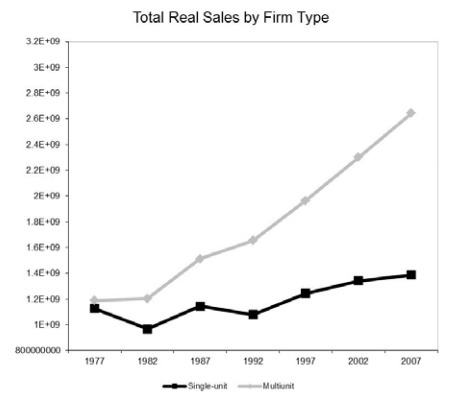 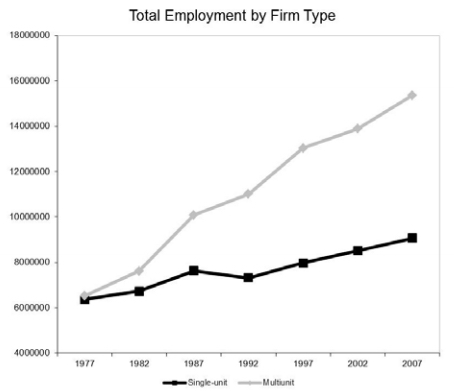 
Note: This figure is taken from Foster, Haltiwanger, Klimek, Krizan, and Ohlmacher (2015). Data comes from the Longitudinal Business Database. Here SU stands for single-unit and MU stands for multi-unit (chain).

<figcaption>The Spread of Chain Firms</figcaption>
</figure>

<figure id="ncmap" data-latex-placement="h">

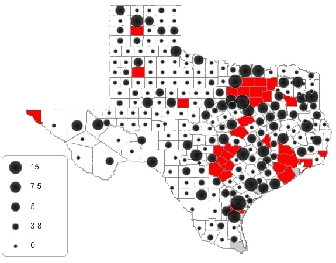 
Note: This figure shows a map with the number of chain hotels represented at the county level. Shaded counties are major metropolitan areas that are excluded from the analysis.

<figcaption>Geographic Distribution of Chain Firms</figcaption>
</figure>

<figure id="numap" data-latex-placement="h">

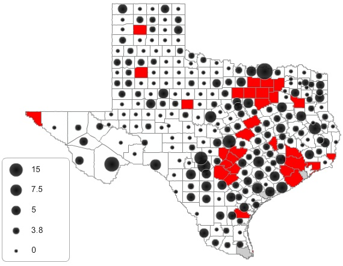 
Note: This figure shows a map with the number of independent hotels represented at the county level. Shaded counties are major metropolitan areas that are excluded from the analysis.

<figcaption>Geographic Distribution of Independent Firms</figcaption>
</figure>

<figure id="ncnuline">

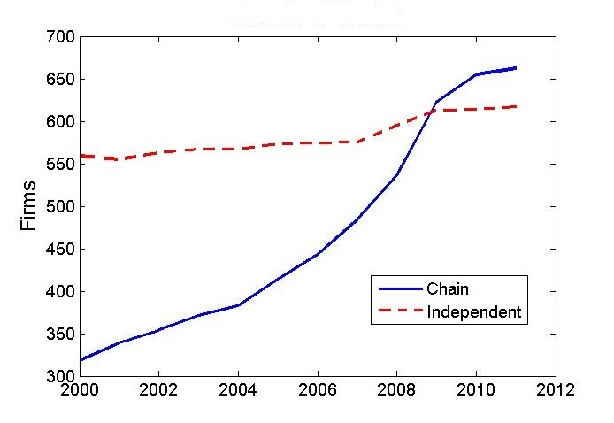 
Note: This figure shows the total number of chain and independent hotels over time for small markets.

<figcaption>Growth of Chains in Rural Texas Hotels</figcaption>
</figure>

<figure id="ysswitch" data-latex-placement="h">

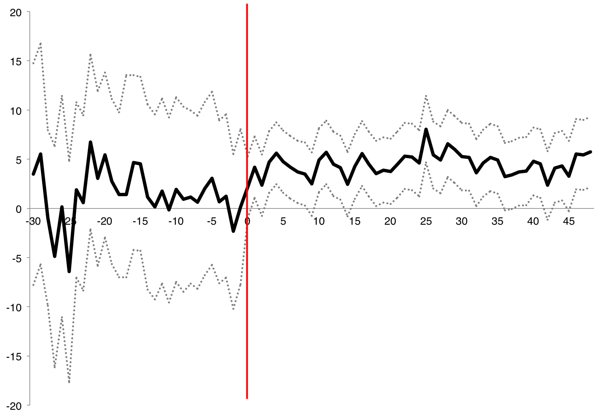 
Note: This figure shows detailed revenue estimates for firms that add chain affiliation during the sample period. Dummies for the number of months before and after the switch occurred are included in revenue regressions and the coefficients on those are plotted. Month 0 corresponds to the first full month after adding affiliation. Dashed lines represent a 95% confidence interval. 

<figcaption>Chain Premium Before and After Switching</figcaption>
</figure>

<figure id="premiumfigure2">

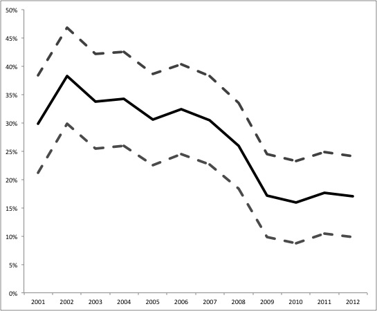 
Note: This figure presents the estimated chain premium as a % of total revenue after controlling for firm and market characteristics. Dashed lines represent the 95% confidence interval. 

<figcaption>Chain Premium (%) Over Time</figcaption>
</figure>

<figure id="ratingsdist" data-latex-placement="h">

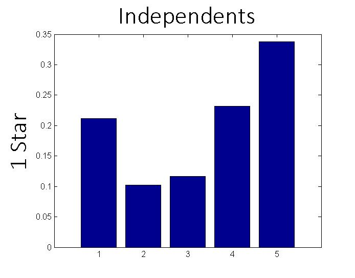 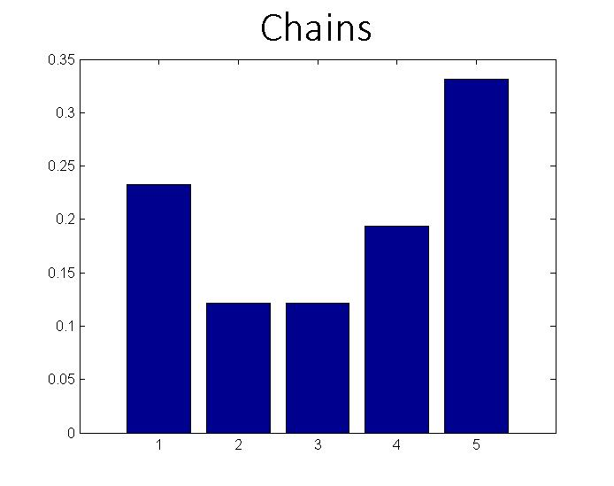 
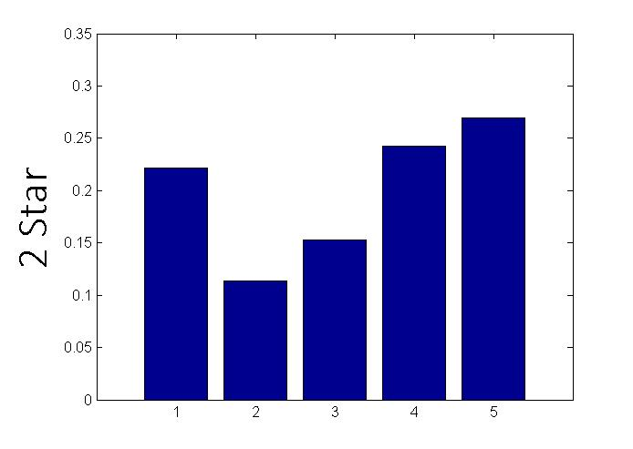 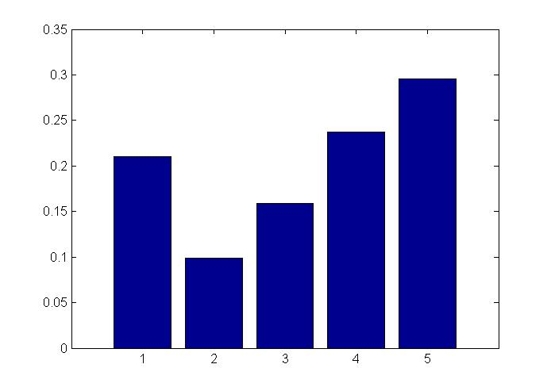 
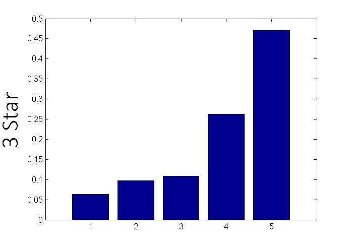 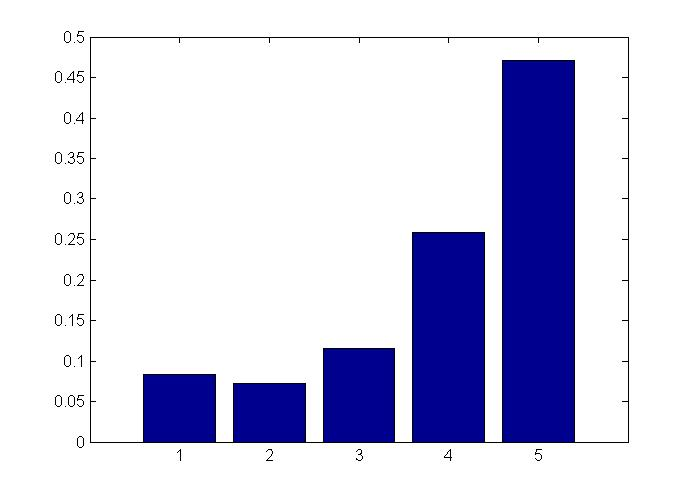 
Note: This figure shows histograms of consumer ratings on TripAdvisor.com separated by firm type, where firm type is either chain or independent, and stars refer to AAA quality ratings. 

<figcaption>Distribution of Ratings by Firm Type</figcaption>
</figure>

<figure id="reviewpremium" data-latex-placement="h">

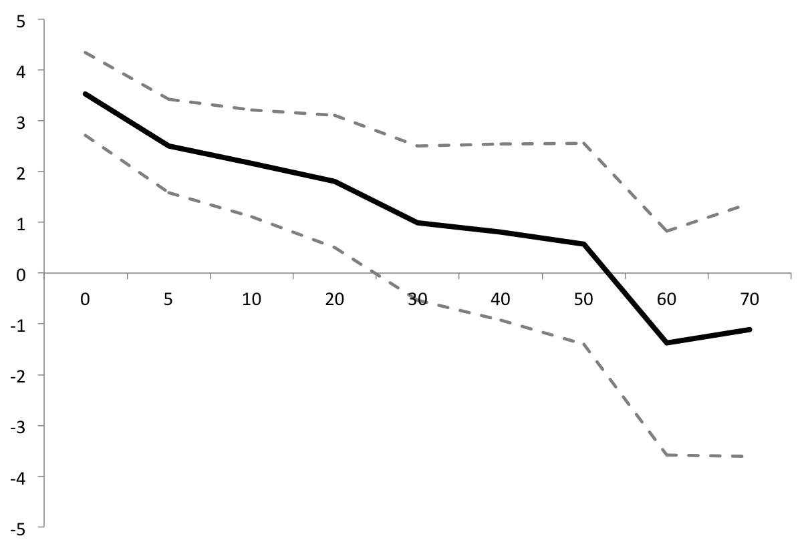 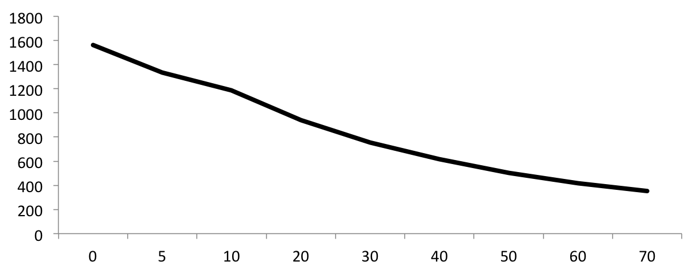 
Note: The left chart presents the estimated chain premium in dollars on the y-axis, where the estimates are on samples truncated by just considering firms with a minimum number number of reviews, shown on the x-axis. The right chart shows the number of firms in each truncated sample. 

<figcaption>Chain Premium, truncated by # Reviews</figcaption>
</figure>

::::: threeparttable
::: {#hotelstats}
                       Chain   Independent
  ----------------- -------- -------------
  N                      676           627

  **Rooms**
  Total               42,306        27,246
  Mean                  62.4          43.3
  Min                     20            20
  Max                    492           445

  **Mean RevPar**
  Total                32.07         19.07
  1 star               20.36         17.44
  2 star               28.82         24.04
  3 star               42.21         34.08
  4 star                             44.00

  : Hotel Summary Statistics
:::

::: tablenotes
Note: This table presents summary statistics on hotel size and revenue per available room per day (RevPar) for small market hotels. Star ratings are based on the AAA Tourbook.
:::

:::::

::::: threeparttable
::: {#marketstats}
                                  Mean   Std Dev    Min       Max Frequency       Unit of Observation   Source
  --------------------------- -------- --------- ------ --------- --------------- --------------------- ---------------------------
  **County Firms**

  Chains                          4.24      3.76      0        19 Monthly         County                Texas Comptroller
  Independents                    4.15      3.41      0        17 Monthly         County                Texas Comptroller

  **Demand Shifters**

  Daily Traffic                 14,289    13,756      0   100,000 Annual          Highway               TxDOT
  Population                    20,130   279,734    880   423,970 Annual          County                Census
  Total Sales ($\$$billion)       3.41      20.6   0.03       438 Annual          County                Census
  Gas Wells                      326.6     737.3      0      6155 Annual          County                Texas Railroad Commission
  Oil Wells                      461.9     843,5      0      8261 Annual          County                Texas Railroad Commission
  Unemployment                    5.72      2.27    1.9      17.8 Annual          County                Census

  **Firm Variables**

  AAA Rating                      1.68       .89      1         4 Annual          Firm                  AAA
  Chain Affiliation                .41       .49      0         1 Monthly         Firm                  Combination of sources
  TripAdvisor Rating              2.03      1.87      0         5 Cross section   Firm                  TripAdvisor
  Number of Reviews              11.76     24.83      0       483 Cross section   Firm                  TripAdvisor
  RevPar                         23.89     21.86      0     550.6 Monthly         Firm                  Texas Comptroller

  : Regressor Summary Statistics
:::

::: tablenotes
Note: This table presents summary statistics on market and firm characteristics, where market refers to county and firm refers to a property operated continually at a specific address.
:::

:::::

::::: threeparttable
::: {#chainstats}
  Chain                        Number of Outlets   Mean Rooms   Mean RevPar   AAA Rating
  -------------------------- ------------------- ------------ ------------- ------------
  Best Western                               275         66.2          37.7            2
  Holiday Inn Express                        224         80.5          54.0            3
  La Quinta                                  213         99.8          41.8            3
  Comfort Inn                                204         68.3          42.1            3
  Super 8                                    159         57.6          29.9            1
  Hampton Inn                                157         87.7          58.9            2
  Days Inn                                   142         66.5          26.7            2
  Motel 6                                    136         94.1          24.3            1
  America's Best Value Inn                    88         62.8          20.3            2
  Courtyard by Marriott                       74        130.9          64.1            3
  Quality Inn                                 72         90.5          31.1            2
  Hilton Garden Inn                           68        230.0          77.1            2
  Holiday Inn                                 67        181.2          50.9            3
  Ramada Inn                                  60        111.5          21.8            2
  Fairfield Inn                               60         94.9          53.1            3
  Regency Inn                                 55         50.5          17.0            2
  Candlewood Sutes                            53         92.7          43.2            3
  Residence Inn                               53        112.7          77.9            3
  Econo Lodge                                 47         51.9          22.4            1
  Extended Stay                               46         99.9          33.7            2
  Hawthorn Suites                             45         81.5          38.6            2
  Marriott Hotel                              44        385.8          86.9            3
  Homewood Suites                             43        103.9          73.0            3
  Studio 6                                    41        105.2          27.6            2
  Sleep Inn                                   37         66.8          37.1            2

  : Chain Summary Statistics
:::

::: tablenotes
Note: This table presents summary statistics on hotel size and revenue RevPar for the 25 most common chains in all Texas markets. Star ratings the mode for each chain.
:::

:::::

::::: threeparttable
::: {#table:nanana}
                             Pooled OLS      Market FE         Firm FE
  ---------------------- -------------- -------------- ---------------
  Chain Status              6.450\*\*\*    5.973\*\*\*     4.347\*\*\*
                                 (.526)        (1.009)         (1.015)
  $\#$Competitors                 -.052    -.945\*\*\*     -.964\*\*\*
                                 (.042)         (.254)          (.261)
  Mkt Chain Share          -6.626\*\*\*   -9.189\*\*\*    -6.639\*\*\*
                                 (.709)        (2.178)         (2.002)
  Log County Revenue               .291    3.718\*\*\*     3.888\*\*\*
                                 (.197)         (.857)          (.851)
  Log Capacity                    -.043       -2.008\*   -18.519\*\*\*
                                 (.371)        (1.081)          (2.46)
  Log Traffic              -1.129\*\*\*           .594           2.632
                                 (.227)        (1.348)         (2.551)
  Log Gas Wells              .288\*\*\*          -.125           -.211
                                 (.066)         (.421)          (.612)
  $\Delta$ Gas Wells        3.356\*\*\*    2.302\*\*\*     2.120\*\*\*
                                (1.219)         (.796)          (.578)
  Log Oil Wells                   -.030           .009           -.027
                                 (.065)         (.343)          (.618)
  $\Delta$ Oil Wells             -1.924         -1.219           -.731
                                (1.334)        (1.076)          (.705)
  Log Population                   .059   -3.574\*\*\*        -9.725\*
                                 (.243)        (1.233)         (5.511)
  Unemployment              -.484\*\*\*   -1.768\*\*\*    -1.582\*\*\*
                                 (.099)         (.479)          (.418)
  2 Stars                   2.489\*\*\*        3.145\*           8.998
                                 (.684)        (1.659)        (17.642)
  3 Stars                  18.398\*\*\*   20.169\*\*\*           7.548
                                 (.959)        (3.346)        (18.613)
  4 Stars                  41.569\*\*\*   33.691\*\*\*
                                (2.834)       (11.474)
  1 Stars\*User Rating      2.574\*\*\*    2.645\*\*\*
                                 (.169)         (.494)
  2 Stars\*User Rating      3.309\*\*\*    3.393\*\*\*
                                 (.187)         (.478)
  3 Stars\*User Rating      1.572\*\*\*      1.697\*\*
                                 (.235)         (.768)
  $\sigma$(Ratings)        -7.459\*\*\*   -6.669\*\*\*
                                 (.790)        (1.962)

  Year Dummies                      Yes            Yes             Yes

  $R^2$                             .32            .39             .76
  N                              12,807         12,807          12,807

  : Revenue Estimates
:::

::: tablenotes
Notes: The dependent variable is RevPar. Standard errors are in parentheses, they are robust and clustered at the market level for all specifications. All data is annualized and $\Delta$ denotes the 1 year change.
:::

:::::

::::: threeparttable
::: {#switchtable}
  Specification                All Switchers            C U            U C   All Switchers   All Switchers
  -------------------------- --------------- -------------- -------------- --------------- ---------------
  Chain Status                    4.39\*\*\*            .74     6.24\*\*\*      4.07\*\*\*
                                       (.73)         (1.58)         (1.08)          (1.28)
  Lead of Chain Status                                                                1.82
                                                                                    (1.27)
  $\#$ Competitors                -.99\*\*\*            .43            .08      -.93\*\*\*      -.87\*\*\*
                                       (.11)          (.60)          (.42)           (.11)           (.11)
  Market Chain Share             -6.82\*\*\*          -2.07    -9.78\*\*\*     -6.75\*\*\*     -4.51\*\*\*
                                      (1.09)         (5.75)         (2.70)          (1.07)          (1.02)
  Log County Rev                  3.62\*\*\*            .63     7.98\*\*\*            2.30
                                       (.32)         (1.95)         (1.20)           (.32)
  Log Capacity                  -18.84\*\*\*   -17.45\*\*\*   -16.25\*\*\*                    -18.19\*\*\*
                                      (1.06)         (3.85)         (2.51)                          (1.04)
  Unemployment                   -1.69\*\*\*      -2.64\*\*           -.32     -1.04\*\*\*     -1.81\*\*\*
                                       (.15)         (1.11)          (.66)           (.15)           (.07)
  Log Traffic                     2.62\*\*\*          -3.38       8.64\*\*      2.52\*\*\*             .36
                                       (.97)                        (3.79)           (.92)           (.93)
  Log Gas Wells                         -.15           1.41    -4.77\*\*\*             .18             .08
                                       (.22)         (2.22)         (1.24)           (.22)           (.22)
  Log Oil Wells                         -.18           1.02      -6.74\*\*             .32             .45
                                       (.51)          (.40)         (2.66)           (.33)           (.34)
  Log Population                -12.28\*\*\*     4.79\*\*\*          -3.27     -2.81\*\*\*           -1.18
                                      (2.45)         (1.12)         (7.87)           (.91)           (.79)
  2 Stars                               1.67           5.77          -2.19           -4.10            2.71
                                      (3.22)        (13.30)         (4.13)          (3.73)          (3.12)
  3 Stars                         9.48\*\*\*                                          2.02      9.22\*\*\*
                                      (3.55)                                        (5.87)          (3.49)
  **Years before switch:**
  11                                                                                                  2.61
                                                                                                    (3.59)
  10                                                                                                  3.83
                                                                                                    (3.10)
  9                                                                                                   3.95
                                                                                                    (2.94)
  8                                                                                                   3.86
                                                                                                    (2.36)
  7                                                                                               4.42\*\*
                                                                                                    (2.11)
  6                                                                                                 3.60\*
                                                                                                    (2.00)
  5                                                                                                   1.42
                                                                                                    (1.88)
  4                                                                                                   1.05
                                                                                                    (1.78)
  3                                                                                                   .007
                                                                                                    (1.72)
  2                                                                                                   1.24
                                                                                                    (1.68)
  1                                                                                                    .40
                                                                                                    (1.65)
  **Years after switch**
  1                                                                                               4.06\*\*
                                                                                                    (1.82)
  2                                                                                                   2.75
                                                                                                    (1.69)
  3                                                                                                 2.97\*
                                                                                                    (1.70)
  4                                                                                               3.77\*\*
                                                                                                    (1.73)
  5                                                                                             4.62\*\*\*
                                                                                                    (1.80)
  6                                                                                             6.63\*\*\*
                                                                                                    (1.94)
  7                                                                                                 3.50\*
                                                                                                    (2.01)
  8                                                                                                   -.20
                                                                                                    (2.22)
  9                                                                                                  -1.21
                                                                                                    (2.57)
  10                                                                                                   .59
                                                                                                    (2.88)
  Year Dummies                           Yes            Yes            Yes             Yes             Yes
  Firm Fixed Effects                     Yes            Yes            Yes             Yes             Yes

  $R^2$                                  .37            .36            .35             .14             .14
  N                                    1,124            385            739           1,124           1,124

  : Revenue Effects of Adding or Dropping Affiliation
:::

::: tablenotes
Notes: This table analyzes the effects of adding or dropping chain affiliation with firm fixed effects. The dependent variable is RevPar. Specifications labeled "C U" use firms that switch from chain to unaffiliated, and vice versa.
:::

:::::

::::: threeparttable
::: {#table:qtrly}
                           Firm FE
  -------------------- ----------- -- --
  Chain Status            3.51\*\*
                            (1.70)
  $\#$Competitors            -3.14
                            (2.15)
  Log County Revenue       13.71\*
                            (8.21)
  Log Traffic                24.13
                           (19.12)
  Log Gas Wells              -3.37
                            (7.60)
  Log Oil Wells               6.03
                           (11.04)
  Log Population            113.32
                           (74.18)
  Unemployment           -9.88\*\*
                            (3.92)

  Year Dummies                 Yes
  Quarter Dummies              Yes

  $R^2$                        .85
  N                            267

  : One Quarter Revenue Comparison for Switchers
:::

::: tablenotes
Notes: The dependent variable is RevPar. The data are firms that add or drop chain affiliation and contain the quarter prior to the switch and the quarter after. The quarter during which the switch occurs is dropped. Standard errors are in parentheses, they are robust and clustered at the market level for all specifications.
:::

:::::

::::: threeparttable
::: {#revestschain}
                          Market FE         Firm FE
  ------------------ -------------- ---------------
  Log Chain size        4.238\*\*\*     2.367\*\*\*
                             (.251)          (.595)
  $\#$Independents      1.516\*\*\*      .807\*\*\*
                             (.341)          (.289)
  $\#$Chains            -.732\*\*\*    -1.038\*\*\*
                             (.216)          (.184)
  Log County Rev        8.738\*\*\*     8.153\*\*\*
                             (.554)          (.460)
  Log Capacity         -9.490\*\*\*   -22.930\*\*\*
                             (.645)         (1.877)
  New Firm             -5.145\*\*\*    -8.446\*\*\*
                             (.550)          (.618)
  Unemployment         -1.832\*\*\*    -1.839\*\*\*
                             (.149)          (.123)
  Log Traffic               3.611\*           2.301
                            (2.025)         (1.677)
  Log Wells                   -.387           -.464
                             (.438)          (.389)
  Log Population       11.158\*\*\*    10.494\*\*\*
                             (.170)         (3.677)
  User rating           2.633\*\*\*
                             (.170)
  2 Stars               3.744\*\*\*
                             (.786)
  3 Stars              17.160\*\*\*
                             (.819)

  N                            5669            5669
  $R^2$                         .35             .17

  : Chain Only Revenue Estimates
:::

::: tablenotes
Note: This table presents results on the sample of chain firms. The dependent variable is RevPar. Chain size is calculated as the number of chain members observed in the revenue data in 2012.
:::

:::::

::::: threeparttable
::: {#reviewstats}
  AAA Rating                 $\star$   $\star\star$   $\star\star\star$
  ------------------------ --------- -------------- -------------------
  **Chain**
  Mean $\#$ Reviews            13.25          16.14               24.99
  Average Rating                2.72           3.18                3.79
  Mean $\sigma$(Ratings)        4.30           4.78               11.78
  Mean reviews per room          .16            .25                 .35

  **Independent**
  Mean $\#$ Reviews            13.28          13.82               35.27
  Average Rating                2.93           3.04                3.70
  Mean $\sigma$(Ratings)        4.53           3.72               16.58
  Mean reviews per room          .10            .22                 .58

  : Hotel Reviews Summary Statistics
:::

::: tablenotes
Note: This table presents summary information on TripAdvisor.com consumer ratings taken from a December 2012 cross-section, broken down by firm type.
:::

:::::

::::: threeparttable
::: {#exitstats}
                        Total   Std. Dev.
  --------------------- ------- -----------
  **Number of Firms**
  Chain                 25
  Independent           118
  Total                 143

  **AAA Rating**
  $\star$               116
  $\star\star$          20
  $\star\star\star$     7

  Capacity              46.81   29.70
  Age (years)           11.99   8.04

  2001                  7
  2002                  9
  2003                  14
  2004                  9
  2005                  14
  2006                  15
  2007                  11
  2008                  10
  2009                  15
  2010                  10
  2011                  15
  2012                  14

  : Exiting Firm Summary Statistics
:::

::: tablenotes
This table presents summary statistics on number of hotels exiting by type and year.
:::
:::::

::::: threeparttable
::: {#inclogit}
  Specification                         1             2             3
  ------------------------- ------------- ------------- -------------
  Chain Status                       .360          .409     8.209\*\*
                                   (.330)        (.331)        (4.09)
  $\#$Independents                 .091\*          .024          .029
                                   (.053)        (.054)        (.054)
  $\#$Chains                        -.032         -.015         -.014
                                   (.038)        (.038)        (.038)
  Log County Sales                   .017         -.103         -.644
                                   (.105)        (1.32)        (1.37)
  Unemployment                  -.065\*\*          .082         -.008
                                   (.039)        (.140)        (.152)
  Log Traffic                   -.282\*\*     2.234\*\*     2.056\*\*
                                   (.126)        (.941)       (1.020)
  Log Wells                      .077\*\*          .128          .137
                                   (.032)        (.107)        (.107)
  Log Population                     .180    3.34\*\*\*   3.632\*\*\*
                                   (.136)        (1.13)       (1.143)
  2 Stars                     1.047\*\*\*   1.069\*\*\*   1.069\*\*\*
                                   (.347)        (.346)        (.349)
  3 Stars                        .885\*\*      .893\*\*        .903\*
                                   (.409)        (.411)        (.413)

  (Log Sales$)^2$                                  .003          .018
                                                 (.032)        (.033)
  (Unemployment$)^2$                              -.010         -.006
                                                 (.008)        (.009)
  (Log Traffic$)^2$                         -.145\*\*\*   -.136\*\*\*
                                                 (.052)        (.057)
  (Log Wells$)^2$                                 -.012         -.011
                                                 (.015)        (.015)
  (Log Population$)^2$                      -.149\*\*\*   -.166\*\*\*
                                                 (.053)        (.053)

  Chain\*(Log Sales)                                        -.556\*\*
                                                               (.271)
  Chain\*(Unemployment)                                          .187
                                                               (.127)
  Chain\*(Log Traffic)                                          -.242
                                                               (.375)
  Chain\*(Log Wells)                                            -.083
                                                               (.080)
  Chain\*(Log Population)                                        .521
                                                               (.326)

  N                                12,270        12,270        12,270
  $R^2$                               .04           .06           .07

  : Incumbent Firm's Policy Function
:::

::: tablenotes
Each specification is a logistic regression. The dependent variable is $1$ if the firm is active that period and $0$ otherwise.
:::

:::::

::::: threeparttable
::: {#entrypoisson}
+:-----------------------------+------------:+-------------:+---------:+-------------:+-------------:+-------------:+
|                              | Independent                           | Chain                                      |
+------------------------------+-------------+--------------+----------+--------------+--------------+--------------+
|                              | 1 star      | 2 star       | 3 star   | 1 star       | 2 star       | 3 star       |
+------------------------------+-------------+--------------+----------+--------------+--------------+--------------+
|                              |             |              |          |              |              |              |
+------------------------------+-------------+--------------+----------+--------------+--------------+--------------+
| **Demand Shifters**          |             |              |          |              |              |              |
+------------------------------+-------------+--------------+----------+--------------+--------------+--------------+
|                              |             |              |          |              |              |              |
+------------------------------+-------------+--------------+----------+--------------+--------------+--------------+
| Log County Sales             | .744\*\*\*  | .111         | -.119    | 7.235\*\*    | .284         | .190         |
+------------------------------+-------------+--------------+----------+--------------+--------------+--------------+
|                              | (.23)       | (1.99)       | (.569)   | (3.68)       | (.41)        | (.29)        |
+------------------------------+-------------+--------------+----------+--------------+--------------+--------------+
| Unemployment                 | -.104       | -.070        | .035     | .228         | .005         | -.067        |
+------------------------------+-------------+--------------+----------+--------------+--------------+--------------+
|                              | (.07)       | (.429)       | (.234)   | (.48)        | (.10)        | (.07)        |
+------------------------------+-------------+--------------+----------+--------------+--------------+--------------+
| Log Traffic                  | -.033       | 10.152       | .217     | -.006        | 1.080\*      | -.873\*\*\*  |
+------------------------------+-------------+--------------+----------+--------------+--------------+--------------+
|                              | (.28)       | (6.26)       | (.555)   | (1.59)       | (.63)        | (.32)        |
+------------------------------+-------------+--------------+----------+--------------+--------------+--------------+
| Log Gas Wells                | .247        | 3.632\*\*    | .221     | .199         | .069         | .899\*\*\*   |
+------------------------------+-------------+--------------+----------+--------------+--------------+--------------+
|                              | (.19)       | (.1.84)      | (.204)   | (1.23)       | (.19)        | (.21)        |
+------------------------------+-------------+--------------+----------+--------------+--------------+--------------+
| Log Population               | -.538       | 11.155       | -.027    | -29.389      | .017         | 1.269\*\*    |
+------------------------------+-------------+--------------+----------+--------------+--------------+--------------+
|                              | (.44)       | (9.40)       | (.105)   | (18.12)      | (.75)        | (.54)        |
+------------------------------+-------------+--------------+----------+--------------+--------------+--------------+
| Interest Rate                | -.314\*\*   | -1.359\*     | .423     | -.733        | -.582\*\*\*  | -.848\*\*\*  |
+------------------------------+-------------+--------------+----------+--------------+--------------+--------------+
|                              | (.28)       | (.85)        | (.608)   | (.88)        | (.21)        | (.14)        |
+------------------------------+-------------+--------------+----------+--------------+--------------+--------------+
| Mean Market Age              | .168\*\*\*  | .047         | .027     | .134         | .108         | .228\*\*\*   |
+------------------------------+-------------+--------------+----------+--------------+--------------+--------------+
|                              | (.05)       | (.27)        | (.105)   | (.24)        | (.63)        | (.05         |
+------------------------------+-------------+--------------+----------+--------------+--------------+--------------+
|                              |             |              |          |              |              |              |
+------------------------------+-------------+--------------+----------+--------------+--------------+--------------+
| **Number of Existing Firms** |             |              |          |              |              |              |
+------------------------------+-------------+--------------+----------+--------------+--------------+--------------+
|                              |             |              |          |              |              |              |
+------------------------------+-------------+--------------+----------+--------------+--------------+--------------+
| Independents:                |             |              |          |              |              |              |
+------------------------------+-------------+--------------+----------+--------------+--------------+--------------+
| 1 star                       | -.781\*\*\* | 1.707\*\*    | .173     | .855         | .440\*\*     | .190         |
+------------------------------+-------------+--------------+----------+--------------+--------------+--------------+
|                              | (.12)       | (.84)        | (.224)   | (.159)       | (.20)        | (.28)        |
+------------------------------+-------------+--------------+----------+--------------+--------------+--------------+
| 2 star                       | .492        | -6.207\*\*\* | .134     | -2.208       | -.859\*\*    | .634\*       |
+------------------------------+-------------+--------------+----------+--------------+--------------+--------------+
|                              | (.32)       | (1.67)       | (.859)   | (2.61)       | (.38)        | (.30)        |
+------------------------------+-------------+--------------+----------+--------------+--------------+--------------+
| 3 star                       | -.880       | -4.257       | 2.227    | .335         | .746         | -.667        |
+------------------------------+-------------+--------------+----------+--------------+--------------+--------------+
|                              | (.68)       | \(3475\)     | (.763)   | (.712)       | (.68)        | (.50)        |
+------------------------------+-------------+--------------+----------+--------------+--------------+--------------+
| Chains:                      |             |              |          |              |              |              |
+------------------------------+-------------+--------------+----------+--------------+--------------+--------------+
| 1 star                       | -.220       | 2.416        | -16.481  | -4.826\*\*\* | .250         | -.193        |
+------------------------------+-------------+--------------+----------+--------------+--------------+--------------+
|                              | (.41)       | (2.06)       | \(2087\) | (1.65)       | (.49)        | (.35)        |
+------------------------------+-------------+--------------+----------+--------------+--------------+--------------+
| 2 star                       | -.255       | -3.436\*\*\* | .057     | -1.978\*     | -1.905\*\*\* | .406\*\*     |
+------------------------------+-------------+--------------+----------+--------------+--------------+--------------+
|                              | (.20)       | (1.16)       | (.411)   | (.205)       | (.25)        | (.16)        |
+------------------------------+-------------+--------------+----------+--------------+--------------+--------------+
| 3 star                       | -.302\*\*   | .495         | -.515    | .558         | .544\*\*\*   | -1.074\*\*\* |
+------------------------------+-------------+--------------+----------+--------------+--------------+--------------+
|                              | (.13)       | (.90)        | (.645)   | (.75)        | (.15)        | (.10)        |
+------------------------------+-------------+--------------+----------+--------------+--------------+--------------+
|                              |             |              |          |              |              |              |
+------------------------------+-------------+--------------+----------+--------------+--------------+--------------+
| N                            | 2729        | 2729         | 2729     | 2729         | 2729         | 2729         |
+------------------------------+-------------+--------------+----------+--------------+--------------+--------------+

: Poisson Entry Probability by Firm Type
:::

::: tablenotes
Each column represents a poisson regression on the number of entrants of each firm type in each market each year. Independent variables are market characteristics and the number of firms already in the market by type of firm.
:::

:::::

::::: threeparttable
::: {#uhfinalests}
+:---------------------------------+-------------:+----------------:+------------:+------------:+------------:+
|                                  | No Market RE | Market RE                                                 |
+----------------------------------+--------------+-----------------+-------------+-------------+-------------+
|                                  | 1            | 2               | 3           | 4           | 5           |
+----------------------------------+--------------+-----------------+-------------+-------------+-------------+
| **Operating Costs**              |              |                 |             |             |             |
+----------------------------------+--------------+-----------------+-------------+-------------+-------------+
| Constant                         | 17.77\*\*\*  | 23.55\*\*       | 21.82\*\*   | 20.53\*\*   | 23.76\*\*\* |
+----------------------------------+--------------+-----------------+-------------+-------------+-------------+
|                                  | (5.71)       | (10.21)         | (11.59)     | (11.73)     | (9.88)      |
+----------------------------------+--------------+-----------------+-------------+-------------+-------------+
| Chain                            | 1.46         | -.49            | -.53        | -.73        |             |
+----------------------------------+--------------+-----------------+-------------+-------------+-------------+
|                                  | (1.18)       | (2.76)          | (1.23)      | (2.62)      |             |
+----------------------------------+--------------+-----------------+-------------+-------------+-------------+
| 2 star                           | 6.04\*\*\*   | 7.32\*\*\*      | 7.21\*\*\*  | 7.13\*\*    | 7.42\*\*    |
+----------------------------------+--------------+-----------------+-------------+-------------+-------------+
|                                  | (1.67)       | (2.94)          | (2.74)      | (3.33)      | (3.06)      |
+----------------------------------+--------------+-----------------+-------------+-------------+-------------+
| 3 star                           | 19.78\*\*\*  | 23.35\*\*\*     | 23.23\*\*\* | 23.08\*\*\* | 23.35\*\*\* |
+----------------------------------+--------------+-----------------+-------------+-------------+-------------+
|                                  | (1.17)       | (4.21)          | (4.21)      | (3.76)      | (4.32)      |
+----------------------------------+--------------+-----------------+-------------+-------------+-------------+
| Log(Traffic)                     |              |                 | .13         |             |             |
+----------------------------------+--------------+-----------------+-------------+-------------+-------------+
|                                  |              |                 | (.44)       |             |             |
+----------------------------------+--------------+-----------------+-------------+-------------+-------------+
| Log(Capacity)                    |              |                 |             | .79         |             |
+----------------------------------+--------------+-----------------+-------------+-------------+-------------+
|                                  |              |                 |             | (.99)       |             |
+----------------------------------+--------------+-----------------+-------------+-------------+-------------+
| Chain size $<$ 100               |              |                 |             |             | 1.67        |
+----------------------------------+--------------+-----------------+-------------+-------------+-------------+
|                                  |              |                 |             |             | (2.94)      |
+----------------------------------+--------------+-----------------+-------------+-------------+-------------+
| 100 $<$ Chain size $<$ 200       |              |                 |             |             | -3.07       |
+----------------------------------+--------------+-----------------+-------------+-------------+-------------+
|                                  |              |                 |             |             | (4.11)      |
+----------------------------------+--------------+-----------------+-------------+-------------+-------------+
| 200 $<$ Chain size               |              |                 |             |             | .37         |
+----------------------------------+--------------+-----------------+-------------+-------------+-------------+
|                                  |              |                 |             |             | (3.92)      |
+----------------------------------+--------------+-----------------+-------------+-------------+-------------+
|                                  |              |                 |             |             |             |
+----------------------------------+--------------+-----------------+-------------+-------------+-------------+
| **Entry Costs**                  |              |                 |             |             |             |
+----------------------------------+--------------+-----------------+-------------+-------------+-------------+
| Independent:                     |              |                 |             |             |             |
+----------------------------------+--------------+-----------------+-------------+-------------+-------------+
| 2 Star                           |              | 153417.12\*\*\* |             |             |             |
+----------------------------------+--------------+-----------------+-------------+-------------+-------------+
|                                  |              | (52522.42 )     |             |             |             |
+----------------------------------+--------------+-----------------+-------------+-------------+-------------+
| 3 Star                           |              | 191026.22\*     |             |             |             |
+----------------------------------+--------------+-----------------+-------------+-------------+-------------+
|                                  |              | (110100.10)     |             |             |             |
+----------------------------------+--------------+-----------------+-------------+-------------+-------------+
| Chain:                           |              |                 |             |             |             |
+----------------------------------+--------------+-----------------+-------------+-------------+-------------+
| 1 Star                           |              | 91910.36        |             |             |             |
+----------------------------------+--------------+-----------------+-------------+-------------+-------------+
|                                  |              | (60724.19)      |             |             |             |
+----------------------------------+--------------+-----------------+-------------+-------------+-------------+
| 2 Star                           |              | 244177.83\*\*   |             |             |             |
+----------------------------------+--------------+-----------------+-------------+-------------+-------------+
|                                  |              | (107545.04)     |             |             |             |
+----------------------------------+--------------+-----------------+-------------+-------------+-------------+
| 3 Star                           |              | 256519.70\*     |             |             |             |
+----------------------------------+--------------+-----------------+-------------+-------------+-------------+
|                                  |              | (155587.19)     |             |             |             |
+----------------------------------+--------------+-----------------+-------------+-------------+-------------+
|                                  |              |                 |             |             |             |
+----------------------------------+--------------+-----------------+-------------+-------------+-------------+
| **Switching Costs**              |              |                 |             |             |             |
+----------------------------------+--------------+-----------------+-------------+-------------+-------------+
| Independent $\rightarrow$ Chain: |              | 129845.8\*\*\*  |             |             |             |
+----------------------------------+--------------+-----------------+-------------+-------------+-------------+
|                                  |              | (16762.3)       |             |             |             |
+----------------------------------+--------------+-----------------+-------------+-------------+-------------+
| Chain $\rightarrow$ Independent: |              | 152721.6\*\*\*  |             |             |             |
+----------------------------------+--------------+-----------------+-------------+-------------+-------------+
|                                  |              | (30646.1)       |             |             |             |
+----------------------------------+--------------+-----------------+-------------+-------------+-------------+

: Estimated Operating Costs ($\$$ per room per day)
:::

::: tablenotes
This table presents final stage estimates of firm operating costs, expressed in terms of dollars per room per day, with bootstrap standard errors. Chain size refers to the number of chain partners in Texas. Column 1 shows estimates without market level random effects. Columns 2-5 calculate market random effects using the [@arcidiaconomiller] procedure. Entry costs and switching costs are one-time costs and so are not normalized to be per room per day. They are estimated in reference to the entry cost of a one star independent firm, which is normalized to zero.
:::

:::::

::::: threeparttable
::: {#costscompare}
                     Logit        Probit           LPM
  ---------- ------------- ------------- -------------
  Constant       23.55\*\*     24.98\*\*     25.34\*\*
                   (10.21)       (10.93)       (11.46)
  Chain               -.49          -.56          -.39
                    (2.76)        (2.70)        (2.66)
  2 star        7.32\*\*\*    7.52\*\*\*      6.48\*\*
                    (2.94)        (2.91)        (3.33)
  3 star       23.35\*\*\*   23.77\*\*\*   24.12\*\*\*
                    (4.21)        (3.48)        (3.96)

  : Estimates Using Different First Stage Specifications
:::

::: tablenotes
This table compares the results of final stage costs estimation under different first stage specifications of policy functions. I model entry/exit decisions as logit, probit and linear processes, use these to form continuation values and solve the final stage using each as inputs while incorporating market RE as described above.
:::

:::::

::: {#str}
+:--------------------------------------------------------------------------------------------------------------------------------+--------------------------------------------------------------------------------------------------------------------------------:+
| Administrative                                                                                                                  | 3.31                                                                                                                            |
+---------------------------------------------------------------------------------------------------------------------------------+---------------------------------------------------------------------------------------------------------------------------------+
| Marketing                                                                                                                       | .64                                                                                                                             |
+---------------------------------------------------------------------------------------------------------------------------------+---------------------------------------------------------------------------------------------------------------------------------+
| Utilities                                                                                                                       | 2.66                                                                                                                            |
+---------------------------------------------------------------------------------------------------------------------------------+---------------------------------------------------------------------------------------------------------------------------------+
| Maintenance                                                                                                                     | 2.24                                                                                                                            |
+---------------------------------------------------------------------------------------------------------------------------------+---------------------------------------------------------------------------------------------------------------------------------+
| Total Operating Expenses                                                                                                        | 8.85                                                                                                                            |
+---------------------------------------------------------------------------------------------------------------------------------+---------------------------------------------------------------------------------------------------------------------------------+
| Franchise Fees                                                                                                                  | 1.99                                                                                                                            |
+---------------------------------------------------------------------------------------------------------------------------------+---------------------------------------------------------------------------------------------------------------------------------+
| Management Fees                                                                                                                 | .65                                                                                                                             |
+---------------------------------------------------------------------------------------------------------------------------------+---------------------------------------------------------------------------------------------------------------------------------+
| Property Taxes                                                                                                                  | 1.99                                                                                                                            |
+---------------------------------------------------------------------------------------------------------------------------------+---------------------------------------------------------------------------------------------------------------------------------+
| Insurance                                                                                                                       | .65                                                                                                                             |
+---------------------------------------------------------------------------------------------------------------------------------+---------------------------------------------------------------------------------------------------------------------------------+
| Debt Service and Other                                                                                                          | 14.18                                                                                                                           |
+---------------------------------------------------------------------------------------------------------------------------------+---------------------------------------------------------------------------------------------------------------------------------+
| Payroll and Related                                                                                                             | 7.97                                                                                                                            |
+---------------------------------------------------------------------------------------------------------------------------------+---------------------------------------------------------------------------------------------------------------------------------+
| Total                                                                                                                           | 31.00                                                                                                                           |
+---------------------------------------------------------------------------------------------------------------------------------+---------------------------------------------------------------------------------------------------------------------------------+
| Notes: Data comes from Smith Travel Research 2012 Hotel Operating Statistics Study, which compiles survey data from 3,593 limited service hotels across the U.S. in the preceding year. Operating costs are for limited service hotels in the Budget category.    |
+---------------------------------------------------------------------------------------------------------------------------------+---------------------------------------------------------------------------------------------------------------------------------+
|                                                                                                                                 |                                                                                                                                 |
+---------------------------------------------------------------------------------------------------------------------------------+---------------------------------------------------------------------------------------------------------------------------------+

: STR Operating Costs ($\$$ per room per day)
:::

::::: threeparttable
::: {#firmdists}
  Firm Type          True 2001 Distribution   True 2011 Distribution   Simulated 2011 Distribution
  ----------------- ------------------------ ------------------------ -----------------------------
  **Independent**
  1 star                      1.80                     3.89                       3.74
  2 star                      .22                      .49                         .48
  3 star                      .11                      .14                         .14

  **Chain**
  1 star                      .21                      .10                         .40
  2 star                      1.16                     1.26                       2.08
  3 star                      .59                      2.17                       2.08

  : Comparison of Model Simulations to Data
:::

::: tablenotes
The left two columns show the distribution of firm types in 2001 and 2011 in the data. The right column shows the results of model simulation. For each market, the model is started at the true 2000 distribution and forward simulated $10,000$ times.
:::

:::::
::::::::::::::::::::::::::::::::::::::::::::::

[^1]: UCLA Anderson School of Management, contact brett.hollenbeck@gmail.com. This article has previously circulated under the title "The Spread of Horizontal Chains: Efficiency or Information?" I would like to thank Eugenio Miravete and Stephen Ryan for their guidance and support. I also thank Allan Collard-Wexler, Stephanie Houghton, Mike Mazzeo, Sanjog Misra, Peter Rossi, David Sibley, Haiqing Xu, and Rostislav Bogoslovskiy for their help as well as all participants in the UT-Austin weekly IO Seminar and seminar participants at CalTech, UCLA, Chicago-Booth School of Management, FTC-Bureau of Economics, DOJ Antitrust Division, Stanford GSB, the University of British Columbia, the Stanford Institute for Theoretical Economics and the 2015 Yale Marketing-Industrial Organization Conference.

[^2]: I use "chains" to mean any business that operates multiple outlets offering similar goods or services under the same banner. The spread of chains can be seen in Figure [1](#haltiwanger), taken from @fosterhaltiwanger15, which uses a slightly more restrictive definition.

[^3]: Examples of work on wages and employment include @basker05 and @jarmin09 For work on competition, see @baskernoel09, and @jia08, among others. Research on aggregate productivity includes [@fosterhaltiwanger06] and [@bloomvanreenan]. This is just a sample of the available literature, for an overview of work related to chains and franchising, see [@lafontaine2012].

[^4]: See, for instance, [@holmes] and [@jia08].

[^5]: Throughout, I use the term reputation to denote the signal a firm's brand name provides to consumers. This signal should at minimum reduce variance in a consumer's prior over firm quality, something risk averse consumers value. It may also increase or decrease mean expected quality. In a seminal article, [@kreps90] discussed the importance of firm reputation, [@horner02] further examines the role of firm reputation in competition, and [@caiobara] explicitly model reputation building in low information environments as an incentive for horizontal expansion.

[^6]: According to the Local Consumer Review Survey 2012, $85\%$ of consumers checked online reviews before making purchasing decisions in 2012.

[^7]: This can be seen by comparing Figures [1](#haltiwanger) and [4](#ncnuline).

[^8]: [@scottlanduse] also employs this estimator in a study of agricultural land use.

[^9]: Recent examples include [@thomadsen05], [@toivanenwaterson], [@aguirre09], [@igamiyang] and [@blevinsyang] on fast-food; [@davistheaters] on movie theatres; [@seim06] on video rental stores; @ellicksonrepocosts and [@villasboas07] on supermarkets; and [@suzuki] and [@mazzeo02] on hotels.

[^10]: [@suzuki] also estimates a dynamic model using Texas hotels data to test if land-use regulations raise firm costs. The key differences between [@suzuki] and this article are that his focus is on total entry costs, which I do not estimate, and he restricts attention to the firms in the 6 largest chains.

[^11]: Because there is such a small number of 4 star firms, and none enter or exit during the sample period, I exclude them from this analysis.

[^12]: I choose not to model the stage game that generates revenue, instead taking revenue as a flexible function of firm characteristics, market characteristics, and the number and type of competitors faced by each firm.

[^13]: I model all costs as fixed costs. Industry analyses suggest that greater than $90\%$ of costs are considered fixed. This is particularly true when aggregating to the period of a year, as I do.

[^14]: In some cases, hotel chains do employ strategies with respect to entry, but the focus of these is on "showcase" hotels in large markets. In the types of markets I focus on here, the process is initiated and controlled by local entrepreneurs.

[^15]: In this industry and others with franchising arrangements, prices are set by franchisees and not franchisors. Chains still maintain some influence over prices by using advertising. For more on chain pricing see [@ateroren] and [@kalninsms16] and the references therein.

[^16]: The unit of analysis throughout this article is at the level of the individual property. Similarly, I define "firm" throughout at the level of the property because hotels are almost universally owned and managed by independent franchisees in these data.

[^17]: As AAA does not rate firms below a minimum quality standard, unrated firms are assigned a score of 1 star. For unrated chain affiliated firms, I assign the modal star rating of its chain partners. There is very little within chain variation in star ratings. For almost all the analysis that follows, I have examined the results when using only the set of AAA rated firms to test the importance of this assumption and in no case are the results significantly different.

[^18]: For all results that follow, I define market as nearest city but also include firms in the same county among potential competitors. In addition, because hotel customers are frequently highway travelers, there is still potential substitution across markets. As a result, for markets on major highways I test inclusion of the firms in adjacent counties as potential competitors. I find that including them has no significant effect on results.

[^19]: Excluded markets are highlighted in Figures [2](#ncmap) and [3](#numap)

[^20]: The organizational structure of chain affiliated hotels can vary. In some cases, the chain both owns and operates the property, in other cases a franchisee owns the property but the chain has a contract to manage it. In nearly all firms in this sample, the chain neither owns nor operates the property. Instead, these roles are taken by local franchisees and the chain simply licenses its branding and provides the franchisee with a operating manual.

[^21]: Roughly twice as many hotels add a chain affiliation as drop it.

[^22]: Each chain maintains an operating manual that is loaned to the franchisee upon opening or converting a new hotel. This document is confidential. Franchise agreements are typically not confidential and lay out a set of obligations for the franchisee to follow. Based on those that I have reviewed and the anecdotal responses of hoteliers I have spoken to, the franchisee must agree to the possibility of a pre-opening inspection and the franchisor maintains the right to conduct periodic inspections through the length of the agreement. These inspections might be random or might be prompted by guest satisfaction surveys, depending on the chain. If a property is found to be deficient in some way, they may be charged a fee by the franchisor or may be required to correct the deficiency. Some switches are accompanied by changes in room number or ownership. The estimates from switches that do and do not accompany these changes show no significant differences, suggesting the result is not due to significant renovations or management improvements.

[^23]: This uses the same specification in equation [\[eq:revest\]](#eq:revest) excluding data from all periods except the quarters before and after a chain affiliation switch.

[^24]: This result does not appear to be caused by increasing numbers of chain competitors, as it is robust to different specifications that include the number of chain firms in each market, the share of chain firms, and the full type distribution in revenue estimates. In addition, although the US as a whole experienced a large recession in 2008-9, large regions in Texas were experiencing an economic boom at this time due to new gas production. Comparing this figure for counties with and without falling employment show no significant difference, suggesting business cycle dynamics do not play a major role in this result.

[^25]: During the sample period 143 firms exit and 603 firms enter.

[^26]: For a full derivation of this, see [@arcidiaconomiller]

[^27]: The dispersion parameter $\sigma_\epsilon$ is unknown and is treated as an extra parameter in final stage estimation. Although parameter estimates in discrete choice models are typically scaled by this unknown dispersion parameter, because revenues are observed in dollars, costs parameters can also be expressed in dollars.

[^28]: Specifically, because a firm's choice probability is defined in equation [\[eq:discretechoice1\]](#eq:discretechoice1), I re-solve a logit model on firm type and continuation value, offsetting revenue estimates.

[^29]: See Table [13](#costscompare), which compares the resulting cost estimates using different first stage specifications of policy functions.

[^30]: These are determined by drawing whole market histories from the set of 353 markets, with replacement, and repeating the full procedure described above 100 times.

[^31]: For background on the impact of search costs and consumer information on firm behavior and outcomes, see [@bayesearch]. For my purposes I consider low information and high search costs to be analogous.

[^32]: There is a potential selection effect here, in that the most reviewed firms could have unobservable characteristics that lead them to show a lower chain premium. I test for this type of selection bias by performing a series of tests where instead of truncating the sample on number of reviews, I truncate it separately on traffic level, age, and number of rooms and in none of these cases do I find a similar pattern.
