# Horizontal Mergers and Innovation in Concentrated Industries
**Brett Hollenbeck**
UCLA Anderson School of Management
May 2019
*Quantitative Marketing and Economics*, 2020, Vol. 18, pp. 1–37
https://papers.ssrn.com/sol3/papers.cfm?abstract_id=2621842

# Introduction

In a concentrated industry, does allowing rival firms to merge increase or decrease investment and innovation? When is there a net positive effect on innovation from allowing dominant firms to acquire new entrants and smaller rivals? Antitrust authorities increasingly deal with industries characterized by high levels of investment and where innovations cause rapid changes in firm market share and product quality.[^1] For these industries, the effects of a merger on dynamic considerations such as investment, entry and exit are more important than the standard considerations of market power and price increases when determining the merger's likely effect on consumer welfare. In industries characterized by multi-sided platforms, traditional price effects may be absent altogether and a merger's effect on innovation incentives is especially important. The relationship between industry concentration and innovation is itself complex and non-monotonic.[^2] Furthermore, few things matter more for consumer welfare than the long run rate of innovation, and the factors that determine firm decisions to develop and produce improvements in product quality occupy a central role in economics and marketing.[^3] Despite this, the relationship between mergers and product innovation remains poorly understood.

Mergers may affect investment incentives in a number of competing ways. Investment typically imposes a negative externality on the industry, as some portion of the gains from a successful innovation come from stealing business from rival firms. By merging, firms will internalize this effect and reduce their investment accordingly.[^4] Firms may also buy out a smaller rival to acquire its new innovation, and so use the merger as a substitute for investing in the new technology itself.[^5] On the other hand, the prospect of being bought out by an incumbent with deep pockets may also encourage entry into the market by new firms, encouraging development of new products and technologies. Some new start-ups in technological and pharmaceutical industries explicitly cite a potential future acquisition as an "exit strategy" when seeking early funding. A merger may also increase the new firm's ability to innovate via economies of scale or complementarities between the two firms' R$\&$D capabilities. Because the relationship between mergers and innovation depends in a complex way on both pre and post-merger market structure, to determine the interplay between and relative importance of these effects requires modeling industry dynamics such as entry and investment along with endogenous mergers.

Empirical work on this question is limited and faces several challenges.[^6] Instead, this paper presents a model of a concentrated industry with fully endogenous entry, exit, quality investment and horizontal mergers. Including each of these features is necessary in order to consider questions regarding innovation, which is inherently dynamic.[^7] I solve this model for a broad range of industry features to show under what conditions mergers will increase or decrease innovation, and in particular under what circumstances will dynamic effects outweigh static harms that might arise under mergers.

I find that even in a setting where mergers exclusively increase prices and harm consumer welfare in the short term, it can commonly occur that the ultimate long-term effect of allowing these anti-competitive mergers is much higher average consumer welfare. This is because those mergers can generate a new type of preemptive or speculative entry which increases the total amount of competition and investment taking place. I then explore what mechanisms drive this result and what industry characteristics make it likely to occur. For the long-term effects on innovation to outweigh the immediate harms from reduced competition, the primary conditions are that entry costs must be relatively low and both new entrants and dominant firms must be capable of generating rapid innovations. I also find that when the dominant firm can directly incorporate the acquired firm's innovation into its own product quality, mergers are especially beneficial. Finally, mergers are more likely to increase long-term welfare when horizontal product differentiation is low and firms mostly compete on quality.

Despite the importance of the dynamic effects of horizontal mergers, they have rarely been studied in settings where mergers occur endogenously.[^8] Endogeneity of mergers is crucial to understand their dynamic effects because today's decisions regarding entry, exit, investment, and mergers are affected by the possibility of future mergers. That mergers occur in waves within industries is well documented. Only a few studies have been done where mergers arise endogenously in a dynamic context.[^9] [@pesendorfer] derives theoretical predictions from a Cournot model with entry, exit and mergers and finds that the standard Cournot result is overturned if firms expect the possibility of mergers in the future. [@gowr99] presents a framework for studying mergers in a dynamic oligopoly with capacity-constrained, homogenous goods producers.

Recently, [@nockeetal14] develop a model of investment and mergers in a homogenous good model where investment lowers production costs. They find mergers decrease long term consumer surplus as well as incumbent profits, but that antitrust policy can increase aggregate value. Along with the different modeling choices described above and the different focus on innovation, I find very different results on the relationship between mergers and consumer welfare. Despite both involving investment, building physical capital and investing in innovations to improve product quality are quite distinct and interact with mergers distinctly as well.

Following this work by [@nockeetal14], I adopt a similar investment technology, described in more detail below, but study a model with a number of features that are better suited to the study of industries where innovation is of first order concern such as software, pharmaceuticals, semiconductors and other tech hardware, telecoms, etc. In so doing, I develop a framework which can be used to consider a variety of questions regarding how mergers affect innovation and product quality decisions. First, instead of firms producing homogenous goods and competing by setting quantity, firms produce vertically differentiated goods and compete in prices. This distinction is significant both because it is in differentiated goods settings where we are most concerned with innovation and because in this setting entry-for-buyout can be efficient as well as beneficial to consumers, whereas in homogenous goods settings it is typically inefficient. Second, the role of mergers is not to reduce production costs but to improve overall product quality. Finally, I alter the investment technology to allow for an endogenous and variable long run rate of innovation.

I proceed by embedding an endogenous merger stage game into an Ericson-Pakes style dynamic oligopoly model where firms produce differentiated goods and compete in prices. They engage in entry, exit, and invest in future product quality. In each period firms may enter merger negotiations with one another. If the firms merge, the acquired firm no longer exists in the industry. In some specifications, I explore allowing the merging firms to combine their products to form a new, higher-quality product. This model represents an increase in generality over previous attempts to model the dynamic effects of mergers, while also extending the setting to differentiated goods and an endogenous rate of innovation.

I take advantage of two recent methodological advances necessary to approach this topic. First, I follow [@goettlergordon14] in modifying the [@pakesmcguire94] framework to allow for a long run rate of innovation that is endogenous. Second, I adapt the investment framework of [@nockeetal14], which allows for rich and flexible investment patterns. I then solve numerically for a symmetric Markov Perfect Equilibrium in pure strategies for a range of model parameters and industry features. An additional contribution of this paper is a proposed modification the stochastic algorithm of [@pakesmcguire01] that substantially improves stability and performance, which is used to solve and simulate the model.

In a baseline model with no mergers allowed, the equilibrium outcome is an industry that exists primarily in a state of duopoly with one firm producing a high quality product and another offering an inferior product and investing little. When mergers are allowed, they frequently arise. In this benchmark case, these mergers reduce competition, remove a product from the market, and offer no cost efficiencies. They are therefore exclusively harmful to consumers. But when they are allowed there is substantially greater entry, including by firms who enter in states where their static profits are negative because the prospect of a buyout is so lucrative. These new entrants then invest in their products and occasionally become rivals to the leading firm. This competition benefits consumers directly but also spurs greater investment overall, leading to a significantly higher rate of long-term innovation. As a result the rate of innovation is dramatically higher than in a setting without mergers. Thus it is possible that allowing for mergers, even when they offer no direct benefit to consumers, can result is greater consumer welfare by increasing the rate of innovation.

Next I vary model parameters and features to determine what industry characteristics make this result more or less likely. First, because preemptive entry is the factor generating the main result, I explore how equilibrium outcomes vary both with and without mergers as entry costs rise from low to high. I find that with low entry costs mergers generate sufficiently higher entry and innovation to improve consumer surplus, but with higher entry costs this effect reverses. Consumers are harmed by mergers in the short run and while entrants eventually replace the acquired firms, preemptive entry for the prospect of a buyout disappears and the net effect of mergers is harm to consumers. The role of entry costs in allowing for preemptive entry-for-buyout is distinct from their role in allowing post-merger replacement entry discussed in the Horizontal Merger Guidelines.

Second, I vary the ability of both new entrants and incumbent firms to generate large innovations. I first vary the maximum product quality that entrants are able to achieve and then vary the amount by which incumbents are able to improve their product quality in a single period. These tests show that the main result that mergers increase consumer welfare depends first on the ability of entrants to enter with at least a moderate product quality. If firms can only enter the industry at the very bottom of the quality ladder, the dynamics described above will generally not occur and mergers remain mostly harmful. Similarly, if incumbents lack the ability to generate large improvements in quality, the scope for mergers to increase long-term innovation is limited. In the case when firms can only advance their product quality by one unit in a period there is no innovation and mergers are only harmful. In practice, these feature can be observed by policymakers by considering relative rates of patent filings, product life-cycles, and the underlying technology.

Next, I explore synergistic mergers in which the two merging firms can combine some share of their products and form a higher quality product. This case may be especially relevant in tech settings in which dominant firms compete by offering a large number of "verticals" in one platform. A new entrant might develop a related vertical that competes indirectly with the dominant firm. The dominant firm thus has a choice of investing to try and incorporate those same features into its platform or to buy out the new firm directly to do so. In this case consumers might benefit from the combination of the two products but be harmed by the loss of a nascent competitor. In addition, this type of merger might be especially likely to generate entrants who wish to get bought out, because the buyout value is substantially higher when products can be combined. I find that as merger "synergies" increase, this indeed does occur and consumer welfare is substantially higher. The greater the degree of synergy is between firms the more likely this type of merger is to generate additional innovation.

Finally, I examine the role of horizontal product differentiation. This represents the degree to which firms who successfully innovate can capture higher market share as a result, and can be thought of as analogous to "contestability," as described by [@shapirobullseye].[^10] When there is a high degree of horizontal product differentiation, a successful innovation on product quality translates into a smaller incremental increase in sales. I show that when horizontal product differentiation is low mergers increase long-run consumer surplus by increasing innovation. When this is high, however, this is no longer true.

This paper also helps address the larger question of what is the relationship between competition and innovation?[^11] Theoretical work on this question has a long and rich history in industrial organization, with economists offering varying opinions for why innovation should be higher under more monopolistic or competitive industries. In recent work, [@aghionetal], suggests an inverted-U shaped relationship with low rates of innovation in highly competitive and monopolistic settings, and high innovation in intermediate settings. [@goettlergordon14] find a similar result. [@marshallparra3] extend patent race models to show what features of product market competition lead to positive and negative relationships between competition and innovation. [@segalwhinston] contribute to this literature by showing in a general model that antitrust policy that protects entrant profits leads to higher innovation. They demonstrate this result for competition policy related to exclusive contracts and network externalities, I show a result for horizontal mergers that is contradictory in the sense that stricter antitrust policy would slow innovation, but via a complementary mechanism. In this case, while mergers are anti-competitive, they increase the value of entry by allowing for potentially lucrative buyouts of small firms.

The rest of this paper will be organized as follows, section 2 describes the model environment and lays out the nature of mergers and investment, section 3 describes the nature of equilibrium and method of computation, section 4 presents benchmark results on the static and long-term effects of mergers and section 5 explores how these results vary over a range of different assumptions and parameter values.

# Model

In this section I present a model of competition between a small number of potentially long-lived firms who invest in order to increase their product qualities. Industry dynamics are based on the [@ericsonpakes] quality ladder framework, in which a set of firms invest, enter, and exit endogenously in discrete time with an infinite horizon. This model and its properties and many applications are reviewed at length in [@doraspakes], and will be given a shorter treatment here with more emphasis on the model's novel elements. In the model, a set of constant marginal cost firms produce differentiated goods and compete in prices. The goods differ with respect to their level of quality and firms can invest in future product quality using a stochastic R$\&$D technology described at length below. The long run rate of innovation in equilibrium is endogenous. Here and throughout, innovation refers to an increase in the technological frontier or an increase in product quality beyond what has been available before. Each period, firms are allowed to enter merger negotiations with any other firm following a random sequence. Firms will attempt to merge if the net gain to the acquiring firm is greater than the reservation value of the acquired firm. In some specifications that follow, mergers are quality-increasing, in that the merger results in a new, higher quality product.

## Incumbent Firms

**Product Market Competition** At any given time there are $n\leq\overline{n}$ firms active in the market, each producing a good with a quality level denoted by $\omega_i \in\{\omega_1,...,\overline{\omega}_{max}$}. This "quality" can be thought of broadly, including as a function over a bundle of characteristics. For instance, the quality of a wireless company's product is a function of the size and quality of its coverage network, the quality and variety of handsets, the retail distribution network, etc. The set of firms' qualities will be referred to collectively as $\Omega=\{\omega_1,...,\omega_n\}$. This is public information and the set of $n$ quality levels represents the state of the industry. When $n<\overline{n}$, the state vector $\Omega$ contains zeroes to indicate the market is not full.

Consumer preferences are represented by $u(\cdot)$, where consumer $k$'s utility from good $i$ is given by $u_{k,i}=\omega_i+log(y-p_i)+\epsilon_{k,i}$, where $y$ is income and $\epsilon_{i,k}$ represents consumers' differing tastes. Each consumer will purchase one unit of the product that gives them the highest utility. They can instead purchase an "outside option" whose utility is normalized to $0$. Following the work of McFadden (1974), if $\epsilon$ is drawn from an extreme value distribution with dispersion parameter $\phi_\epsilon$, the result of consumer choices is a demand curve represented by the logit demand system:

$$
\label{eq:demand}
q_i(p_1,...p_n;\Omega)=M\frac{exp(\phi^{-1}_\epsilon(\omega_i + log( y-p_i)))}{1+\sum_j exp(\phi^{-1}_\epsilon(\omega_j+log(y-p_j))))}
$$ where $q_i(\cdot)$ is firm $i$'s demand and $M$ is the size of the market, or the total measure of consumers. In this setting, $\phi_\epsilon$ can be thought of as the degree of horizontal differentiation in consumer preferences, such that an increase in $\phi_\epsilon$ translates into a higher market share for the highest quality product in the market. Firms face symmetric marginal costs $mc$ and choose prices conditional on the set of goods in the market to maximize profits, which follows from consumer demand such that:

$$
\pi(p_i,p_{-i})=q_i(p_1,...,p_n;\Omega)(p_i-mc)
$$

## Investment

In each period firms can invest by paying a cost in the hope of increasing their product quality. All firms have access to the same stochastic R$\&$D technology. This technology follows recent work by Mermelstein, Nocke, Satterthwaite and Whinston (2014) (hereafter MNS$\&$W.) The technology is stochastic in that investment costs vary across firms and time, but after the cost is paid product quality improvement is deterministic.

Let each firm's current quality level $\omega_i$ take an integer value. Firm $i$ then draws a set of investment costs $\{c_j\}_{j=1}^{\omega_i} \in [ \underline{c}, \overline{c} ]$ for each unit that makes up $\omega_i$. This is the cost of upgrading that unit by 1. MNS$\&$W refer to this technology as $\emph{capital augmentation}$ although in this context it might better be thought of as $\emph{quality augmentation}$. In addition, firms draw another cost, which MNS$\&$W refer to as a $\emph{greenfield cost}$, from some distribution $[\overline{c}, c_g]$. This determines the cost of product improvement for investment levels above $\omega_i$. Therefore, if they pay a high enough cost any firm can reach any greater state in each period. Because they get more cost draws, firms with higher quality products are more likely on average to get low cost draws for the same amount of innovation.

This investment technology produces several desirable features. First, for a given unit of innovation, larger firms are more efficient in the sense that they are more likely to receive a low cost draw because they will have more opportunities. Second, within a firm there are decreasing returns in the sense that each additional unit of investment will come at an increasing cost. Both of these patterns are consistent with the empirical literature on R&D and firm scale, which [@cohen2010] in a review article summarizes as follows: "Thus, the robust empirical patterns relating to R&D and innovation to firm size are that R&D increases monotonically- and typically proportionately- with firm size among R&D performers within industries, the number of innovations tends to increase less than proportionately than firm size, and the share of R&D effort dedicated to more incremental and process innovation tends to increase with firm size."

In addition, as noted by MNS$\&$W, in the widely used [@pakesmcguire94] dynamic oligopoly framework mergers reduce the number of firms and thus the number of firms who can invest. Mergers will then directly reduce the industry-wide investment possibility set. In the MNS$\&$W framework, the set of possible investments and investment costs are purely a function of a firm's current state $\omega_i$. Thus, when firms merge and combine products, this action does not necessarily reduce the total set of possible investments. If the new state is $\omega'_i = \omega_i+\omega_j$, the firm's investment problem is unchanged from the combined pre-merger problems of both firms, except that the business stealing externality has been internalized. This is useful for examining the relationship between mergers and innovation, since the standard model mechanically generates a negative relationship.

**Long Run Rate of Innovation**

In addition to the endogenous improvements in product quality generated by firm investment, the outside good in the model also exogenously improves in quality over time. This is a standard feature of the [@pakesmcguire94] framework. Another standard feature is to bound the profit function above a certain level, so that firms have no incentive to invest increasing amounts and increase their product quality more and more relative to the outside good. If they did so the state space would become unbounded and the model would become intractable. But a bounded profit function indirectly serves to exogenously cap the long-run rate of innovation at the rate at which the outside good's quality improves. This happens at rate $\delta$, meaning the outside good's quality improves by 1 unit in each period with probability $\delta$, which is equivalent to reducing all firms product qualities by 1.

To study the effects of mergers on long-run innovation, however, we need the rate of innovation to be endogenous. But if this endogenous long-term rate of innovation exceeds $\delta$, the set of potential good qualities $\Omega$ becomes unbounded. To avoid the problems this would imply, I follow [@goettlergordon14] in modifying the profit function and the treatment of the state space. Denote $\overline{\omega}_{max}$ as the industry frontier. If in any period a firm innovates or merges to achieve a quality level $\omega'_i > \overline{\omega}_{max}$, the result is that all firms experience a downward shock equal to $\omega'_i - \overline{\omega}_{max}$. At the same time successful innovation generates a spillover effect on the outside good, which increases by the amount by which the innovation increased the quality frontier. The quality frontier can thus be thought of as the maximum amount by which a firm can innovate before knowledge spillovers cause the outside good or a newly entering firm to benefit from the leading firms innovation. This keeps the frontier firm at level $\overline{\omega}_{max}$ and preserves the relative differences between the product qualities of all active firms. Because only these relative differences matter for profits, this does not affect firm behavior or equilibrium outcomes. This modification keeps the problem tractable while allowing the innovation rate to be endogenous.

From the perspective of consumers, it is the absolute level of product quality that matters and not just the value relative to the outside good. An increase in the quality frontier generates additional consumer surplus in the current period but also in all future periods. I follow [@goettlergordonjpe] in adjusting for this when calculating per-period consumer surplus. If a firm innovates such that $\omega'_i > \overline{\omega}_{max}$, consumer welfare therefore increases by $\frac{\omega'_i - \overline{\omega}_{max}}{1-\beta}$.

Firms also face a flat, fixed operating cost $FC$ that must be paid each period and receive a private, random scrap value upon exit, drawn from some distribution $F(\cdot)$. In the beginning of each period, after observing investment costs $\{c_1,...,c_{\omega}\}$, firms choose whether to remain in business and pay $FC$ or exit and receive the scrap value. They then choose investment level $x_i\in\{0,...,\overline{\omega}_{max}\}$.

## Merger Stage

**Multiplicity and Proposal Order:** The bulk of previous research studying the implications of horizontal mergers has examined the results of exogenously imposed mergers. Although studying the pattern of mergers that would arise endogenously has clear benefits, modeling endogenous mergers poses a challenge. In many industries there may exist a set of profitable but mutually exclusive merger arrangements. Two large firms might each benefit from buying a smaller rival, for instance, but only one can do so. The mergers in this set represent multiple equilibria and there needs to be a clear equilibrium selection mechanism. One solution to this problem is to model the merger stage as a non-cooperative game, where firms propose buyout offers according to a defined sequence that provides a unique equilibrium in each stage.

[@gowr99] follows this approach, embedding in an Ericson-Pakes model a stage game wherein the largest firm acts first. It has the ability to propose a merger to any other firm. If it chooses not to the second largest firm may propose, and so on. I use a similar stage game although I allow the sequence by which firms propose mergers to be random. While this adds to the difficulty of solving the model, it should result in a richer pattern of outcomes.

At the beginning of each period, a firm is randomly chosen and allowed to enter merger negotiations with any other firm. In the benchmark case, the acquired firm receives a buyout and exits the industry. In an alternative specification explored in section [5.2](#synergies) firms who merge can partially combine their product qualities to a degree determined by the amount of "synergy," represented by a parameter $\sigma$. In this case, in the period following the merger, the new, combined firm will produce a product of quality $\omega' = \sigma(\omega_B+\omega_S)$, where subscripts indicate the buyer and seller. The degree of synergy might reflect the amount of overlap between the two firms' products pre-merger. The realism of this assumption and what industry settings are likely to exhibit merger synergies are discussed in section [5.2](#synergies).

In the benchmark case with no synergies, mergers therefore can only harm consumers in a static sense. This is because the number of products available is reduced, competition is reduced, and there are no cost efficiencies that accompany the merger. This modeling choice is intentional, since mergers with large efficiency gains that increase static welfare are uncontroversial regardless of their effects on innovation.

During the merger stage firms are fully forward-looking. Each firm observes all potential merger partners at the beginning of the period and all firms observe the randomized sequence in which merger proposals may occur. The proposing firm will either propose a merger with the firm offering the highest return in the merger stage or pass on the option. If the firm passes, a new firm is chosen at random and given the opportunity to offer a merger. The process continues until all firms have had an opportunity or a merger occurs. Each firm therefore receives at most 1 chance to propose a merger. Because firms know that if they refuse a buyout offer they may be the next firm with the power to propose a merger, they may have the incentive to turn down a profitable merger foreseeing another, more profitable merger with some other firm. Similarly, they may accept or propose a less valuable merger to prevent two other firms in the market from merging and becoming too powerful.

**Merger Surplus and Buyout Cost:**

To evaluate a possible acquisition, firms consider the potential surplus that would result from a merger. The merger's surplus is the difference between the combined firm's present discounted value and the sum of the separate firms' values if they remain independent and the process proceeds. If there is a positive surplus from the firms' merger, it will be split between the two parties. This split results from Nash bargaining where the reservation price of the firm being acquired is its value if the negotiation fails.[^12] The value to the acquiring firm is the difference in values between the combined firm and its value if negotiations fail. Let $V^B(\cdot)$ and $V^S(\cdot)$ be the values of the buyer and the seller at the beginning of the following period at market structure $\Omega$, which are described in greater detail in the following section, and let $m_{ij}$ indicate whether or not a merger was agreed to by both parties, with $1$ meaning it was. The size of the buyout offer $\tau_{ij}$solves:

$$
\max_{\tau_{ij}}\bigg(V^B(\Omega'|m_{ij}=1) - \tau_{ij} - V^B(\Omega'|m_{ij}=0)\bigg)^{\rho_b}\bigg(\tau_{ij}-V^S(\Omega'|m_{ij}=0)\bigg)^{\rho_s}
$$

where $\rho_b$ and $\rho_s$ represent buyer and seller bargaining power parameters. The result is a payment equal to

$$
\tau_{ij}=\rho_bV^S(\Omega'|m_{ij}=0)+\rho_s[V^B(\Omega'|m_{ij}=1)-V^B(\Omega'|m_{ij}=0)]
$$

Because $\rho_s=1-\rho_b$ by definition, this can equivalently be written as $$
\tau_{ij}=V^S(\Omega'|m_{ij}=0)+\rho_s[V^B(\Omega'|m_{ij}=1)-V^B(\Omega'|m_{ij}=0)-V^S(\Omega'|m_{ij}=0)]
$$ The first term is the reservation value of the seller and the second term is the share of the surplus from the buyer that is paid out. Finally, when a merger agreement is reached, the acquiring firm pays a fixed merger cost $c_M$.

## Potential Entrants

In each period, a single firm may enter the market. The potential entrant lives for a single period and must pay an entry cost $ce_i$ to join the industry, becoming an incumbent and competing in the product market in the following period. The timing of the model is such that potential entrants make their entry and investment decision at the beginning of the period, simultaneous with incumbent firms making their exit and investment decisions.

In addition to their entry cost, potential entrants face the same investment cost function as incumbents, but where greenfield costs begin at $\omega_{max}$, the same set of potential costs as a firm at the industry frontier. The investment technology allows entrants to innovate up to any possible $\omega$ level if they were to receive a sufficiently favorable set of cost draws. This assumption is meant to capture the fact that potential entrants' activities are focused entirely on developing their product quality, resulting in them facing temporarily lower investment costs on top of their general entry cost. Once they enter and become incumbents, they face the same investment costs as all other incumbents.

Modeling entrant investment as coming from a favorable set of cost draws can also be thought of as a "reduced form" version of a model with multiple potential entrants competing to enter the industry, and where the entrant with the lowest investment cost or best product quality ultimately wins the right to enter. While this assumption is used in the benchmark case explored in the model, Section 5 also shows results over a range of entry costs and a range of entrant investment capabilities.

## Timing

1.  Incumbent firms observe investment costs and potential entrants observe entry costs.

2.  Incumbents choose whether or not to exit, their investment level if continuing, and entrants decide to enter or not and at what quality level. Their product qualities adjust as a result.

3.  Firms enter the merger stage:

    1.  All firms observe a randomly chosen sequence that governs the order in which they may propose mergers.

    2.  Firm $i$ selects its most profitable potential partner, and if both firms find the merger profitable relative to the option value of allowing the next firm to propose, the two firms agree to merge.

    3.  If no merger is agreed to in step (b), the merger stage repeats until either all firms have had a chance to propose mergers or an agreement occurs.

4.  If a merger agreement was reached, firm $i$ pays $\tau_{ij}$ to firm $j$ who exits.

5.  Firms compete and earn profits $\pi(\Omega')$

# Equilibrium and Computation

## Firm Policies

In this section I formally describe firm policies over entry, exit, investment and mergers as well as the value functions associated with those policies. I then describe the conditions for a symmetric, Markov perfect equilibrium and the computational algorithm for finding it.

**Incumbent exit and investment policies:** At the beginning of a period, for a given state $\Omega=\{\omega_1,...,\omega_n\}$, there exist a set of incumbents and a potential entrant. Denote as $V(\omega_i, \omega_{-i})$ the value of being an incumbent in state $\omega_i$ with rivals in states $\omega_{-i}$ at the beginning of a the period, before any cost shocks have been observed and before entry, exit, and investment decisions are made. Denote as $V^E(\Omega,ce_i)$ the value of being a potential entrant in state $\Omega$ after drawing an entry cost $ce_i$.

Each incumbent then draws a set of investment costs equal in number to their product quality $\omega$, which takes an integer value. For simplicity, I will describe this process in terms of one representative firm. Firm $i$ with product quality $\omega_i$ takes $\omega_i$ draws uniformly from the distribution $[\underline{c}, \overline{c}]$. In addition they draw a greenfield cost from the distribution $[ \overline{c}, c_g]$.

Let $V^M(\omega_i,\omega_{-i})$ represent the interim value of being in state $\omega_i$ while your rivals have states $\omega_{-i}$ after entry, exit, and investment have taken place but before the merger stage game plays out and $V^M(\omega_i,\omega_{-i},i,j)$ as the value conditional on the proposer being firm $i$. After observing its set of cost draws $\tilde{c_i}$, firm $i$ chooses its exit policy $\chi^{EX}\in\{0,1\}$ and, if not exiting, the amount of investment to undertake $x_i\in\{0,...,\overline{\omega}_{max}\}$. Simultaneously, the industry-wide depreciation shock $\eta\in\{0,1\}$ is realized, taking value $1$ with probability $\delta$. After investing at level $x_i$, a firm's state updates to $\omega'_i = \omega_i+x_i - \eta$. The firm therefore solves:

$$
\max_{x_i}\{-FC-C(\tilde{c_i},x_i)+\beta \sum_\eta \sum_{\omega_{-i}}V^M(\omega_i+x_i-\eta,\omega_{-i}')p(\eta)h(\omega'_{-i}|\omega_{-i})\}
$$

Where $h(\cdot|\cdot)$ represents beliefs over rival firms investment outcomes, including potential entry and exit. Let $x^*_i$ represent the solution to this problem. The firm draws a random private scrap value $\phi$ and exits and $\chi^{EX}=1$ if

$-C(\tilde{c_i},x^*_i)+\beta  \sum_\eta \sum_{\omega_{-i}}V^M(\omega_i+x^*_i-\eta,\omega_{-i}')p(\eta)h(\omega'_{-i}|\omega_{-i}) < FC + \phi$.

The investment level $x^*_i$ is determined by equating the marginal cost of an additional unit of investment to the increase in the expected value upon reaching the merger stage.

The potential entrant's problem is very similar to that of an incumbent. After observing its entry cost, it chooses its entry policy $\chi^{E}\in\{0,1\}$ and then, if entering, draws $\overline{\omega}_{max}$ investment cost draws from the distribution $[\underline{c}, \overline{c}]$. It then decides whether or not to enter based on the expected value of pursuing the optimal level of investment. Consequently, the product quality of the entrant is endogenous and can take any value in $\{1,...,\overline{\omega}_{max}\}$.

**Mergers:** When deciding whether or not to propose a merger with another firm, firm $i$ must evaluate a set of potential future outcomes. In evaluating whether to propose a current merger, each firm will form expectations over the distribution of future states if they do not propose a merger. They must consider the probability that there is a merger between other firms, which occurs with probability $\sum_k \sum_j Q(m_{jk}|\Omega)$ where $m_{jk}$ represents a merger between firms $k$ and $j$. This probability represents the joint probability that firms $k$ or $j$ are next to propose a merger.

If firm $i$ is the proposing firm, they choose:

$$
\begin{aligned}
\max &\left\{  \max_j \{ -\tau_{ij}(\omega_i,\omega_{-i}) - c_M + \pi(\omega_i,\omega_{-i}|m_{ij}) + \beta V(\omega_i,\omega_{-i}|m_{ij})  \},\right.\\
&\left. \sum_k \sum_j  Q(m_{jk}|\Omega) ( \pi(\omega_i,\omega'_{-i}|m_{jk}) + \beta V(\omega_i,\omega'_{-i}|m_{jk})) \right\}
\end{aligned}
$$

The first term inside the max operator is the firm's choice of merger partner. For each potential partner they evaluate the size of the buyout payment and post-merger profits and continuation value. The second term is the expected value of not proposing a merger and potentially seeing rival firms merge in the same period.

If firm $i$ is not the proposing firm but is offered a buyout by firm $j$, they choose: $$
\max \{ \tau_{ij}(\omega_i,\omega_{-i}) , \sum_k \sum_j  Q(m_{jk}|\Omega) ( \pi(\omega_i,\omega'_{-i}|m_{jk}) + \beta V(\omega_i,\omega'_{-i}|m_{jk})) \}
$$

## Equilibrium

I will consider symmetric Markov Perfect Equilibria in pure strategies (MPE) for this model. If $s\in \mathcal{S}$ represents some element of the state space, a MPE consists of:

- A subset $\mathcal{R}\subset\mathcal{S}$;

- Strategies $\chi^*$ for every $s\in \mathcal{R}$, where $\chi^*=(\chi^E,\chi^{EX},m_{ij},\tau_{ij},x_i,xe_i)$ respectively governing entry, exit, mergers, buyout offers, and investment.

- Expected discounted values conditional on these strategies, $V^E(\Omega,ce_i), V(\omega_i,\omega_{-i})$, and $V^M(\omega_i,\omega_{-i},i,j) \forall j$.

Such that:

1.  The Markov process defined by any initial condition $s_0$ and the strategies $\chi^*$ has $\mathcal{R}$ as a recurrent class.

2.  For every $s\in\mathcal{R}$, strategies are optimal given $V^E(\cdot)$, $V(\cdot)$, and $V^M(\cdot)$. That is, $\chi^*(\Omega)$ solves:\
    $$
          \max_{\chi^E, xe_i} V^E(\Omega,ce_i), \max_{\chi^{EX},x_i} V(\omega_i,\omega_{-i}), \max_{m_{ij},\tau_{ij}} V^M(\omega_i,\omega_{-i},,i,j)

    $$

3.  Values are consistent on $\mathcal{R}$. For every $\Omega$ and $\Omega'$ that are components of $s\in\mathcal{R}$:

    $$
    V(\omega_i,\omega_{-i})=\max\{\phi,\max_{x_i} -FC-C(\omega_i,x_i)+\beta \sum_\eta \sum_{\omega_{-i}}V^M(\omega_i+x_i-\eta,\omega_{-i}')p(\eta)h(\omega'_{-i}|\omega_{-i})\}
    $$ $$
      V^E(\Omega,ce_i)=\max\{0,-ce_i+E_{xe_i}[max_{xe_i}\{C(\omega_{max},xe_i)+\beta \sum_\eta \sum_{\omega_{-i}}V^M(xe_i-\eta,\omega_{-i}')p(\eta)h(\omega'_{-i}|\omega_{-i})\}]\}

    $$

    $$
    \begin{aligned}
    V^M(\omega_i,\omega_{-i},i,j) =  &\chi(\omega_i\geq\omega_j)\max \left\{  \max_j \{ -\tau_{ij}(\omega_i,\omega_{-i}) - c_M + \pi(\omega_i,\omega_{-i}|m_{ij}) + \beta V(\omega_i,\omega_{-i}|m_{ij})  \},\right.\\
    &\left. \sum_k \sum_j  Q(m_{jk}|\Omega) ( \pi(\omega_i,\omega'_{-i}|m_{jk}) + \beta V(\omega_i,\omega'_{-i}|m_{jk})) \right\} \\
    & + \chi(\omega_i<\omega_j) \max \{ \tau_{ij}(\omega_i,\omega_{-i}) , \sum_k \sum_j  Q(m_{jk}|\Omega) ( \pi(\omega_i,\omega'_{-i}|m_{jk}) + \beta V(\omega_i,\omega'_{-i}|m_{jk})) \}
    \end{aligned}
    $$

**Computation:**

To compute the model, I map the measure of product quality $\omega$ onto the integers $\{0,...,10\}$. There is no limit on the number of firms allowed in the market although under the parameters chosen there are never more than 4 firms active in equilibrium. Most prior work in this literature caps the number of active firms at 2 for computational reasons. This limitation is potentially costly, as it necessarily restricts attention to mergers to monopoly, which are rarely allowed in practice. A binding cap could be thought of as imposing an infinite entry cost at states with 2 firms in the industry, even if a third firm could profitably operate.

The model is too complex to allow an analytic solution, instead, it is solved computationally using a modified version of the stochastic algorithm of [@pakesmcguire01]. The potential computational burden of the model described is enormous. The size of the state space grows exponentially in the number of firms and potential good qualities, and for each state, the integral over potential future states required to calculate the expected discounted value of different actions involves probability distributions over the random sequence of merger proposers, synergy values, exit and entry behavior, and the outcomes of investment. The computational burden of this high-dimensional integral and state space is the reason there has been little work done on this type of analysis to date. The stochastic algorithm method substantially reduces this burden.

A detailed description of how the model is solved can be found in Appendix A. This method solves the model asynchronously using the technique of reinforcement learning. The model is simulated for a very high number of periods, with firms' value functions being updated with the observed results of their actions. Over time, the average of a firm's experiences becomes equal to its true expected value. The method offers several advantages. The first is that equilibrium policy and value functions are only computed over a subset of the state space. This subset, $\mathcal{R}\subset\mathcal{S}$, is the recurrent class of the Markov process formed by equilibrium strategies. While the state space grows exponentially in the number of potential firms, its possible for $\mathcal{R}$ to grow linearly or even not grow at all.

The other advantage is that by simulating the model rather than solving it directly, it is not necessary to solve any high-dimensional integrals except once, in the limit. To briefly describe the algorithm; for each visit to a state, firms solve the optimal policy based on their estimate of the value function. Once they choose, pseudo-random numbers are drawn for any stochastic component and the state is updated. The value function estimate at the original state is then updated to include the profit realized and value at the new state. The process then repeats at the new state. To improve performance, policy functions are randomly perturbed in a small share of periods that slowly declines to zero.[^13] Periodically, a test of the equilibrium conditions is conducted, this test is described in detail in [@fershtmanpakes]. The algorithm performs well, converging to the same equilibrium outcome from very different initializations of value of policy functions.

**Equilibrium Existence and Uniqueness** An MPE for this model can be shown to exist following [@dorasatter]. For a discussion of potential multiplicity, see [@doraspakes]. Generally, there is no way to fully rule out the possibility of multiple equilibria or to find all possible equilibria, which poses a challenge for counterfactual policy analysis. Given that multiple equilibria have been found to exist in similar models without a merger stage, a more complex model also plausibly suffers from this problem. [@borkovskietal] show multiplicity in a quality ladder model, although they conclude that "the differences between equilibria tend to be small and may matter little in practice."

While there is no way to completely rule out meaningfully different equilibria, I proceed by exploring the parameter space along many different dimensions and following a Simple Continuation Method as suggested by [@judd98]. In this procedure, I vary a parameter of the model and trace out how equilibrium outcomes change as the parameter value changes. In each case I initialize the model at the equilibrium value function found at the last parameter value. I then repeat the process in the opposite direction and trace out the set of equilibrium outcomes that results. If there are meaningfully different equilibria possible this procedure could hopefully find them and characterize them.[^14]. I perform this procedure using 5 different model parameters which are discussed in the following section. In each case, the set of equilibrium outcomes that is traced out is presented visually for a set of benchmark results. In none of these experiments did the model result in different equilibrium outcomes as the parameter value was increased from those that resulted in the opposite direction. This provides some evidence that there do not exist other meaningfully different possible equilibria.

# Results on Innovation and Mergers {#Results}

The model is solved for MPE numerically with parameter values initially taken from [@pakesmcguire94] with the addition of merger fixed costs set at $.5$ and merging firms having equal bargaining power.[^15] The full set of parameters can be seen in Table [2](#table:params). These parameters form a benchmark case. In this section I first present results for this benchmark case followed by extensive exploration of the parameter space with particular focus on entry costs and the merger technology. In all cases results are computed from simulations of the industry for 500,000 periods from the equilibrium's recurrent class of states.[^16]

::: {#table:params}
  --------------------- ------
         $\beta$         .925
   $\overline{\omega}$    10
          $FC$            .6
          $c_M$           .5
   $\rho_b$,$\ \rho_s$    .5
        $\delta$          .6
     $\underline{c}$      .1
     $\overline{c}$       5
          $c_g$           15
     $\phi_\epsilon$      1
            y             15
            M             10
  --------------------- ------

  : Base Parameterization
:::

## Results in the Benchmark Case

**Static Competition:** Before presenting results of the full dynamic model, I explore the static competition between firms. Figure [1](#staticoutcomes) presents results on prices, profits and incremental profit gains in duopoly markets. The results show the prices at each state for a focal firm facing 3 different possible competitors, a high-quality competitor, a low-quality competitor, and a medium-quality competitor. Prices and profits are the result of Nash-Bertrand competition and are increasing smoothly in own-quality. Facing a higher quality competitor causes a firm to charge lower prices even when they are in the lowest possible quality state.

The incremental profit gain is the increase in profits associated with a 1 unit increase in product quality holding rival's quality fixed. This gain is not monotonic but is inverse-U shaped, with the highest gain in profits coming from an incremental gain that puts the focal firm at a higher quality level than a close rival. When facing a low-quality rival, for instance, the highest profit gain comes from increasing quality from 2 to 3 or 3 to 4, after which there are diminishing returns. When the rival has state 5, the highest gain in profits comes from increasing from 5 to 6 followed by 6 to 7. This same feature carries over to the firm's value function, where the largest incremental gain in firm value comes from separating themselves from a close rival. This provides the largest incentives to invest and to complete a merger, in order to escape a close rivalry.

<figure id="staticoutcomes">

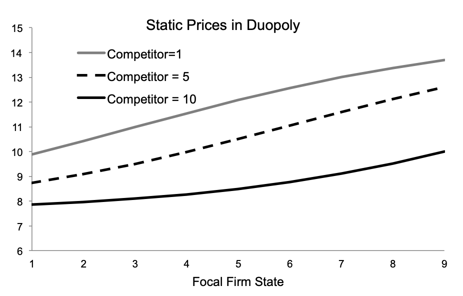 
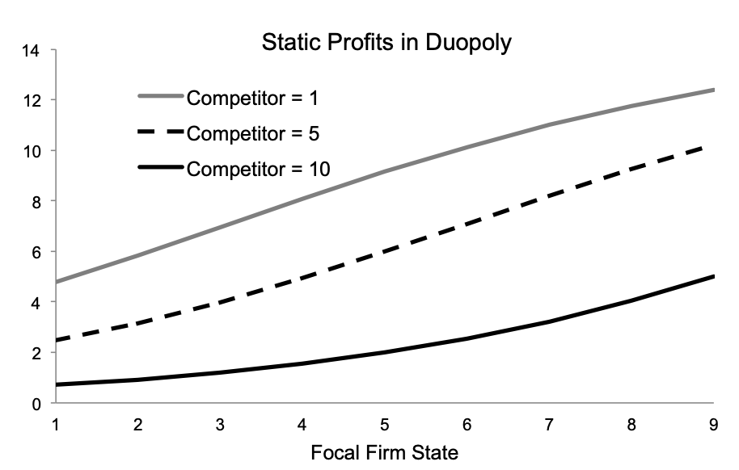 
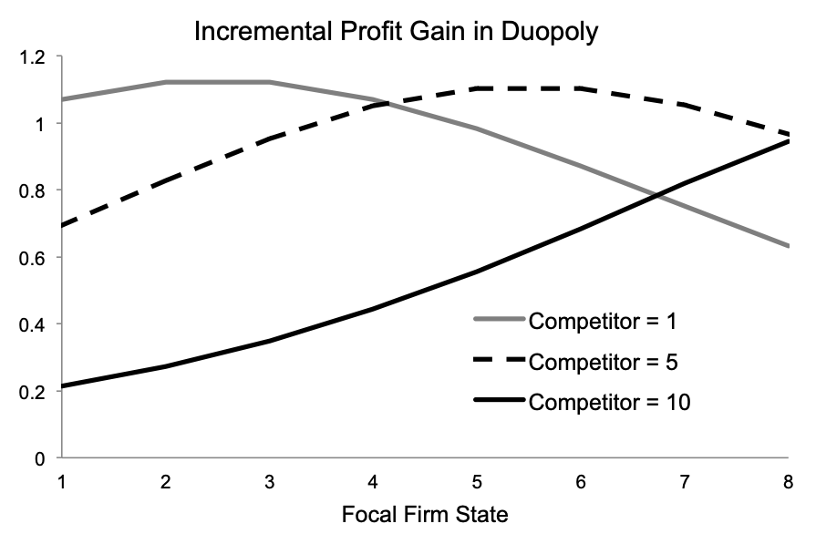 
Note: This figure shows the prices, profits, and incremental profits at each state in a duopoly as a function of competitor state. Incremental profits represents the increase in profits associated with increasing product quality by 1, holding rival’s quality fixed.

</figure>

**Merger Outcomes:** Next I explore some features of the equilibrium distribution of mergers. In this benchmark case there are no merger synergies. Mergers therefore only serve to eliminate a rival firm and do not contribute to the acquiring firm's product quality or directly contribute to innovation. In this case, greater than 90% of mergers include a firm operating at the leading edge of the quality ladder and the dominant firm always acts as the acquirer. In roughly 95% of cases, mergers reduce the number of active firms from 3 to 2 and in the other 5% they reduce the number of firms from 2 to 1.

Figure [2](#mergerhist) shows the distribution of acquired firms by product quality. This distribution is bi-modal, with a peak at medium-low quality and a peak just below the leading firm quality. Industry leading firms therefore use mergers both to eliminate both close rivals and potential rivals who have reached a certain quality cutoff. It is notable that there are very few acquisitions of truly nascent competitors who have only entered the industry at the lowest quality level. That is, dominant firms do not reflexively buy out new entrants but only acquire firms that have reached some minimum quality level. From the entrant's perspective, this provides additional incentive to invest and achieve the quality required to potentially be acquired.

Figure [3](#mergerhist3d) shows a three dimensional histogram of the state space just prior to mergers when $n=3$. The firm acting as acquirer in these mergers is almost always at the industry frontier, so the figure shows the distribution of states of the smaller 2 firms in the market. It provides additional insight on what is generating the pattern shown in Figure [2](#mergerhist). Essentially, it is the case that two smaller firms can co-exist with a firm operating at the industry frontier. This co-existence is made possible by the option value of a potential acquisition. Firms in the middle states are less likely to be acquired and it is unprofitable for 3 firms to exist simultaneously with one in this middle position. Finally, when there are two large firms it is profitable for a third small firm to exist because competition between them and the larger firm is less direct and there remains the prospect of a buyout.

An important fact about mergers is that they are entirely harmful to consumers in the short run. Because firms compete in prices and because there is horizontal differentiation between products, in all cases where firms merge and synergies are set to 0 mergers reduce consumer welfare. Consumers are harmed by the removal from the market of a product, by the reduction in price competition that causes prices to increase on remaining products, and by the lack of any offsetting cost efficiencies.[^17] In the next section results are shown with positive synergies but even in these cases the vast majority of mergers harm consumer welfare. This is not surprising, the model essentially stacks the deck against mergers that benefit consumers in the short run in order to highlight the difference between the static outcome and the long-term outcome.

<figure id="mergerhist">

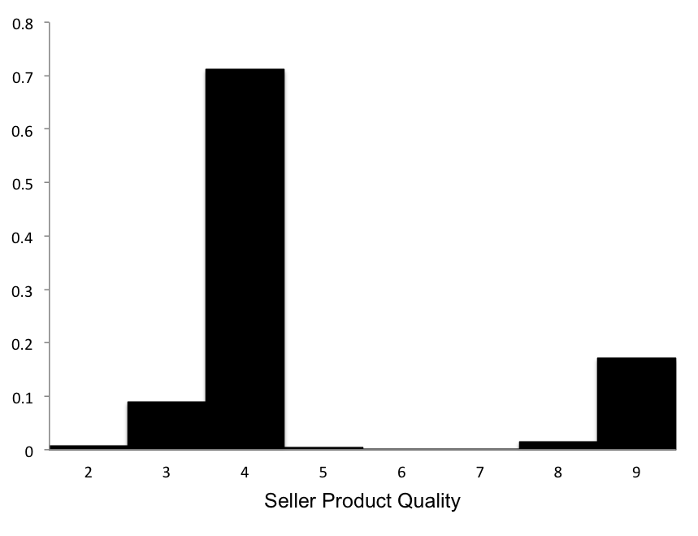 
Note: This figure shows the distribution of firms acquired in mergers by product quality.

<figcaption>Distribution of Acquired Firms</figcaption>
</figure>

<figure id="mergerhist3d">

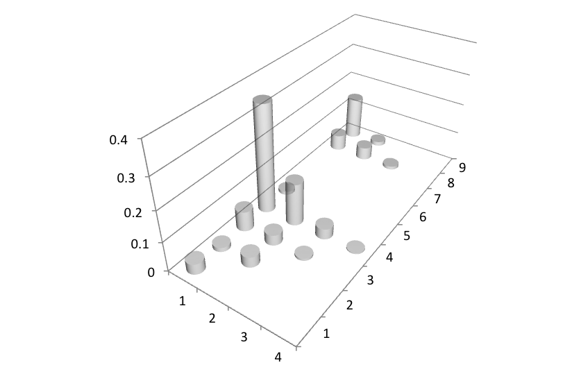 
Note: This figure shows the distribution of firms when n=3, just prior to a merger occuring. It shows the states of the two firms other than the firm operating at the industry frontier, who is the acquiring firm in almost all cases.

<figcaption>Distribution of Small Firms Prior to Mergers</figcaption>
</figure>

::::: threeparttable
::: {#table:params}
  --- ------ ----- ----- ----- ------ ------ ------ ------
        1      2     3     4     5      6      7      8
  5    2.8
  6    5.4
  7    15.0
  8    12.0   4.7   3.3   7.1   7.2    5.5
  9    5.0    5.7   9.8   6.5   11.9   13.1   18.2   24.8

  --- ------ ----- ----- ----- ------ ------ ------ ------

  : Buyout Cost
:::

::: tablenotes
This table shows the average buyout amount arising in equilibrium with buyer state shown in rows and seller state shown in columns. No mergers occur in equilibrium with a buyer in state 4 or lower.
:::
:::::

**Industry Outcomes:** Table [3](#outcomes_table) summarizes the key equilibrium outcomes with the benchmark parameterization in two different settings: one in which no mergers are allowed and one with no restrictions on mergers. In the benchmark case without firm acquisitions shown in column 1, the industry forms a relatively stable duopoly with 1.9 firms active in a period on average. When firms exit they are quickly replaced by a new entrant and entry and exit take place in roughly 10% of periods. In most periods the duopoly takes the form of a leader and a laggard on quality where the leading firm invests enough to typically maintain its position. The rate of innovation is measured as the average amount by which investment advances the industry past $\omega_{max}$, effectively defining innovation as the rate at which the industry's technological frontier advances. In the no-merger duopoly outcome, innovation occurs primarily when the laggard firm invests sufficiently to challenge the leading firm and the leading firm responds by investing significantly to regain ground on their rival.

When mergers are allowed with no restrictions, they occur frequently, in roughly 16% of periods. The most important result is that when mergers are allowed the rate of entry increases substantially from only $11\%$ of periods to roughly $27\%$ of periods. One of the results of this entry is that despite having mergers directly reduce competition, the result is only slightly fewer firms in the market, on average. This decreases from $1.91$ to $1.75$ and while the share of periods spent in monopoly grows substantially, mergers also increase the share of periods with 3 firms active. The result is an industry spending roughly $9\%$ of the time with three firms and $34\%$ of periods as a monopoly.

<figure id="postmergerdynamics">

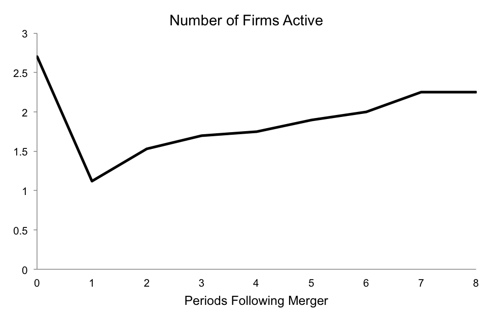 
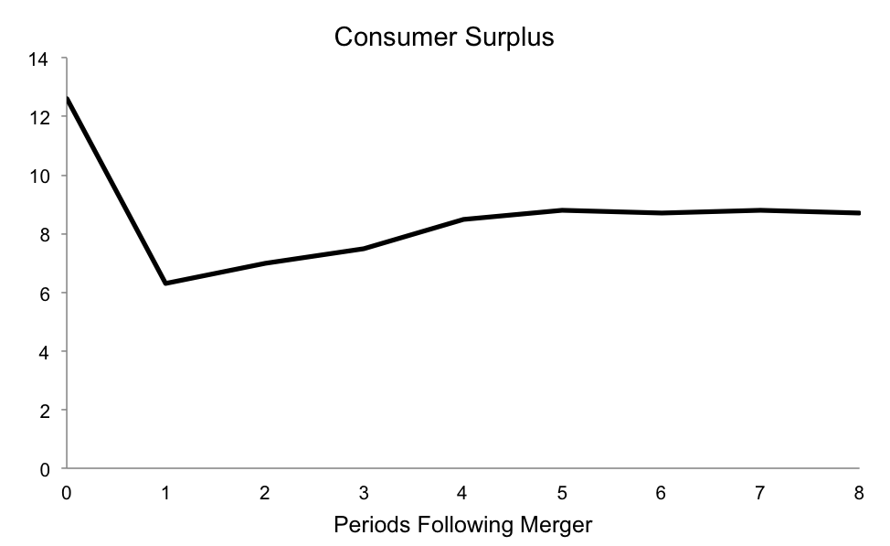 
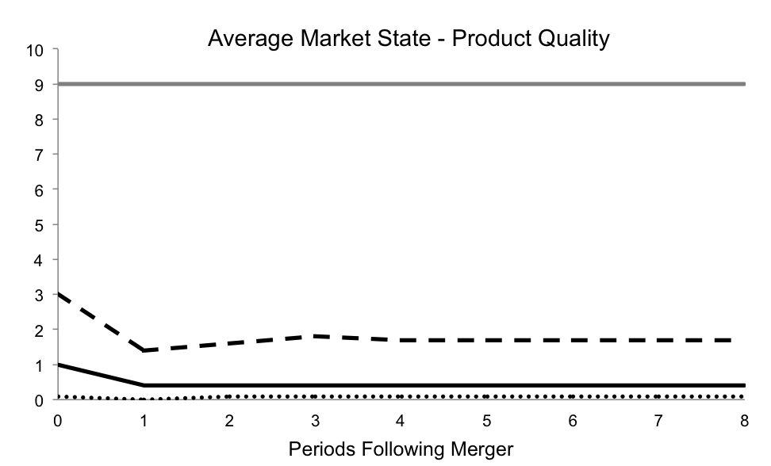 
Note: This figure shows how the industry reacts after a merger. In period 0 a merger occurs and the figures show the number of active firms, total consumer surplus, and the average individual firm states following the mergers. The bottom panel shows the average product quality for the 4 largest firms in the industry in each period. In each case the figure depicts the average outcome over a large number of simulations.

<figcaption>Industry Dynamics Following a Merger</figcaption>
</figure>

Figure [4](#postmergerdynamics) shows the industry dynamics following a merger. I simulate the model a large number of times and track the outcomes that follow a merger. The figures show the average over these simulations. We see that entering the period in which a merger occurs, the number of active firms is close to 3. This falls to nearly 1 following the merger and recovers to the long-term average after 6-8 periods. Similarly, the merger dramatically lowers average consumer surplus, cutting it in half from over 12 to roughly 6. This also recovers to the long-term average in 6-8 periods. The bottom figure shows the average states of up to 4 firms. The leading firm is always at the technological frontier. The merger reduces the average quality of the 2nd best firm, typically by eliminating it from the market altogether.

The main result of the benchmark comparison is that, despite the fact that mergers substantially reduce welfare in the short run, allowing mergers increases the average consumer surplus in the industry and the rate of innovation substantially. The rate of innovation increases from $.35$ to $.82$. In other words, the technological frontier advances by an average of 1 unit in 80% of periods as opposed to one third of periods. Consumers benefit in perpetuity from an increase in the technological frontier and so the increase in the endogenous rate of innovation dramatically increases long-term consumer welfare.

::::: threeparttable
::: {#outcomes_table}
                                      No Mergers   Mergers
  ---------------------------------- ------------ ----------
  **Firm Characteristics**
  Mean number of firms                   1.91        1.75
  Mean firm quality                      5.74        6.90
  Share of periods with exit           10.7$\%$    15.0$\%$
  Share of periods with entry          10.7$\%$    27.2$\%$
  Share of periods with mergers                    12.2$\%$

  **Investment**
  Total investment                       1.45        2.27
  Rate of innovation                     .35         .82
  Mean entrant investment                3.30        4.69
  Mean investment by market leader       1.18        1.45

  **Surplus**
  Mean consumer surplus                  7.75       10.02
  Mean total profit                     13.09       12.90

  **Firm Distribution**
  Share of periods in Monopoly           14%        34$\%$
  Share of periods in Duopoly           81$\%$      56$\%$
  Share of periods with 3 firms         5$\%$       9$\%$
  Share of periods with 4 firms        5e-4$\%$    4e-3$\%$

  : Comparison of equilibrium with and without mergers
:::

::: tablenotes
This table presents the results of a simulation of the industry for 500,000 periods from the equilibrium's recurrent class of states. This is a sufficient number of simulation periods that the results displayed do not vary over simulations and so no standard deviations are presented alongside them. In the simulation, the outcomes shown are measured in each period and the average is taken over periods. Total investment indicates the average sum total of investment undertaken by all firms in a period.
:::

:::::

**Preemptive Entry**

Figure [5](#entrates) shows that the rates of entry occurring for different numbers of incumbent firms. When there is only one incumbent in the market, entry occurs $86\%$ of the time in the mergers equilibria. Entry occurs more rarely in the no-mergers equilibrium, regardless of number of incumbent firms.

<figure id="entrates">

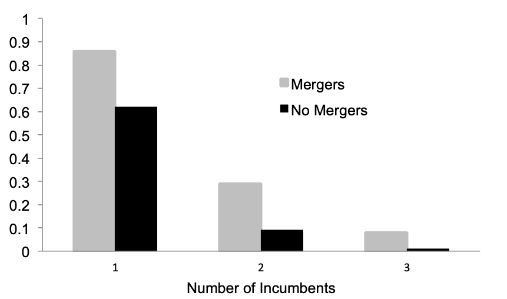 
Note: This figure shows the average rate of entry as a function of number of incumbent firms for the equilibria with and without mergers. This is computed as the average across all market states that appear in equilibrium across many simulations.

<figcaption>Entry Rates</figcaption>
</figure>

It is clear from Figure [5](#entrates) that the additional entry generated in the mergers equilibrium is not merely replacement entry after a merger reduces the number of firms below the stable duopoly number. This is because with mergers allowed, the average number of firms in the market actually increases, and entry rates are higher even when 2 or 3 incumbents are present, as shown in Figure [5](#entrates). Entry rates are higher at every market state. While antitrust economists have long known that entry can mitigate the anticompetitive effects of mergers, and entry is discussed in the Horizontal Merger Guidelines for this reason, the argument for entry here is distinct. The value created by entry is not about reducing market power of large, post-merger incumbents, but instead the prospect of a future buyout is generating new, additional entry that is increasing competition and innovation while also increasing consumer surplus.

# Exploration of Assumptions on Entry, Mergers and Investment

In this section I explore the parameter space to see how results depend on entry costs, the innovation ability of entrants and incumbents, the potential for merger synergies, and the degree of horizontal product differentiation.

## Entry Cost Distribution:

Entry costs are a central parameter of this model and a key feature of antitrust analysis. Policymakers typically take a lenient approach to mergers that would otherwise present consumers with static harm if entry is likely to occur rapidly following the merger. Figure [4](#postmergerdynamics) shows that in the benchmark case entry does occur relatively rapidly, reducing the harm to consumers of the acquisition and removal of a firm from the market. But the long-term effect of mergers in this case is not merely short-term harm alleviated by rapid entry. Instead, the prospect of a lucrative buyout provides a powerful incentive to enter and invest, generating greater competition and innovation and a higher steady state level of consumer welfare. Because this is the central dynamic in the model, I first explore how this result depends on the level of entry costs.

I vary average entry costs from low to high and trace out the average equilibrium outcomes. In each case entry costs are still stochastic, drawn from a uniform distribution around the average cost $c^E\pm 2$. Results are compiled for both the cases with and without mergers and are summarized in Figure [6](#entrycosthomo). At the high end of entry costs, in the setting without mergers the industry forms a stable duopoly with no entry or innovation. At the low end entry occurs in roughly 50% of periods and innovation and consumer welfare are high. Similarly, in the setting with mergers as entry costs increase the rate of entry falls substantially, as does the rate of innovation and consumer welfare.

Comparing the two scenarios as entry costs rise illustrates the mechanism by which mergers generate higher long-term consumer welfare. We see that when entry costs are low, consumer welfare is higher with mergers allowed than with no mergers. This is driven by the higher rate of entry and high innovation rate overcoming the fact that there are fewer firms on average as a result of mergers. The difference in innovation and thus consumer surplus is substantial.

As entry costs increase, the non-merger equilibrium forms a stable duopoly with neither entry nor exit and no innovation. The mergers equilibrium also forms a stable outcome as entry costs rise, but with a modest amount of entry by firms replacing those that have been acquired by larger firms. This is merely replacement entry and very little innovation occurs in this outcome. As result, consumers are harmed in the static sense by the merger with no offsetting increase in entry and innovation, and so total consumer surplus is lower than if mergers were not allowed. Thus for mergers to have beneficial long-term properties, entry costs must be sufficiently low to allow for speculative or preemptive entry and the subsequent competition and innovation that results.

<figure id="entrycosthomo">

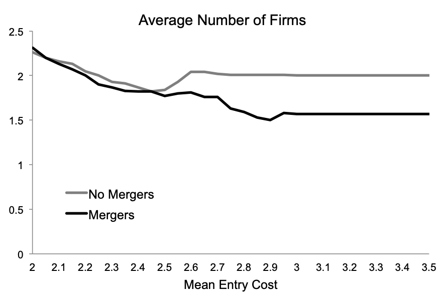 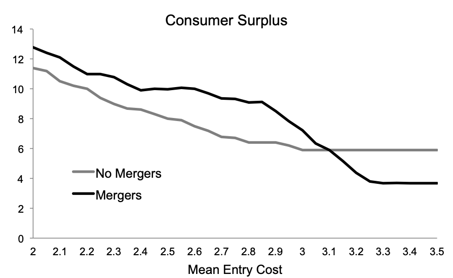 
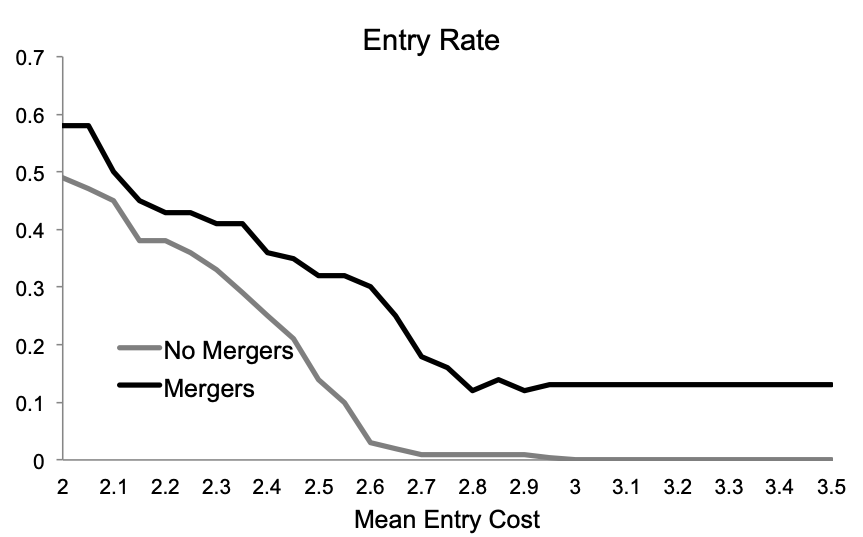 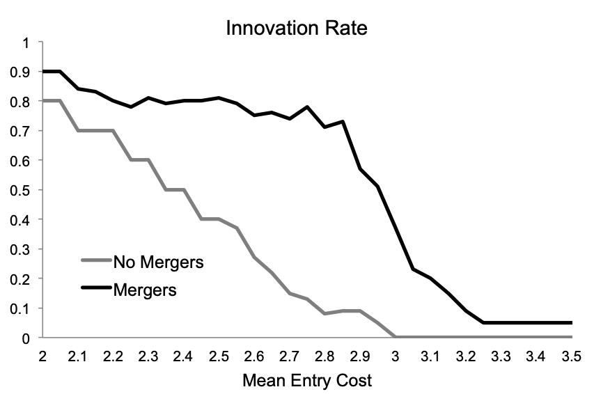 
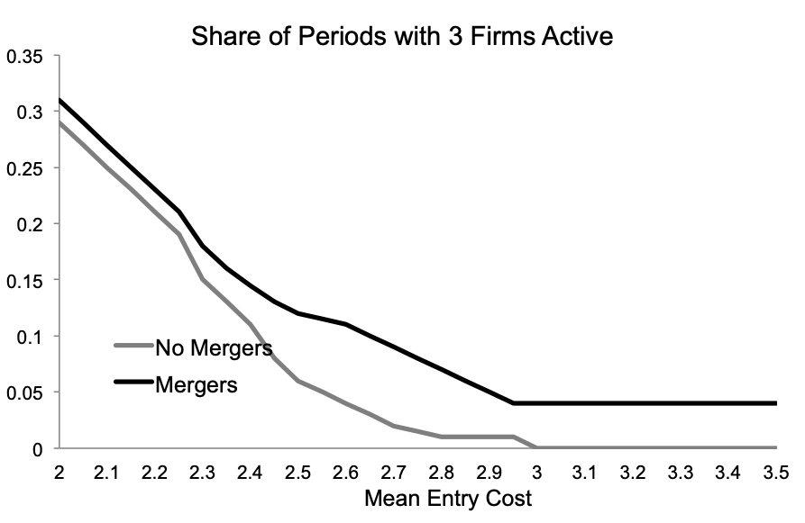 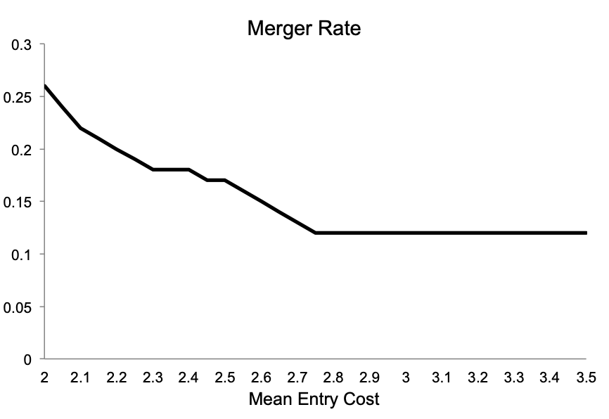 
Note: This figure shows the main equilibrium outcomes as average entry costs vary from low to high.

<figcaption>Equilibrium Outcomes as Entry Costs Vary</figcaption>
</figure>

## Merger Synergies: {#synergies}

Next I consider the prospect of synergistic mergers. In the benchmark case mergers do not generate any synergies or efficiencies. In the quality ladder model then, the combined firm simply takes the product quality of the larger firm and the acquired firm ceases to exist. This benefits the larger firm through lessened competition, but in practice the acquiring firm may take components of the acquired firm's product and incorporate it into a combined product with higher quality. In this case the new product would have quality $\omega' = \omega_B+\sigma\omega_S)$ where S indicates seller, B indicates buyer, and $\sigma$ is a parameter between 0 and 1 reflecting the degree of synergy.

**Discussion:**

Having firms combine their products rather than continuing to produce both and simply adjusting prices is not how mergers are typically treated in the literature on competition in Bertrand settings. This combination of product qualities can be thought of as representing the total utility consumers receive from a firm's offerings, which reflect a bundle of characteristics, and where $\sigma$ represents the degree of overlap in these characteristics.

For example, a company in an online setting may offer a mobile app product that has a number of map-based features including driving directions, links to online shopping, information on public transit options, information on specific business locations including consumer reviews, pictures, and links, as well as varying degrees of integration with other devices. If a new firm enters that offers one of these specific features that a large dominant firm currently lacks, they may acquire the new entrant and integrate the new feature into their existing product, increasing it's quality while also eliminating a rival in the online maps market.

A similar mechanism applies in some pharmaceutical mergers, a setting which has attracted much interest with regards to the effects of these mergers on long term innovation. For instance, when Merck bought Idenix in 2014 they stated that they planned to "combine the drug with two of its own drugs that work by different mechanisms for a triple-drug regimen that could potentially cure most types of hepatitus C in less than two months ([@wsjmerck]). Another setting to which this model applies is in online services where firms collect data on consumers and sell this data to other interested parties. Acquiring a rival both reduces the number of competitors and increases the quality of the acquiring firm's product. A recent merger of this sort is the Nielsen acquisition of Arbitron, in which the impact on innovation incentives played an important role in the FTC's decision.

An added benefit of this approach to modeling mergers is that it fits better within the quality ladder setting, where firms and products are defined by their position in vertical quality space. This is a more natural setting to study innovation and particularly the relationship between competition and innovation, and has been used by [@greensteinramey], [@acemogluakcigit], [@goettlergordon14], [@acemoglucao], and [@borkovskyqme], among others, for this purpose. Empirical work on mergers and industry dynamics is more likely to take the form of a quality ladder as well. In this case vertical considerations are more important than static horizontal ones like the diversion ratio between firms and the pricing externality.[^18] While the product synergy approach used here sacrifices realism with respect to static horizontal features, it does so to focus more on what is relevant to the study of long-term innovation.

**Results:**

I explore the role merger synergies has on equilibrium outcomes by varying $\sigma$ in small increments from 0 to 1 and re-solving for a new equilibrium at each point. The main results are presented in Figure [7](#synergyhomo). As synergies increase, the rate of innovation increases dramatically, and thus consumer surplus increases as well. This is possible because mergers can generate additional innovation beyond that generated by firm investment. If two high quality firms merge the new product may have a quality above the current technological frontier. Thus the merger advances the frontier and generates innovation directly.

As merger synergies increase, it becomes increasingly common for a new entrant to enter and immediately be bought out. This generates synergies and the merger surplus is split between the incumbent and new entrant. Notably, as the degree of potential synergies increases, this effect eventually flattens and as synergies approach 1 the rate of innovation levels off. This implies that the process faces diminishing returns in $\sigma$ and it is not necessary for $\sigma$ to be 1 for consumers to benefit from synergistic mergers. Even modest synergies can provide significant long-term benefits to consumers through the increased innovation they spur.

<figure id="synergyhomo">

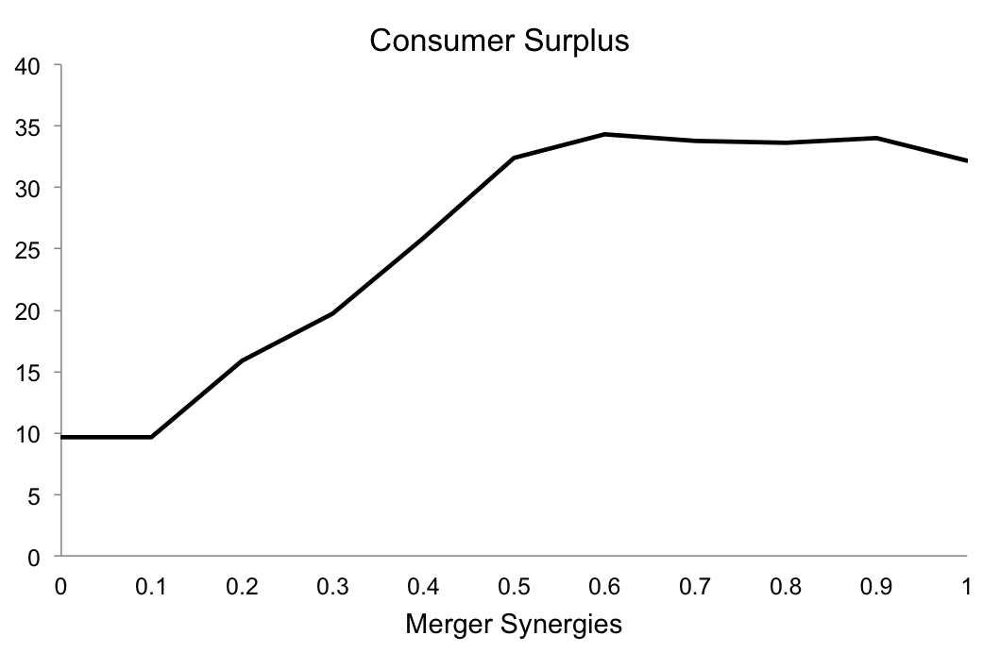 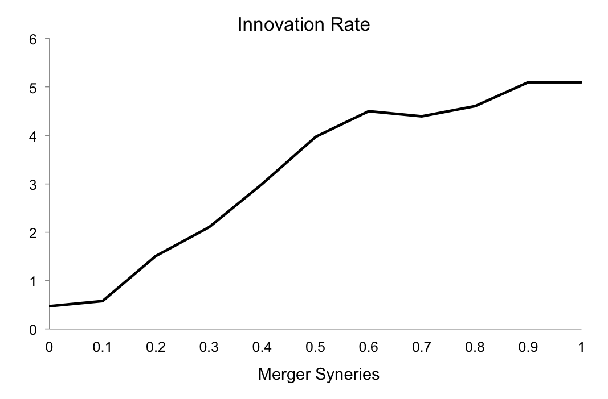 
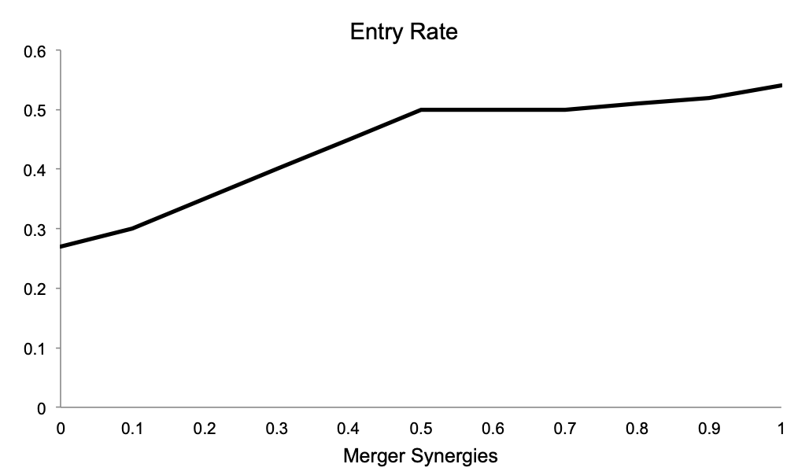 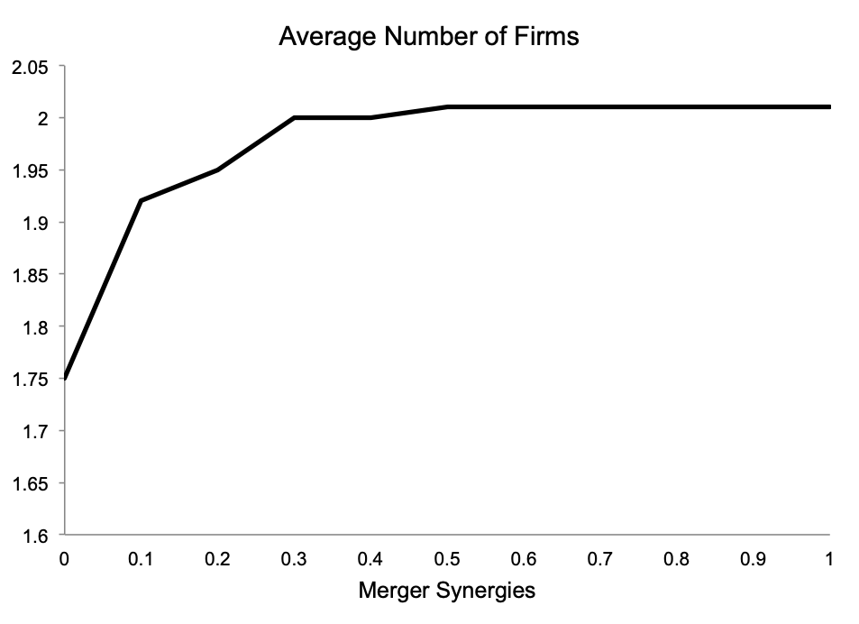 
Note: This figure shows the main equilibrium outcomes as merger synergies vary from 0 to 1. For each value of <em>σ</em> a new equilibrium is computed and simulated from.

<figcaption>Equilibrium Outcomes with Merger Synergies</figcaption>
</figure>

## Entrant Product Quality:

Next I explore the assumption that entrants can enter at any point in the quality ladder. In the benchmark specification there is no cap on the product quality of a new entrant, only increasing entry costs prevent firms from joining the industry at an already high level. In some settings, particularly those with complex technologies or network effects, this may be unrealistic. I therefore compute equilibrium outcomes for different specifications in which this assumption is tightened.

Let $\overline{\omega_E}$ represent the maximum quality attainable by an entrant. Above $\overline{\omega_E}$ entry costs can be thought of as infinite. Figure [8](#caphomo) shows equilibrium outcomes as $\overline{\omega_E}$ increases from 1 up to $\overline{\omega}$, the highest possible quality. When there is no limit on entrant quality, we observe the familiar outcome that the mergers equilibrium displays significantly higher innovation and consumer surplus than the no merger equilibrium.

As the maximum possible entrant quality decreases, the gap in consumer surplus between the two models decreases as well. At the point where an entrant can only enter at the lowest possible quality, the non mergers equilibrium results in higher consumer welfare than the mergers equilibrium. In this case, there is still more innovation with mergers but the level is quite low and there is relatively little entry. The results in these figures can be interpreted by viewing the firm distribution in Figure [3](#mergerhist3d). Firms will prefer either to enter at a low state or a relatively high state, with less value associated with middle states. We therefore see a jump in entry rate and innovation rate when entrants have the ability to enter at states 6 and above.

The main result that mergers increase innovation and thus welfare therefore depends on both relatively low entry costs and the ability of entrants to develop products with at least middling quality. When new entrants can only enter the bottom of the quality ladder, the static harm to consumers caused by the mergers cannot be outweighed by greater innovation.

<figure id="caphomo">

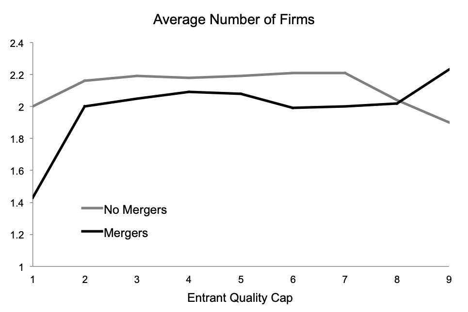 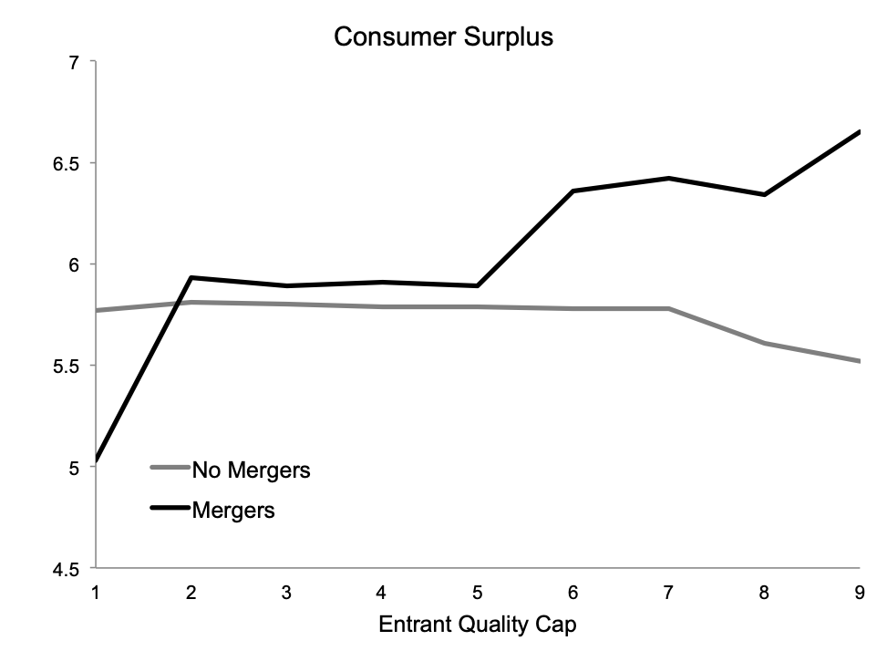 
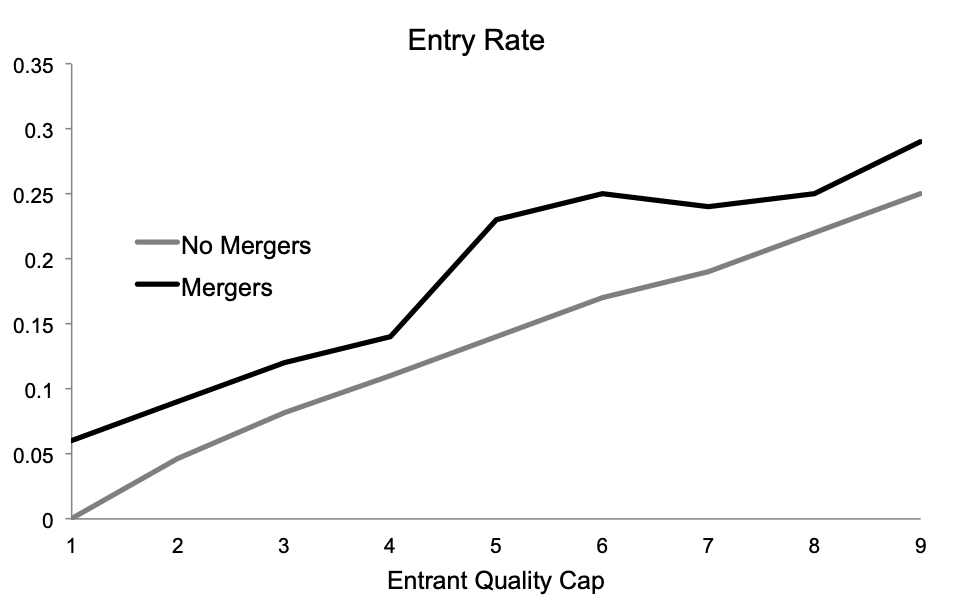 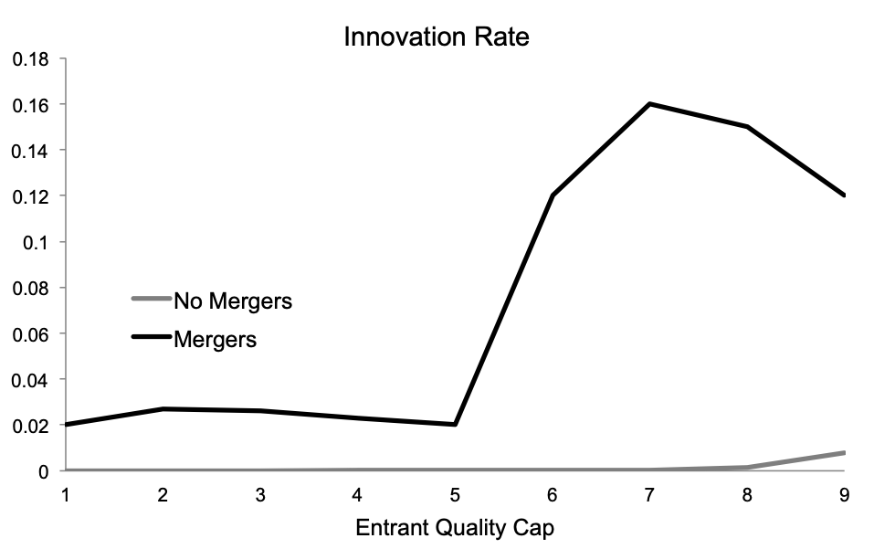 
Note: This figure shows the main equilibrium outcomes as the maximum possible entrant quality varies from low to high.

<figcaption>Equilibrium Outcomes as Potential Entrant Quality Varies</figcaption>
</figure>

## Incumbent Innovation Capacity

In the baseline model, firms are able to innovate to achieve any level of $\omega$ in any period. Indeed, in rare circumstances when a firm receives a set of very low investment costs, we do observe large changes in $\omega$ in a single period. This investment technology follows [@nockeetal14] and is important because it is "merger neutral" in the sense that it does not change the investment opportunities that are available in the market and avoids mergers that mechanically reduce the industry's technological possibility set and hence total investment. While important, it may not be realistic for all industries. In some industries, it is impossible regardless of investment costs to dramatically increase the quality of a product quickly.

I examine the results after varying the amount of product innovation firms are capable of from the baseline of no limit down to a limit of one incremental unit per period. Let $\tilde{I}$ represent this cap, such that $\omega'-\omega \leq \tilde{I}$, or equivalently $c_i=\infty$ for $\omega' > \omega_i +  \tilde{I}$.

Results are presented in Table [4](#disruptability). We see that when firms can only advance by 1 in each period, the previous results are reversed. There is essentially no innovation and long run consumer welfare is lower with horizontal mergers than without. For middle levels of innovation capacity, mergers produce slightly higher levels of innovation and welfare. Finally, when there is no cap on innovation, the previous result is seen again, mergers create the incentive for much higher innovation and long run consumer welfare.

::::: threeparttable
::: {#disruptability}
+:-------------------+--------:+--------:+--:+--------:+--------:+--:+--------:+--------:+--:+--------:+--------:+--:+----:+-----:+
|                    | $\tilde{I}=1$     |   | $\tilde{I}=3$     |   | $\tilde{I}=5$     |   | $\tilde{I}=7$     |   | No Cap     |
+--------------------+---------+---------+---+---------+---------+---+---------+---------+---+---------+---------+---+-----+------+
|                    | NM      | M       |   | NM      | M       |   | NM      | M       |   | NM      | M       |   | NM  | M    |
+--------------------+---------+---------+---+---------+---------+---+---------+---------+---+---------+---------+---+-----+------+
|                    |         |         |   |         |         |   |         |         |   |         |         |   |     |      |
+--------------------+---------+---------+---+---------+---------+---+---------+---------+---+---------+---------+---+-----+------+
| Rate of Innovation | 0       | 0       |   | 0       | .05     |   | .07     | .11     |   | .19     | .35     |   | .35 | .81  |
+--------------------+---------+---------+---+---------+---------+---+---------+---------+---+---------+---------+---+-----+------+
| Consumer Surplus   | 5.8     | 4.8     |   | 5.9     | 6.1     |   | 6.2     | 6.7     |   | 7.1     | 9.1     |   | 7.8 | 10.0 |
+--------------------+---------+---------+---+---------+---------+---+---------+---------+---+---------+---------+---+-----+------+

: Innovation Capacity and Mergers
:::

::: tablenotes
Each column shows the rates of innovation and long run average consumer surplus with mergers and with no mergers.
:::

:::::

## Horizontal Product Differentiation

In this section, I examine the role of horizontal product differentiation. This can thought of as an analogy to "contestability" in the sense of [@shapirobullseye], meaning the degree to which firms who successfully innovate can capture higher market share as a result.[^19] To do so I manipulate the scale of the individual level utility shock. This is represented by the parameter $\phi_\epsilon$ in the consumers utility function, the dispersion of the random component of utility. When this parameter is high, preferences exhibit less heterogeneity, consumers agree more on which product offers the highest utility and firms with higher product quality capture a higher market share. When $\phi_\epsilon$ is low, preferences are more horizontally differentiated.

When horizontal product differentiation is low, a successful innovation translates into a large increase in both market share and profits. When it is high, by contrast, there is less reward to innovation because a larger share of utility comes from random or horizontal components. In industries with a low degree of horizontal product differentiation, the benchmark rate of innovation will naturally be higher because the vertical component of utility and thus a product's quality are valued more highly by consumers. But the relative effects of mergers is potentially ambiguous. To resolve this, I compare equilibria with and without mergers in industries with varying levels of horizontal product differentiation. The results are shown in Table [5](#contestability).

As horizontal product differentiation decreases the effects of mergers change dramatically. When $\phi_\epsilon=1.25$, there is slightly higher innovation and consumer welfare in the no-mergers equilibrium . When horizontal product differentiation decreases to $\phi_\epsilon=.75$, the rate of innovation and average consumer welfare are both substantially higher in the mergers equilibrium then the no-mergers equilibrium. This result is somewhat counterintuitive, because when horizontal product differentiation is higher, a higher share of the gains from innovation come from business stealing. Merging firms should internalize this incentive and invest less. Indeed, they do, investment by leading firms falls, relative to the no-mergers case. But this effect is outweighed by a large increase in entry and innovation by new entrants. The reason is that when horizontal product differentiation is low, monopoly is relatively more valuable. The result is that the equilibrium buyout offer $\tau$ at the modal merger state is 2.4 times higher when $\phi=.75$ than when $\tau=1.25$.

::::: threeparttable
::: {#contestability}
+:------------------------+-----------:+-----------:+--:+----------:+----------:+--:+-----------:+-----------:+--:+-----------:+-----------:+
|                         | $\phi_\epsilon=.75$     |   | $\phi_\epsilon=1$     |   | $\phi_\epsilon=1.15$    |   | $\phi_\epsilon=1.25$    |
+-------------------------+------------+------------+---+-----------+-----------+---+------------+------------+---+------------+------------+
|                         | NM         | M          |   | NM        | M         |   | NM         | M          |   | NM         | M          |
+-------------------------+------------+------------+---+-----------+-----------+---+------------+------------+---+------------+------------+
|                         |            |            |   |           |           |   |            |            |   |            |            |
+-------------------------+------------+------------+---+-----------+-----------+---+------------+------------+---+------------+------------+
| Rate of Innovation      | .51        | .89        |   | .35       | .82       |   | .33        | .12        |   | .12        | 0          |
+-------------------------+------------+------------+---+-----------+-----------+---+------------+------------+---+------------+------------+
| Consumer Surplus        | 9.82       | 12.13      |   | 7.75      | 10.02     |   | 7.50       | 7.09       |   | 6.99       | 6.04       |
+-------------------------+------------+------------+---+-----------+-----------+---+------------+------------+---+------------+------------+
|                         |            |            |   |           |           |   |            |            |   |            |            |
+-------------------------+------------+------------+---+-----------+-----------+---+------------+------------+---+------------+------------+
| Leading Firm Investment | 1.22       | 1.52       |   | 1.18      | 1.45      |   | 1.17       | .60        |   | .90        | .78        |
+-------------------------+------------+------------+---+-----------+-----------+---+------------+------------+---+------------+------------+
| Monopoly Profits        | 13.31      | 13.31      |   | 12.47     | 12.47     |   | 11.99      | 11.99      |   | 11.69      | 11.69      |
+-------------------------+------------+------------+---+-----------+-----------+---+------------+------------+---+------------+------------+

: Horizontal Product Differentiation and Innovation
:::

::: tablenotes
Each column shows the rates of innovation and long run average consumer surplus with mergers and with no mergers.
:::

:::::

# Discussion and Conclusion

The relationship between horizontal mergers and innovation is increasingly important but poorly understood. Firm decisions to invest in improving product quality interact in many ways with the ability to merge and acquire other firms. To examine these interactions requires simultaneously modeling endogenous entry, investment behavior, and endogenous mergers. In addition, firms must have a broad ability to innovate, the long-run rate of innovation must be made endogenous, and the mergers technology must allow for a flexible and rich pattern of mergers.

This paper develops a framework for studying these issues and a method for improving computation of models of industry dynamics. The paper then shows that in a model with these features, traditional horizontal mergers policy based on static welfare analysis may be counterproductive in the long run. Even when mergers are practically designed to fail a static consumer welfare test, the long term result when they are allowed is substantially higher innovation and consumer welfare. The prospect of a windfall gain from a buyout offer by the leading firm generates additional entry that otherwise would not occur. This is possible even with a single dominant firm in an industry and does not require competition among dominant firms to buyout nascent competitors. Furthermore, this is distinct from the replacement entry post-merger discussed in the Horizontal Merger Guidelines.

Combined, these results give guidance to antitrust policymakers regarding when there is a potential long run benefit of allowing mergers that are harmful to consumers in the short run. First, it is necessary that entry costs or barriers to entry be low. This is a distinct argument than the standard view of barriers to entry, however. Entry does not merely alleviate the harm to consumers caused by the merger, with an entrant lured into the industry post-merger by the prospect of less competition and higher profits. Instead, entrants invest and preemptively enter the industry partially due to the incentive provided by the prospect of a lucrative buyout This entry then results in higher competition and more innovation.

Second, a perhaps more limiting condition is that this dynamic is most likely to occur in industries where innovation is occasionally rapid and disruptive. If entrants can only enter with a very low quality product or if incumbents cannot make large advances in product quality in a short time period, the additional innovation incentives generated by mergers will no be able to outweigh the short-term harm to consumers they cause.

While the nature of innovation in an industry is a feature of underlying technology and thus out of the scope of policy, it may be observable and therefore a useful factor for a merger authority to consider. Similarly, the degree of horizontal product differentiation in an industry is an important determinant of the innovation incentives generated by mergers. To the extent that horizontal product differentiation is analogous to a broader notion of contestability, policymakers may have tools at their disposal to promote this. A more contestable market can be achieved by restricting the use of long-term contracts, bundling requirements, and other practices that raise switching costs. In innovative industries this policy may be more effective in promoting consumer welfare and innovation than strict merger review.

While this paper's main result effectively argues for leniency in horizontal merger review, these result suggests greater attention should be paid by antitrust authorities to actions taken by firms that raise entry barriers or decrease contestability.

# Appendix A: Algorithm for solving the model

This appendix describes the algorithm used to solve for an equilibrium to the model described in section 3. This builds on the work of [@pakesmcguire94] and [@fershtmanpakes] but adds a novel element from the reinforcement learning literature to improve convergence properties. It has been noted that the basic stochastic algorithm often performs badly on convergence. Indeed, without the changes described below the basic algorithm almost always fails to reach an equilibrium. Here I review some of the reasons for this and how they can be fixed. For greater detail on the basic algorithm see [@pakesmcguire94] and [@fershtmanpakes].[^20]

The algorithm proceeds iteratively, simulating the dynamic game using a stored value function that firms use to generate policies regarding entry, exit, investment, and mergers. At each step of this simulation, the value function is updated with the payoffs realized for each action taken or not taken. The key components that are stored in memory are the current state of the industry at each iteration $k$, called $\Omega_k$, the stored value functions defining payoffs for each action at that state: $W^I_k(\Omega_k, x_i)$, $W^E_k(\Omega_k, xe_i)$, and $W^M_k(\Omega_k, i,j)$, and a counter that stores the number of prior visits to state $\Omega_k$ to that point: $h^I_k(\Omega_k, x_i)$, $h^E_k(\Omega_k, xe_i)$, and $h^M_k(\Omega_k, i,j)$. If $h^I_k(\Omega_k, x_i)=0$, $W^I_k(\Omega_k, x_i)$ is empty. When the state $(\Omega, x_i)$ is reached for the first time, $W^I_k(\Omega, x_i)$ is set to an initial value and updated from there.

Profits $\pi(\Omega)$ are computed offline for all states. Each value function is initialized at some level that I discuss in more detail below. The timing is as follows, at each iteration $k$:

1.  At state $\Omega_k$ draw from memory:$W^I_k(\Omega_k, x_i)$, $W^E_k(\Omega_k, xe_i)$, $W^M_k(\Omega_k, i,j)$, $h^I_k(\Omega_k, x_i)$, $h^E_k(\Omega_k, xe_i)$, and $h^M_k(\Omega_k, i,j)$.

2.  For all incumbent firms $i$ and for the potential entrant, draw investment costs $\tilde{c_i}$

3.  Incumbents solve: $$
    \max_{x_i}\{-C(\tilde{c_i},x_i)+W^I_k(\Omega_k,x_i)\}
    $$ and exits if the max of this term is less than zero.\
    Entrants solve: $$
      \max_{xe_i}\{-C(\tilde{c_i},xe_i)+W^E_k(\Omega_k, xe_i)\}

    $$ and enter if the max of this term is greater than zero.

4.  Randomly draw the industry-wide depreciation shock $\eta$.

5.  Using $\eta$ and the investment, entry and exit decisions of incumbents and the potential entrant, update the market state from $\Omega_k$ to $\Omega'_k$.

6.  Begin the merger stage by drawing a random ordering of firms to act as merger proposers.

7.  Loop over all firms, for each solve for the best merger partner as $max_j W^M_k((\Omega'_k, i,j)$. If the value of merging for both firms is higher than the option value of letting the next firm in the merger order proceed, they agree to merge, $\tau_{ij}$ is calculated, $\Omega'_k$ is updated to $\Omega_{k+1}$, and the merger stage ends. During this stage, $\Omega_{k+1}$ is necessarily rounded to the nearest integer value. Once a merger has occurred or all firms have had a chance to propose, the stage ends.

8.  Profits for all firms are calculated as $\pi(\Omega_{k+1})$.

9.  Stored value functions are updated as: $$
    W^I_{k+1}(\Omega_k,x^*_i) = \alpha^I(\Omega_k) \beta [\pi(\omega'_i) - FC + \mathbb{E} W^I_k(\Omega_{k+1})] + (1-\alpha^I(\Omega_k) ) W^I_k(\Omega_k,x^*_i)
    $$ $$
    W^E_{k+1}(\Omega_k,xe^*_i)= \alpha^E(\Omega_k) \beta [\pi(\omega'_i) - FC +\mathbb{E} W^I_k(\Omega_{k+1})] + (1-\alpha^E(\Omega_k) ) W^E_k(\Omega_k,xe^*_i))
    $$ If firm $i$ is acquired by firm $j$: $$
    W^M_{k+1}(\Omega'_k, i,j)= \alpha^M(\Omega'_k,i,j) \tau_{ij}  + (1-\alpha^M(\Omega'_k,i,j) ) W^M_k(\Omega'_k, i,j)
    $$ If firm $i$ acquires firm $j$: $$
    W^M_{k+1}(\Omega'_k, i,j)= \alpha^M(\Omega'_k,i,j) [ \mathbb{E} W^I_{k}(\Omega_{k+1})-\tau_{ij} ] + (1-\alpha^M(\Omega'_k,i,j) ) W^M_k(\Omega'_k, i,j)
    $$ where $\alpha^I(\cdot)$, $\alpha^E(\cdot)$, and $\alpha^M(\cdot)$ are weighting functions to be described in detail below. In addition, counters $h^I_k\cdot)$, $h^E_k(\cdot)$, and $h^M_k(\cdot)$ are incremented by 1.

10. Return to step 1 at state $\Omega_{k+1}$.

The algorithm is periodically paused to test for whether an equilibrium has been reached. This test follows [@fershtmanpakes] and checks whether the value functions are consistent with equilibrium notions described in section 3.2. This simulates a sample path of the model and keeps a separate memory of the distribution of outcomes reached at each state on this sample path. The mean squared difference between these outcomes and the value function stored in memory is used to calculate bias. This is done separately for $W^I_k(\cdot)$, $W^E_k(\cdot)$, and $W^M_k(\cdot)$ and the highest bias value of the three is compared to $.001$ to determine if an equilibrium has been reached.

In most cases, this equilibrium calculation is taken inside a larger loop over possible parameter values as part of the Simple Continuation Method. This method traces out the equilibrium outcomes of the model as parameters vary. In this case, when an equilibrium is reached the value functions $W^I_k(\cdot)$, $W^E_k(\cdot)$, and $W^M_k(\cdot)$ are saved but the counters $h^I_k\cdot)$, $h^E_k(\cdot)$, and $h^M_k(\cdot)$ are returned to 1 and the weighting functions described below are similarly updated

A key consideration in the algorithm is what function to use to weight realized payoffs in iteration $k$ and how much to weight the current estimate of $W_k(\cdot)$. One alternative would be to simply use $\alpha^I(\cdot) = \frac{1}{h^I_k(\Omega_k)}$, ie the number of previous visits to that state. This ultimately would give value functions equal to the arithmetic mean of realized payoffs across all visits to that state. One problem with this approach is that if the initialized value functions are far from their true values, it could take a very long time for the algorithm to converge.

A second and more serious problem with the algorithm as described above is that for discrete choices such as entry and exit, it can get "stuck" at a suboptimal choice. For example, if the value functions for firm investment are set high in order to encourage exploration, firms will initially invest large amounts and rarely exit. At the same time as they make these choices, potential entrants are exploring entry strategies and updating their entry value function with the realized outcomes. In the case where incumbents invest highly entry is rarely profitable and so in certain states potential entrants may update all entry options as having negative value. Once they have done so, entry will cease at those states and as incumbent firms investment policies converge towards equilibrium the potential entrant will have stopped testing entry even though it may be profitable to do so.

I solve this second problem by implementing a strategy from the reinforcement learning literature known as $\epsilon$-greedy exploration. In this case, firms will take what they perceive as being the optimal action with probability $1-\epsilon$ and with probability $\epsilon$ they will choose a policy at random from their set of possible actions. The researcher sets the initial value of $\epsilon$ to encourage exploration and as the algorithm proceeds it declines slowly to 0. In states in which firms take suboptimal policies as a result of this process, they learn and update values for those policies but the other firms in the market do not update at those states.

This approach is simple but has the advantages that it ensures each action will be taken a large number of times and that policies ultimately converge to the optimal ones. In practice, without implementing this strategy the algorithm almost always converged to an outcome where a suboptimal discrete choice was taken and which was strongly rejected as an equilibrium outcome by the testing procedure. This would remain true regardless of how long it ran. Even if this extreme case of non-convergence were not possible, it is highly likely the $\epsilon$-greedy exploration improves the speed to convergence of even a simple model.

## Computational details

Here I provide specific details on the implementation of the algorithm. For incumbent and entrant value functions, I initialize the values above the level of discounted profits if the state they entered were permanent. A high initialization is useful for ensuring firms explore their strategy space early on. That is: $$
W_0^I(\Omega) = \frac{1.1\pi(\Omega)}{1-\beta}.
$$ Merger value functions are set at a flat constant value of $5$, which is high enough to encourage exploration. For all policies, $\epsilon$ is set initially at $.1$ and declines such that $\epsilon' = .9\epsilon$ every $200,000$ iterations.

The weighting functions used are: $$
\alpha^I(\Omega_k)=\frac{1}{min(h^I_k(\Omega_k, x_i), \bar{h}^I)}
$$ where $\bar{h}$ is a cap on high $h_k(\cdot)$ for weighting purposes. This effectively places more weight on the more recent $\bar{h}$ observations. In practice, $\bar{h}$ begins at 100 and doubles every $1,000,000$ iterations until it ceases to bind. In all cases, the test concluded that an algorithm had been reached before at most $350$ million iterations and in some cases much sooner.

[^1]: [@katzshelanski] and [@gilbert06] discuss the increasing importance of innovation in merger analysis. The 2010 Horizontal Merger Guidelines introduced a section dealing with innovation, and in the years 2013-2015, the Department of Justice challenged mergers in part due to concerns about innovation incentives in online platforms, online display advertising, chemicals, computer cir cuits, aircraft components and beer. For more see the Annual Report on Competition Policy Developments in the United States for those years, jointly produced by the DOJ and FTC.

[^2]: A long literature in economics considers this topic. Notably, [@aghionetal] has shown a inverted-U shaped relationship between industry concentration and innovation.

[^3]: [@hausertellis] identify innovation as "one of the most important issues in business research today."

[^4]: This internalization effect is closely related to the notion of innovation markets developed by [@gilbertsunshine].

[^5]: This has been cited as a particularly important issue in recent pharmaceutical mergers. A notable example is the Merck purchase of Idenix in 2014.

[^6]: Mergers are frequently a response to a larger shock to technology, preferences or regulations that would cause firms or the entire industry to expand or contract in the absence of a merger [@harfordmergers], for instance, shows that industry level merger waves are primarily driven by "economic, regulatory or technological shocks." In addition, mergers strongly cluster over time and industries, and both the decision to merge and the decision to invest have strong strategic components that depend on rivals' actions. These factors make finding causal evidence from pre and post-merger R$\&$D levels very difficult. Even if a plausible instrument could be found, it is unlikely the effects of mergers induced by this instrument would be generalizable to other settings. See [@nevowhinston] for more on this point. Recent attempts have been made to estimate structural models of merger dynamics, including [@jeziorski14] in the radio industry, [@igamihdd] the hard disk drive industry, [@nishidayang] in retail, and [@stahlmergers] in broadcast television.

[^7]: [@gowr99] discusses the challenges of solving a dynamic model with endogenous mergers and presents a lengthy discussion of the flaws inherent in static models and models of exogenously imposed mergers.

[^8]: [@cheongjudd] and [@chen] present numerical results showing that the welfare conclusions of static models can be overturned in the long run. [@cheongjudd] show that even in Cournot type industries mergers may be profitable in present value terms. Each of these consider only exogenous mergers.

[^9]: [@federicoetal1] and [@federicoetal2] study this question in a simple two-stage model. They find that mergers reduce the incentives to innovate for the merging firms, as they internalize the business stealing externality associated with innovation. This effect outweighs the increase in innovation brought about by higher post-merger profits due to the reduction in product market competition. The model does not allow for post-merger entry by new firms that may ameliorate this second effect and mergers always make consumers worse off. Similarly, [@mottamergers] studies both quality-enhancing and cost-reducing investment incentives in a two-stage model without entry and find that mergers harm consumers if there are no corresponding efficiency gains.

[^10]: Specifically, [@shapirobullseye] uses the definition "The prospect of gaining or protecting profitable sales by providing greater value to customers."

[^11]: [@shapirobullseye] calls this "arguably the most important question in the field of industrial organization."

[^12]: One reason previous papers have resisted considering dynamic models of mergers in industries with more than 2 firms is that there is no fully satisfactory solution to the bargaining problem merging firms must solve due to the fact that there is a positive externality being conferred on the non-merging firm. I use the bilateral Nash bargaining outcome, effectively ignoring the effect of the merger on the non-merging firm. The externality still effects outcomes however, as firms might strategically wait or turn down a merger opportunity in cases where they would benefit more from their two rivals merging.

[^13]: This prevents the algorithm from getting "stuck" in non-equilibrium values. It is referred to in the machine learning literature as an epsilon-greedy or epsilon-decreasing strategy. More detail on how this is implemented can be seen in Appendix A.

[^14]: A similar procedure is followed by [@borkovskyqme] and [@borkovskybrandbuilding].

[^15]: The empirical finance literature finds inconclusive results on the shares of a merger's surplus going to either party, but most work finds the shares roughly equal. See, for instance, [@ahern].

[^16]: Because I present results for the long term stationary distribution of industry outcomes, the starting point of this simulation does not effect the results provided it is in the recurrent class. Unlike in other dynamic industry models, such as [@besankoetallbd], there is no distinction between the short term and long term distribution of industry outcomes.

[^17]: As noted by [@ackerbergrysman] and others, the way taste heterogeneity is represented in logit style models means that reducing the number of products available reduces total consumer surplus, even holding all else equal.

[^18]: An alternative approach would be to retain multiproduct firms using the method of [@gowrstatespace], although this would inevitably face an insurmountable computational limitation as firms continue to merge over time adding more and more products to their portfolios.

[^19]: This is distinct from how the term contestable is used by [@baumolcontestable] who used it to referred to a market with frictionless reversible entry.

[^20]: For another application, see also [@askerpakes].
