# Online Reputation Mechanisms and the Decreasing Value of Chain Affiliation

**Brett Hollenbeck**  
UCLA Anderson School of Management  
March 2018  
*Journal of Marketing Research*, 2018, Vol. 55(5), pp. 636–654  
https://journals.sagepub.com/doi/10.1177/0022243718802844

The past decade has seen a dramatic change in both the nature of and amount of information available to consumers. Beginning in the mid-2000's, online reputation mechanisms like Trip-Advisor, Yelp, and the reputation and reviews portions of Amazon, eBay, Alibaba, and other retailers, have produced an influx of detailed information on the quality and attributes of goods and services. These new sources of information have potentially large implications for how consumers make choices. One implication is that consumers may rely less on traditional signals of quality like price, branding, and advertising.[^2]

I examine the implications of this information for business format franchising. The formation of chains using business format franchising has become widely used in retail and service industries, generating sales responsible for over $3\%$ of GDP in 2007 ([@lafontaine2012]). Under this model, a local entrepreneur typically owns and operates a business while licensing its brand name and, in most circumstances, agreeing to purchase inputs and follow standard operating procedures. In return, the franchisee pays the franchisor a fixed fee and a share of revenue. Much of the benefit to the franchisee comes via licensing the branding that, as described in [@aakerbook], provides four benefits: awareness, perceived quality, specific mental associations, and loyalty. The first two of these rely on asymmetric information.

A chain firm's reputation for quality is costly and time-consuming to build and a major source of its value. Firms across industries invest large amounts of resources in developing their reputation. While the franchise literature implicitly recognizes the importance of quality reputation effects within chains, no previous work has fully explored the implications for franchising of improving consumer information, or the effects of online ratings on the value of franchising more generally.[^3]

I empirically examine three research questions: 1) How have online reputation mechanisms affected the value of chain affiliation and business format franchising? 2) How is the relationship between online reputation mechanisms and chain value determined by vertical differentiation and market size? 3) Is chain reputation decreasing in importance and, if so, what are the implications of this for franchise contracts? I document that, as more information has become available, the value of chain affiliation has declined significantly. In addition there is substantial heterogeneity in the size of the effect determined by vertical differentiation and market size. Finally, chain-level reputation is declining as a predictor of firm performance and outlet-level quality is increasing as a predictor.

Much previous work on online reviews, including [@chevalierjmr06], @chintaguntaewom, and [@zhuzhangjm10], attempt to identify a causal effect of average online rating on outcomes like sales. Unlike this work, I do not study the effect of star rating on sales. In that context, average star rating's close relationship with underlying quality makes it difficult to identify a separate causal effect. Instead, I take advantage of this relationship and treat the star ratings as useful proxies for product quality. I go beyond star rating to measure quality along many separate dimensions as revealed by text analysis. The focus here is on the implications of increased product information on the gap in performance between chain and independent firms. I use a very large and detailed panel to construct comprehensive measures of amount of information available through online reputation mechanisms and time-varying quality as revealed through online ratings.

The setting is the hotel industry, which is an ideal industry for considering these issues. It is a large and important sector that is largely franchised and whose product is an experience good. Historically, consumer information about specific hotel properties has been relatively low, often limited to the name, location, price, and perhaps a few lines in a guidebook. A hotel's chain affiliation has been one of the most salient and important signals of its underlying quality. By contrast, beginning in the mid-2000's and growing rapidly since then, a number of widely used online platforms now offer highly detailed user-generated reviews and quality ratings.[^4] The hotel industry offers other advantages as well: competition is primarily geographic and firms offer a single basic product, a night's stay in a room, that is differentiated primarily vertically and according to quality tiers widely agreed upon within the industry. In addition, this setting features many independent firms that offer a useful counterfactual against which to measure the value of franchising.

This study combines a large, 15-year, property-level panel of hotel revenues with roughly 1.4 million online reviews from multiple platforms. The empirical strategy is to take advantage of the changing level of online information available to consumers over time, markets, and firms to measure the aggregate performance of chain firms versus independent firms and explore differential effects of information on performance across different types of firms. In particular, I leverage the large and highly granular data on both revenue and reviews as well as the fact that many firms add, drop, or switch chain affiliations in the sample period. The rich text data associated with the reviews is an additional strength. I use Latent Dirichlet Allocation, an unsupervised machine learning algorithm, to model the high-dimensional text data into distinct topics and then calculate a separate ratings valence along each topic. This serves two purposes. First, it provides results on which quality dimensions are most associated with increases or decreases in revenue. And second, it strengthens the empirical analysis by controlling for time-varying hotel quality along each dimension separately.

These controls for quality are crucial to the empirical strategy, which should be seen as descriptive with attempts to come to near causality. The goal is to describe the relationship between revenue and amount of information and how this relationship differs for chain and independent firms. Estimating this relationship is complicated by unobserved factors that influence both reviews and revenue. Large numbers of fixed effects are included to capture property-specific factors and time trends at the market-level. The remaining concern stems from time-varying quality at the hotel level. I attempt to capture this using short-term and long-term moving averages of quality constructed from online ratings, as well as time-varying measures along each of the separate dimensions of quality as revealed by the text analysis. If these controls are imperfect, and in particular since we are interested in the gap between chain and independent firms, if there remains a time-varying, uncontrolled-for factor that influences both the amount of information and revenue for only independent and not chain hotels, then the results cannot be interpreted strictly as causal effects.

I find the following three main results. First, the amount of information consumers have on a specific outlet, measured in four separate ways, has a significant positive association with revenues of independent hotels but none with chain hotels. Receiving more reviews, longer reviews, more unique terms, and more recent reviews are all correlated with increases in independent hotel revenues but have no association with chain hotel revenues. This effect size is not uniform across the vertical quality dimension. It is mostly driven by low-quality independent firms, which benefit the most from higher numbers of reviews. These firms are also the most negatively affected by negative ratings and high variance in ratings.

In order to quantify the cumulative effect of reviews I measure the aggregate change in the revenue gap between chain and independent firms from 2000 to 2015. There exists a large advantage associated with chain affiliation, the result of which is a revenue premium of $25.1\%$ over otherwise identical independent firms. This premium remains large but has fallen substantially over the years 2000-2015, from $31.8\%$ to $19.3\%$. Again, the decline is not uniform and relates to both vertical differentiation and market size. It has fallen particularly far for low-quality firms and firms in small or rural markets. Third, within chain hotels I find a shift in the relative importance of overall chain-wide reputation versus individual product quality. The average correlation between revenue and chain-level reputation is decreasing over time and the correlation with property-level ratings is increasing over time.

Altogether these results suggest online reputation mechanisms have had a large impact on the value of franchising and chain affiliation, and that consumers value the quality signal chains provide particularly for low-quality and small market firms where the risk of an adverse experience is relatively high. These results also point to an increase in the relative importance of individual product quality and characteristics and a decrease in the relative importance of chain reputation. This has significant implications for the franchising model. The overall value of joining a chain and in effect renting its name, logo, and marketing is falling, particularly at the low end of the quality scale. In addition, franchisee-franchisor relationships are based on royalty contracts designed to incentivize chain members to provide high-quality. This incentive is becoming less important as spillovers across chain members diminish.

This paper is the first to consider the implications of online reputation mechanisms on franchising and the first to show directly that online reviews are decreasing the value of chain affiliation. This contributes to the literatures on franchising by first empirically quantifying the value of chain affiliation and then using online reviews to show how much of this value relates to quality signaling and how this varies over types of firms. This paper also contributes to the literature on online word-of-mouth (WOM) by focusing on the implications of the information content of online reviews.

The rest of this paper is organized as follows. In the following sections, I review the related literature and contribution. The data collected and industry setting is described and I show results on the impact of online reviews on different firm types. Next, results are presented quantifying the revenue premium earned by chain firms and showing this premium is declining over time. Next I present results on the changing correlation between chain-wide reputation and property-level ratings with revenue. Finally, I discuss implications for firms and researchers.

# Literature Review {#literature-review .unnumbered}

This paper relates to several literatures. First, it builds on work by [@waldfogel], who find that the presence of online information reduces brand preferences by showing that shoppers who use price comparison sites are less likely to purchase from well-known retailers. I extend this insight in several ways. First by showing that, like price intermediaries, the information provided by online WOM has a significant effect on the value of branding and that this affects not just online retailers but brick-and-mortar firms in a large and important segment of the economy. In addition, I quantify the long-term decline in the value of chain affiliation this has caused and discuss the implications for the franchisee-franchisor relationship. Finally, I show that the size and nature of this effect depends crucially on the quality level of the brand and the type of market the firm operates in.

The next contribution is in the study of franchising. [@lafontaine2012] and [@lafontaineshaw05] survey a variety of empirical work on business format franchising and franchised chains. A great deal of work has been done in the vertical integration and franchising literature on why and when chain firms own and manage their own outlets and when they franchise them out. This literature implicitly recognizes the importance of quality reputation effects as a primary source of value for chains but this paper is the first to explicitly measure it and study how online reputation sites may be changing it. Several notable works study issues related to franchising in the hotel industry. These include @klperformance, who study the relationship between organizational form and performance within a major chain [@kalninsms16], who study the use of pricing as quality signaling within hotel chains and @chintaguntarebranding, who study the effects of rebranding.

This paper also contributes to the literature on online word-of-mouth (WOM) and user generated content (UGC). A number of papers, including [@chevalierjmr06], have studied the impact of online reviews on product sales. @chintaguntaewom, and [@zhuzhangjm10] also study the relationship between online reviews and sales. @joshimeta and [@reviewsmetastudy] survey additional research on this subject. A closely related work is [@lucayelp], who uses a regression discontinuity design to study the marginal effect of Yelp.com star ratings on Seattle restaurants. He finds a significant positive relationship between average star rating and restaurant revenues, and notably finds this relationship is larger for non-chain restaurants than for chain restaurants.

Recently, [@tirunillai] and [@allenbyreviews] have suggested methods for analyzing and summarizing review text. Several recent papers study UGC and WOM specifically in the context of the hotel industry. This includes [@proserpiozervas], who study the impact of managerial replies on online ratings. @chevaliermanipulation study review manipulation and finds that hotels with a high incentive to fake reviews have higher ratings and their neighbors have more low ratings. @ghoseetal12 use UGC from hotel reviews and other sources to study optimal ranking of search results.

# Data and Setting {#data-and-setting .unnumbered}

This section describes the data and industry setting. The unit of analysis throughout this paper is at the level of the individual property. Similarly, I define "firm" throughout at the level of the property because the vast majority of hotels are owned and managed by independent franchisees in these data.[^5] Because the state of Texas collects a hotel occupancy tax, the full monthly revenues of all Texas lodging establishments is available from the Texas Comptroller of Public Accounts. This paper combines 15 years of monthly revenue data on 5,265 properties with a panel dataset containing the full history of online reviews for those same properties. Tax revenue data is particularly trustworthy because incorrectly reporting it is considered unlawful tax evasion. For each hotel I also collect location, capacity, and age. This information, along with chain affiliation, was cross-checked with a number of sources, including the AAA Tourbook published each year and various hotels booking websites. The AAA Tourbook also provides a standardized measure of quality, giving a rating of 1 through 5 stars for each hotel listed based on a uniform criteria. These star ratings and the associated criteria are widely accepted in the industry as denoting distinct quality tiers. The remainder of this paper will use both subjective online ratings and objective AAA ratings as measures of quality, but will refer to a property's AAA star rating as its quality level.

The panel covers the years 2000-2015 and contains 5,265 total firms in 548 cities. While the data is limited to one state, Texas is helpfully a very large and heterogenous state. It contains roughly $10\%$ of the U.S. population and produces roughly $10\%$ of U.S. GDP, making it the 12th largest economy in the world, larger than Mexico or South Korea for instance. It contains a variety of distinct market types as well, including coastal resort areas, suburban markets, rural areas, and major urban centers, including 6 of the 20 largest cities in the U.S. For what follows, I delineate three market types: small, mid-sized, and large. Small or rural markets have populations below 150,000 and are geographically isolated by being greater than 20 miles from a major population center. Mid-sized or suburban markets are defined as being geographically isolated medium-sized cities such as Lubbock as well as small cities within 20 miles of major cities. Large or urban markets are defined as the central areas of major cities.[^6] In 2015, $37\%$ of firms are in small markets, $27\%$ are in mid-sized markets, and $35\%$ are in large markets.

The tax return data provides total revenue but not prices or bookings. To measure performance, I instead use daily revenue per available room, or "RevPar". This is the industry standard measure of performance, and is computed simply as revenue divided by capacity and the number of days in the reporting period. Summary statistics can be seen in Table [1](#hotelstats){reference-type="ref" reference="hotelstats"}. All revenue data are adjusted for inflation using 2006 as the base year. Average RevPar for the full sample is $\$39.7$ and is substantially higher for chain firms and firms with higher AAA star ratings. 1 star firms average $\$23.9$ per room per day while 5 star hotels average $\$345.6$. In total, I observe $\$89.4$ billion in revenues during the sample period. The industry is growing rapidly in Texas during this time, with over 2,100 new entrants compared to 408 exits. The largest segment by far is the 3 star segment, followed by 2 stars and 1 star. Overall, $62\%$ of hotels in the data are members of regional or national chains. For the remainder of this paper, for simplicity I will refer to these hotels as *chain* and non-chain members as *independent*.

To supplement the panel of revenues, I collect ratings and reviews data from two major U.S. online travel platforms, TripAdvisor.com and Priceline.com. As Figure [1](#sharelistedtapl){reference-type="ref" reference="sharelistedtapl"} shows, the share of firms listed on these sites has grown steadily since 2002, surpassing $50\%$ in 2009. TripAdvisor uses a 5 point quality scale whereas Priceline uses a 10 point scale.[^7]

The data was collected by scraping all reviews off each site in March of 2015. This was done by crawling each site for all listed hotels in the state of Texas collecting the name, location information, and full text, rating and date of each review. To ensure completeness, a secondary search was performed for any hotel listed in tax data but not present in the initial scraping. When a hotel closes, its records are still stored by TripAdvisor and Priceline, so the data include hotels that exited during the sample period. Of 408 exiting firms, 104 have TripAdvisor reviews and 78 have Priceline reviews. This includes firms exiting as early as 2005.

In total, I collect 1.44 million full-text reviews posted between 2002 and 2015. Table [2](#reviewstats){reference-type="ref" reference="reviewstats"} presents summary information on TripAdvisor.com reviews by firm type. As of 2015, $77.4\%$ of Texas hotels are listed on TripAdvisor. Listed firms have an average of $130.7$ reviews listed in 2015. The average number of reviews has grown nearly exponentially since online travel sites started displaying them in the early to mid-2000s, as Figure [2](#numtapl){reference-type="ref" reference="numtapl"} shows. Summary statistics on all variables used in the paper are presented in Table [4](#marketstats){reference-type="ref" reference="marketstats"}.

## Text Analysis {#text-analysis .unnumbered}

The data contain the full text of all reviews, a rich source of information that I take advantage of in three ways. First, I categorize each review term into topics based on an unsupervised learning algorithm and score each review on each topic. This allows the content of reviews, despite being very high-dimensional, to be incorporated into the empirical analysis in a simple and intuitive way. Second, after presenting results on the difference between chain and independent firms in their relationship between reviews and revenue I classify review terms based on firm type to study why reviews seem to have different effects. Third, I combine the topics-based analysis with the detailed revenue data to see which topics are most highly correlated with changes in revenue in the short term.

Text of user-generated content has been analyzed using topic modeling previously by [@tirunillai] and [@allenbyreviews], whom I follow in several respects. While text is rich and informative it is also extremely high-dimensional with a long right tail. Factor-analytic methods for dimension reduction have been found to have poor convergence and stability properties in this context. Instead, I implement the unsupervised machine learning algorithm Latent Dirichlet Allocation (LDA) to reduce the text from a very high-dimensional space to a small number of topics. Rather than follow a rule-based analysis of the text of reviews, this method finds the groups of words and expressions that it designates as "topics" based on a tendency to appear together in reviews. The topics capture the latent dimensions of each review, which can be combined with that review's valence as expressed by the associated star rating so that both content and valence can be jointly represented in a reasonable number of dimensions.

First, the text is prepared by stripping out extremely common terms such as "the," "is," and "it" as well as punctuation marks and stopwords. Next, words are grouped together that share stems, such as "stay" and "stayed". Each review is then treated as a separate document and the relative co-occurrence of terms and expressions is used as the input to determine the topics. The model is unsupervised but we must determine the number of topics based on overall fit and subjective judgment of the outcomes.[^8]

The output of the LDA procedure is a probabilistic model representing how closely each word is associated with each topic as well as what mixture of topics is present in each review. The LDA was estimated for 2 through 15 topics and the output evaluated for each. Ultimately, 6 topics fit best and the results are shown in Table [3](#ldaoutput){reference-type="ref" reference="ldaoutput"}. Realistically, most reviews contain several topics and adding more topics to the model produced unstable results and topics with large amounts of overlap. For 6 dimensions the topics were associated with clearly interpretable concepts with relatively little overlap.

Table [3](#ldaoutput){reference-type="ref" reference="ldaoutput"} shows the words most closely associated with each topic and the labels are given by subjective interpretation. Interpretation of this step is naturally subjective, but the topics seem to represent (1) description of the interior features of the hotel room such as "bathroom", "clean" or "towel", (2) terms associated with service issues and staff interactions such as "desk," "problem," and "told"/"said"/"asked," (3) references to specific business- and conference-related features such as "meeting," "member," or "conference" as well as specific brand names, (4) general descriptions of quality such as "great," "friendly," or "comfortable," (5) descriptions of location or external features such as "pool," "parking," or "walk,", and (6) a topic consisting of Spanish words and phrases. While this last topic is a useful confirmation that the topic modeling found distinct phrase groupings, reviews that were entirely written in Spanish or other languages are largely excluded from the analysis which follows. Reviews which contain both English and Spanish are still included.[^9]

The bottom row of Table [3](#ldaoutput){reference-type="ref" reference="ldaoutput"} shows the relative frequency of topics in the full set of reviews. Descriptions of the room are the most common topics, followed closely by service issues and general quality. Spanish terms and discussion of business terms are much less frequent. Each review is then scored based on how closely it fits with each topic and these are compiled at the hotel and hotel-month level.

I make use of text data in two additional ways. First, I search review text for use of the words "renovations," "construction," and variations on these terms. These do not represent a separate topic, but I use the results of this to construct two other variables, a dummy for whether a hotel is currently undergoing renovations and a dummy for whether it has undergone renovations in the past year. Second, in the next section I describe the use of Naive Bayes Classification to find what review terms are distinctly associated with chain versus independent status.

# Measuring the Impact of Online Reputation Mechanisms {#measuring-the-impact-of-online-reputation-mechanisms .unnumbered}

In this section I present the first main result, a differential effect of online reputation mechanisms on revenue of chain and independent firms. Chain affiliation serves several functions, but a primary function is to let outlets signal their reputation and specific qualities to consumers by using a common name, logo, imagery, and marketing. The rapid expansion of online reputation mechanisms as alternative sources of that information thus has potentially large implications for chain firms. The goal then is to measure the effect of quantity of information on firm performance. I construct four related measures of the amount of information available for each firm and look to measure the effect of these variables interacted with firm type on revenue to test if online reputation sites have a differential effect on chain versus independent firms.

The goal in this section is to estimate the differential effect of the amount of hotel-level information available online on independent versus chain firm revenues. Measuring causal effects of online WOM variables can present an empirical challenge. In particular, differences in quality at the firm level, including changes in quality over time, influence both their rating and their revenues. Because the goal here is to measure the effect of amount of information and not the ratings themselves, these ratings can serve as useful proxies for this unobserved quality. The empirical strategy relies first on large numbers of fixed effects to capture most firm-level unobserved factors, and second on using ratings data to measure time-varying quality within a hotel property. Because the true underlying quality is multidimensional, simply using the average rating is incomplete, and so I calculate the primary topics used by consumers to rate hotels using LDA topic modeling and construct separate measures of quality along each dimension as further controls. Each step is described in greater detail below.

## Empirical Strategy {#empirical-strategy .unnumbered}

First, I control for the main sources of unobserved heterogeneity using large numbers of fixed effects. Specifically, I use property-level fixed effects to control for unobserved time-invariant hotel quality variables such as location, size, layout, and major attributes. I also include owner/manager fixed effects, as many hotels change management during the sample period and many owners have multiple hotels. I include year and month fixed effects to control for time trends and seasonality and I interact these with market type to allow for different seasonal patterns or time trends in different markets.

While these control for trends and seasonality and time-invariant hotel characteristics, hotel service quality may change over time. To account for this I model time-varying service quality using the average star ratings.[^10] This includes the average rating of the most recent 5 reviews on TripAdvisor and Priceline and the average of all reviews posted in the past month as moving average measures of quality. I also include the standard deviation of ratings from both sites.

Next I incorporate the results of the LDA topic analysis in the model of quality: first, by including the average share of reviews of each topic for each hotel; and second by constructing new variables to measure valence separately for each topic. To do this I categorize each review based on the topic it is most associated with. This provides a time-varying measure of quality across each of the main attributes described in the reviews. Finally, I also include the dummies for whether a hotel recently was renovated or is currently being renovated described above. Altogether, these variables should complement the property fixed effects by capturing time-varying elements of quality both overall and along each dimension of the semantic content. Finally, I include the average RevPar of each hotel's competitors in the same market as a measure of market-level demand shocks and a lagged dependent variable to capture any other time-varying unobservable revenue determinants and improve model fit.

This strategy would be incomplete if there are elements of time-varying quality reflected in the number of reviews but not captured by any of these measures constructed from the ratings corresponding to those reviews, and in particular these elements must effect revenue differentially for chain and independent firms. To the extent that this is possible, the results would be effected by those elements and should be taken as descriptive since causality is not definitively established. In order to get closer to causality, a companion web appendix presents results using two sets of instrumental variables which confirm the main results. The first IV uses exogenous policy changes on TripAdvisor.com to generate exogenous variation in informativeness of reviews. The second uses lags of number of reviews to rule out serial correlation in demand or in omitted quality. The appendix also presents robustness checks that rule out several main remaining sources of potential endogeneity, including advertising campaigns, serial correlation in demand, and offline WOM.

## Marginal Effects {#marginal-effects .unnumbered}

To measure the association between online information and revenue for different firm types, I construct four related measures of quantity of information available: total number of reviews posted, total number of characters in the stock of reviews, total number of unique words in the stock of reviews, and a dummy for whether a review has been posted in the most recent month. In each case the variable of interest is lagged one month and the focus is on the interaction with firm type.[^11]

For each of the four variables I estimate:

$$\begin{equation}
\label{eq:numeffect}
\textrm{Log(RevPar}_{imt}) = \textrm{x}_{imt}\beta_1  + \beta_2 \textrm{c}_{it}  + \beta_3 \textrm{Info}_{i,t-1}+ \beta_4 \textrm{I}_{it}\cdot \textrm{Info}_{i,t-1}  + \textrm{time}_t + \textrm{owner}_j + \textrm{hotel}_i + \epsilon_{imt},
\end{equation}$$

where $i$ denotes hotel, $m$ denotes market, and $t$ denotes month. $I_{it}$ is a dummy that equals 1 if a hotel is independent, $c_{it}$ is a dummy for if the hotel is a chain, and $\textrm{Info}_{i,t-1}$ stands in for each of the four variables representing amount of information. Firm characteristics are represented by $x_{imt}$, which includes the number and type of competitors in each market, age, capacity, average star rating on TripAdvisor and Priceline overall and in the short term, standard deviation of each set of ratings, the share of each topic in the review text, the share of each topic's reviews which are 4 or 5 stars, and the average RevPar of the firms in the same market as a control for market-level demand. Fixed effects for time, owner, and the individual property are also included as well as interactions between month fixed effect and market. The main effect of amount of information is captured by $\beta_3$, the effect of chain affiliation is captured by $\beta_2$, and the interaction between these is captured by $\beta_4$, the main object of interest in this section.

Table [\[texttests2\]](#texttests2){reference-type="ref" reference="texttests2"} shows the results from these tests. Column 1 shows the main result on the effect of number of reviews measured separately for chain and independent firms. The marginal effect of one additional review is significant and positive for independent firms but not chain firms. Column 2 shows results for number of total characters posted about a hotel, after controlling for number of reviews posted. Conditional on number of reviews, the marginal effect of more characters is positive for independent hotels but not chain hotels.

Column 3 show results for number of unique terms. If a new review contains only terms that have previously been posted in past reviews, it will not add to this measure. These types of reviews, which add little additional content, may not be very informative. In addition, most reviews sites allow consumers to search review text, and with more unique terms in the stock of reviews it will be more likely they will find the specific information they are interested in. The result is that, conditional on number of reviews, having more unique words posted has a significant positive effect for independent firms and none for chain firms.

Fourth, I consider different effects of recent reviews versus old and "stale" reviews. This uses a dummy for whether or not at least one review has been posted in the most recent month. Recent reviews should be more informative than older reviews because they would contain information about any changes to quality or service that had occurred recently. The result is a positive effect of recent reviews for independent hotels but not for chain hotels.

While these measures are correlated with one another, we nevertheless see a very consistent result across four different ways of measuring the information content available to consumers through online reputation mechanisms. In each case, this information has a larger positive effect for independent than chain hotels.

The text topic modeling provides several results as well. First, across all specifications a higher proportion of reviews being dedicated to the topic labelled "service issues" is associated with lower revenue, perhaps not surprisingly since service issues tend to be negative complaints. The proportion of reviews discussing the topic labelled "business/conference" is significant and positive. The interaction between valence and topic shows that positive valence is associated with higher revenue for all topics, as we would expect. Notably most topic valences are not statistically significant separately from the overall valence. The two that that are significant are the "room interior" and "service" topics, which also have much higher magnitudes than the other topics. This suggests that scoring positively on room interior and customer service are most associated with higher future sales.

I next consider how these effects vary over chain quality and market size. We might expect information effects to be strongest for lower-quality chains or in settings where consumer risk aversion is high. Figure [3](#stareffects){reference-type="ref" reference="stareffects"} show the effect is not uniform across quality levels or market types and in fact the difference is quite dramatic. It shows that both the overall effect and the gap between chain and independent hotels is primarily driven by lower-quality hotels. It also shows that the effect is largest for both firm types in small markets but particularly for independent hotels in small markets.

To further explore the difference in effects of reviews for different firm types, I perform an additional analysis of the review text. Specifically, I do a classification analysis using naive Bayes classification, similar to that in @netzertext. This employs machine learning techniques to assign probabilistic classifiers to features of text based on predefined categories. For the category of chain versus independent, the method will identify which terms in the text are most predictive of whether a review refers to a chain or independent firm. This provides an intuitive notion of which terms are most unique to each firm type. A simple naive Bayes classification does not account for other variables such as quality level, so I condition on AAA star rating.

Results are shown in Table [5](#nboutput){reference-type="ref" reference="nboutput"}, which displays the 50 most distinctive words for each firm type along with a measure of how much more likely they are to appear alongside that type. Notably, for chain hotels 10 of the 14 most distinctive terms refer either to highways or airports. Independent hotels by contrast are much more likely to generate review terms such as "lodge," "historic," "quaint," and "charm".[^12] This is suggestive evidence that chain hotels are more likely to be chosen out of convenience and reviews reflect that, therefore offering less informative content.

# Aggregate Implications for Chains {#aggregate-implications-for-chains .unnumbered}

In this section I present the second main result. We have seen that online reputation mechanisms have a larger effect on independent firm revenue than chain firm revenue, but the marginal effect of a single review, character, or unique term is quite small. Given this, what can we expect to be the cumulative effect on the value of chain affiliation over time as consumers have accumulated a very large set of information on each firm? This section measures the aggregate effect on the value of chain affiliation over the years 2000-2015 and how this varies over firm and market type.

To test this, I calculate the aggregate revenue premium earned by chain firms compared to equivalent independent firms and track its value over time. Specifically, the model for RevPar that I consider is:

$$\begin{equation}
\label{eq:revpremium}
\textrm{Log(RevPar}_{imt}) = \textrm{x}_{imt}\beta_1 + \textrm{c}_{it}\delta_t^c  + \textrm{market}_m + \textrm{time}_t + \textrm{owner}_j + \textrm{hotel}_i + \epsilon_{imt},
\end{equation}$$

where $x_{imt}$ denotes firm characteristics and includes the number and type of competitors in each market, age, capacity, average star rating on TripAdvisor and Priceline, standard deviation of each set of ratings, and the average RevPar of the firms in the same market as a control for market-level demand, $c_{it}$ indicates whether a firm is a member of a chain in period $t$, and $market$, $time$, $owner_j$, and $hotel_i$ are fixed effects. The ultimate object of interest is $\delta^c$, which is the remaining effect on revenue of chain affiliation after controlling for firm and market characteristics.

It is important to correct for potential correlation between chain affiliation and unobserved factors that impact revenue. For instance, if chain hotels were more likely to be built at better locations, this would cause upward bias in the estimate of the chain premium. Fortunately, 663 hotels add or drop chain affiliation in the sample period.[^13] Because we observe these switches, I can include firm fixed effects and estimate $\delta^c$ off the subpopulation of switchers.[^14] No firms that add or drop chain affiliation change their star rating, indicating that switches occur within well-defined quality tiers, rather than accompanying a significant change in underlying firm quality.[^15]

Results from this estimation are in Column 1 of Table [\[chainpremiumovertime\]](#chainpremiumovertime){reference-type="ref" reference="chainpremiumovertime"}. The FE regression suggests chain firms earn a quite substantial revenue premium compared with equivalent independent firms. The estimated chain premium is $25.2\%$ of RevPar or roughly $\$170,000$ per year for an 80-room property.

This chain premium is the average over the 15 years in the sample. Of more interest is how the revenue premium varies from year to year, which can be measured by interacting the chain effect with year dummies. We are interested in seeing whether or not this premium is falling over time as online reputation mechanisms increase consumer information. The results can be seen in Figures [\[premiumstars\]](#premiumstars){reference-type="ref" reference="premiumstars"} and [4](#fallingpremium){reference-type="ref" reference="fallingpremium"}. The chain revenue premium, expressed as a percentage, steadily decreases over the decade, from $31.8\%$ in 2000 to just under $19.3\%$ in 2015.[^16]

There is heterogeneity across both firm and market type in how the chain premium has fallen. As shown in Figure [\[premiumstars\]](#premiumstars){reference-type="ref" reference="premiumstars"}, the chain premium falls roughly 12 percentage points for 1 and 2 star firms, but with a much smaller trend for 3-5 star firms. This is noteworthy and consistent with the results in the previous section. It suggests a bifurcation in the value of chain affiliation, where the value to low-quality firms of affiliating is decreasing as the ability to signal a reliable quality level becomes less necessary. For high-quality firms, the growth of loyalty programs or other factors may offset this effect.

For firms in small markets, the chain premium has fallen dramatically, from $25\%$ to $6.9\%$. Similarly, in medium-sized towns and suburban markets it has fallen from $33.4\%$ to $13.7\%$. By contrast, in denser urban areas, it has fallen only from $34.5\%$ to $25.9\%$. Since urban markets are the largest and fastest growing markets, this has muted the overall pattern somewhat, but this result further suggests that firms about whom consumers are especially uninformed or risk averse have been most impacted by the change in information.

To investigate this further, Figures [5](#chaintrend){reference-type="ref" reference="chaintrend"} and [6](#unaftrend){reference-type="ref" reference="unaftrend"} show the raw trends in revenue for chain and independent firms, respectively. These revenues are adjusted for inflation and then normalized to their value in 2000. Between 2000 and 2015, average chain revenue has declined for all quality categories except 3 star, which has stayed level. For 1 and 2 star firms, revenues decline $21\%$ and $12\%$, respectively. For independent firms, on the other hand, revenues have trended upwards over the period 2000-2015. The increase ranges from $8.4\%$ for 3 star firms to $41.3\%$ for 4 and 5 star firms. The combination of trends we see in Figures [5](#chaintrend){reference-type="ref" reference="chaintrend"} and [6](#unaftrend){reference-type="ref" reference="unaftrend"} suggest that the decline in the chain premium has been caused primarily by an increase in performance by independent hotels.

# Chain Reputation and Property-Level Performance {#chain-reputation-and-property-level-performance .unnumbered}

This section presents the third main result. The previous results suggest online reputation mechanisms have a larger effect on independent hotels than chain hotels and that the cumulative impact of this has substantially reduced the revenue premium associated with chain affiliation. These results suggest that quality signaling is an important source of a chain's value. Within the subset of chain hotels, however, I test for an important implication of this, which is a shift in the relative importance of the chain's broader reputation versus individual outlet quality. A key premise of franchising is that the reputation developed over existing outlets can be extended to signal quality of chain partners. As more outside information becomes available, however, the value of this signal should decrease. If this is true it has substantial implications for franchising. To test if this hypothesis is supported empirically, I restrict attention to chain firms and measure the relative importance of a chain's overall reputation and individual property quality for outcomes as well as how this changes over time.

To do so, I include the average TripAdvisor rating of all chain members as an independent variable alongside the average rating of the individual outlet. I treat average chain rating as a proxy for overall chain reputation. I continue to use average property-level rating as a measure of product quality and interact both of these measures with time. The full model is thus:

$$\begin{equation}
\label{eq:spec5}
\textrm{Log(RevPar}_{imt}) = \textrm{x}_{imt}\beta_1  + \beta_{2,t} \textrm{chain rating}_{it}  + \beta_{3,t} \textrm{property rating}_{i,t} + \textrm{time}_t + \textrm{owner}_j + \textrm{hotel}_i + \epsilon_{imt},
\end{equation}$$

where $x_{imt}$ are the same covariates as before and noting the time subscript on the parameters $\beta_{2,t}$ and $\beta_{3,t}$. The top left plot in Figure [7](#chainbetas){reference-type="ref" reference="chainbetas"} shows the results for the full sample of chain hotels. Notably, the coefficient on mean property-level rating is increasing over time and the correlation with chain-level rating is decreasing over time. Looking at all six plots, we see that the increase in correlation between outlet rating and revenue is fairly consistent across all firm and market types, rising from an initial level of roughly $.05$ at the beginning of the sample period to roughly $.20$ at the end. For the full sample, the coefficient on chain rating decreases from near $.30$ to roughly $.20$, but with wide heterogeneity across firm and market type. Comparing the different plots we see that the fall is most pronounced for low-quality chains, as measured by AAA ratings of 1 and 2 stars with little change for high-quality chains. The decline in the correlation with chain reputation is also most pronounced in small and mid-sized markets. In large markets and for high-quality chains, the coefficient on chain ratings begins higher and shows little decline.

These results show a substantial decline in importance of the broader chainwide reputation in determining individual property performance, and an increase in importance of individual property quality. The pattern in these results is consistent with the evidence in the previous sections regarding the heterogeneity of these effects across the vertical quality spectrum and across market size. For high-quality chains, there has been little decline in the correlation between hotel performance and chain reputation. For small and rural markets, chain reputation is more important than individual property quality and, while this has fallen, it remains true at the end of the sample period. For mid-sized and urban markets, however, overall chain rating has decreased below property rating.

# Conclusions {#conclusions .unnumbered}

The previous sections have shown that the value of chain affiliation in the hotel industry has fallen significantly beginning in the mid-2000's and that this fall is at least partially due to information from online reputation mechanisms. After constructing a large and detailed panel of online reviews and firm revenues, I can take advantage of the comprehensive nature of this data in several ways. First, it allows construction of a detailed and multifaceted set of variables measuring the amount of information available to consumers over time. Second, it allows for time-varying, multi-dimensional variables measuring firm quality by using machine learning analysis of online review text to recover the latent dimensions of quality. These average ratings come from moving averages of ratings from multiple sites as well as the rich text data associated with them and serve as highly useful proxies for quality and how it varies over time. Still, this should be seen as a descriptive study with some attempts to come to near causality.

There are three main results. First, the marginal effect of additional information on revenue is substantially higher for independent hotels than chain hotels. Indeed, after controlling for quality there is no association between the amount of consumer information and revenue for chain firms while there is a significant positive one for independent firms. Over time this produces the second main result, which is that the revenue premium earned by chain hotels has fallen by roughly half between 2000 and 2015. Third, the correlation between performance and overall chain reputation has fallen substantially while increasing for individual property quality. In addition, these effect are not uniform across chains, markets, or properties. This has implications for entrepreneurs considering making a large investment in a brand name via franchising fees, as the decline in the value of chain affiliation has mostly occurred among lower-quality, limited service properties and those in rural and suburban markets. While it has fallen slightly, the value of chain affiliation for higher quality and urban firms remains high.

On a broader level, the declining value of chain affiliation as information becomes more readily available has potentially large implications for the franchisee-franchisor relationship. As [@blairlafontainebook] describe, franchising contracts are premised on the negative externality involved in chains. A key source of a chain's value is its partners ability to use a common name, logo, imagery and marketing in order to create a common reputation and signal specific qualities. Each new chain partner has an incentive to free ride off the reputation of its partners and offer low-quality, knowing that it will not bear the full cost of this. As a result, franchise contracts are composed of a fixed fee and a recurring share of revenue. But as the value of chain affiliation decreases in aggregate, the fees charged to be a member of a chain may be forced to decrease as well, particularly for chains that target the limited service segment. In addition, as the quality of the individual property becomes more important and the reputation of the chain as a whole becomes less important, the free rider problem is lessened. Thus, contracts with a strong monetary incentive to maintain high-quality should be less necessary and could be phased out in settings where they produce inefficient outcomes.

Business format franchising is widely used across retail and service industries and the effects of online reputation mechanisms are likely to vary based on firm and market type. Several results in this study point to one possible mechanism explaining the declining premium associated with chain affiliation. At the low end of the quality spectrum, and in small markets or settings with little potential for repeat business, uncertainty is high and consumers exhibit risk aversion with respect to negative outcomes. This uncertainty and risk aversion likely explain much of the value of chain affiliation in those settings and as more information has become available through alternative channels, this value is significantly diminished. For these firms, increasing the amount of online word-of-mouth is associated with a substantial increase in revenue. For higher quality firms, the value associated with branding has been less affected by new sources of information, indicating it may stem more from loyalty and signaling specific amenities or distinguishing features. In the case of hotels, then, high-quality chains might focus more efforts on developing distinctive offerings both at the chain-wide level and at individual properties.

In general, the increase in information available to consumers has significant implications for the future of franchised chains. The spillover of reputation across firms linked under the same name and logo should decrease, and with it the value of chain affiliation as a whole. Whether chains should react to this decrease in spillovers by investing less in quality of individual products or whether they should invest more in individual product quality and less in their broader reputation remains an open question beyond the scope of this paper. But the results here suggest this is likely to vary over the average quality level of the brand as well as the type of market or setting they are found in.

<figure id="sharelistedtapl">

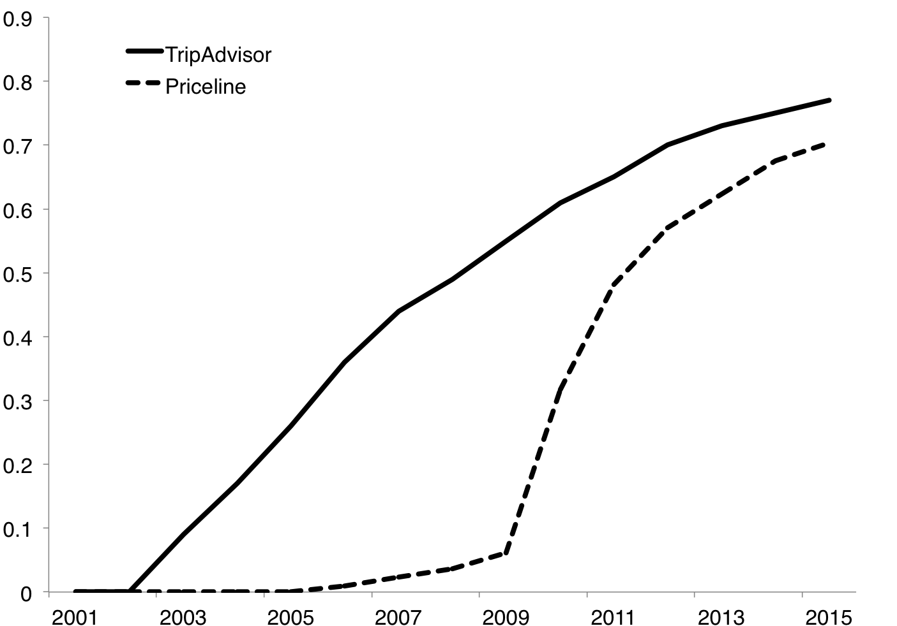 

<figcaption>Share of Texas Hotels with Online Reviews</figcaption>
</figure>

<figure id="numtapl">

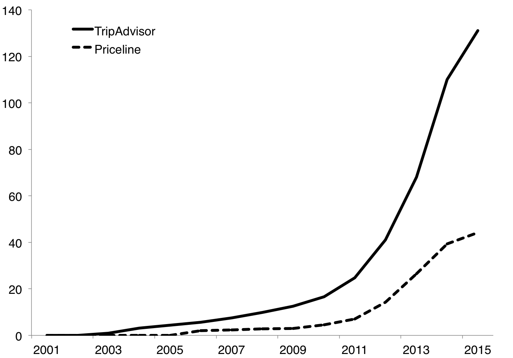 

<figcaption>Average Number of Online Reviews per Hotel</figcaption>
</figure>

<figure id="stareffects">

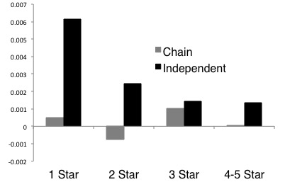 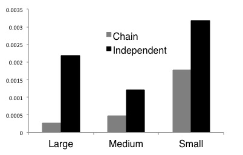 
 Note: This figure plots the coefficients from the regression described in equation <a href="#eq:numeffect" data-reference-type="ref" data-reference="eq:numeffect">[eq:numeffect]</a> where number of reviews is interacted with AAA ratings on the left and market size on the right. All independent firm coefficients are statistically significant at the 1% level. Only the coefficient on 3 star chain firms is significant. For market type all coefficients are significant except for large market chains.

<figcaption>The Marginal Effect of Number of Reviews</figcaption>
</figure>

<figure id="fallingpremium">

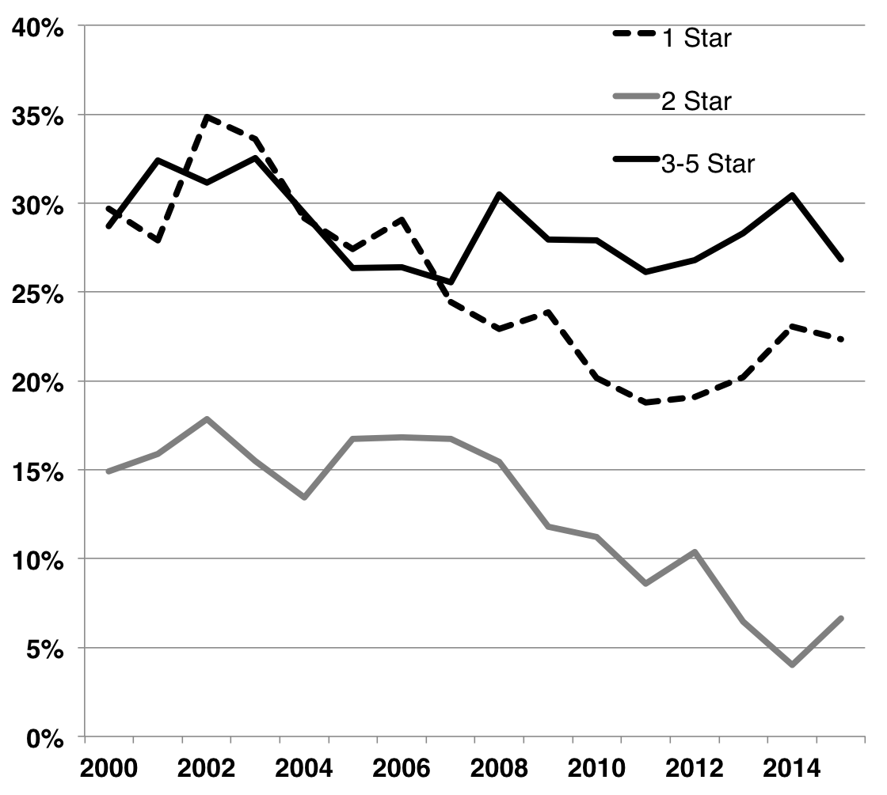 

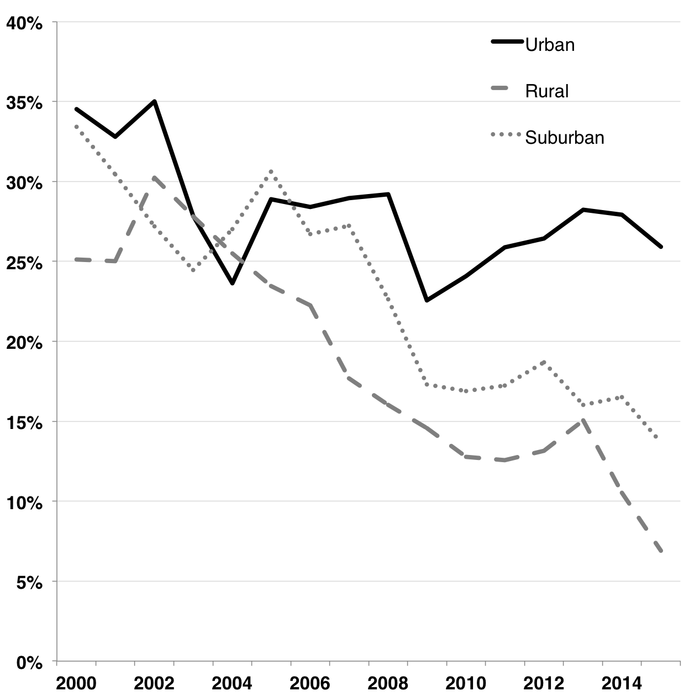 

<figcaption>The Falling Chain Premium</figcaption>
</figure>

<figure id="chaintrend">

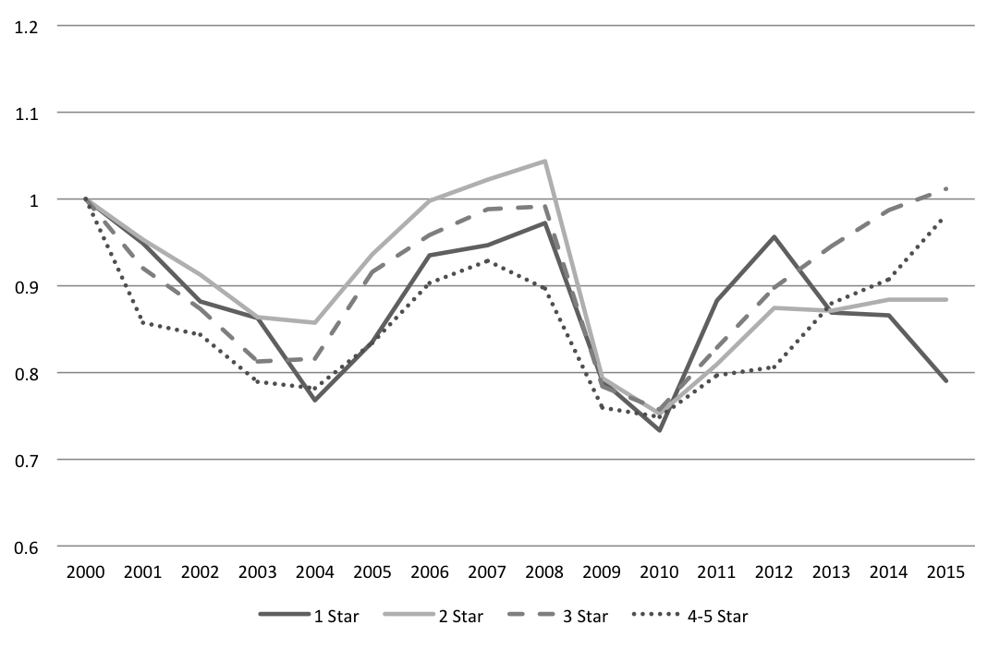 

<figcaption>Chain Revenue Trend</figcaption>
</figure>

<figure id="unaftrend">

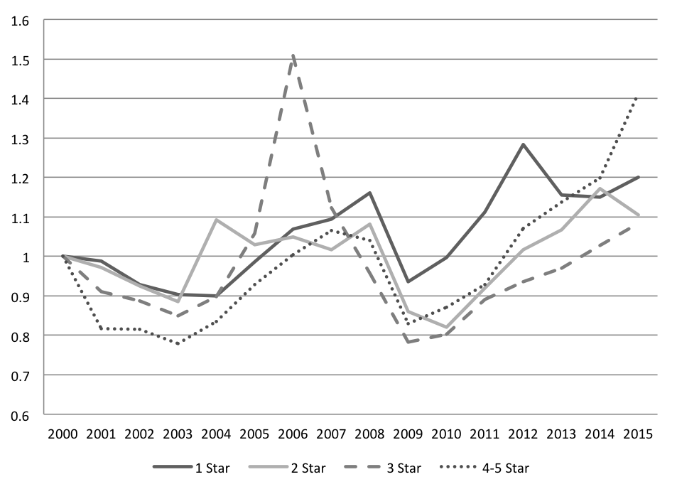 

<figcaption>Unaffilated Revenue Trend</figcaption>
</figure>

<figure id="chainbetas">

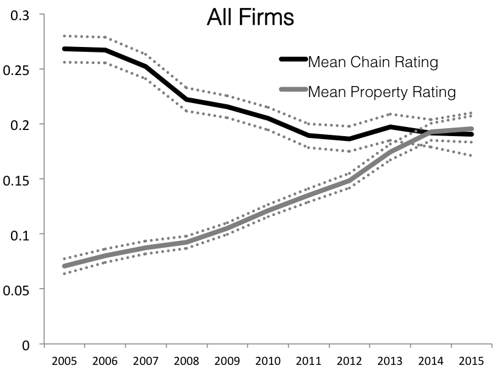 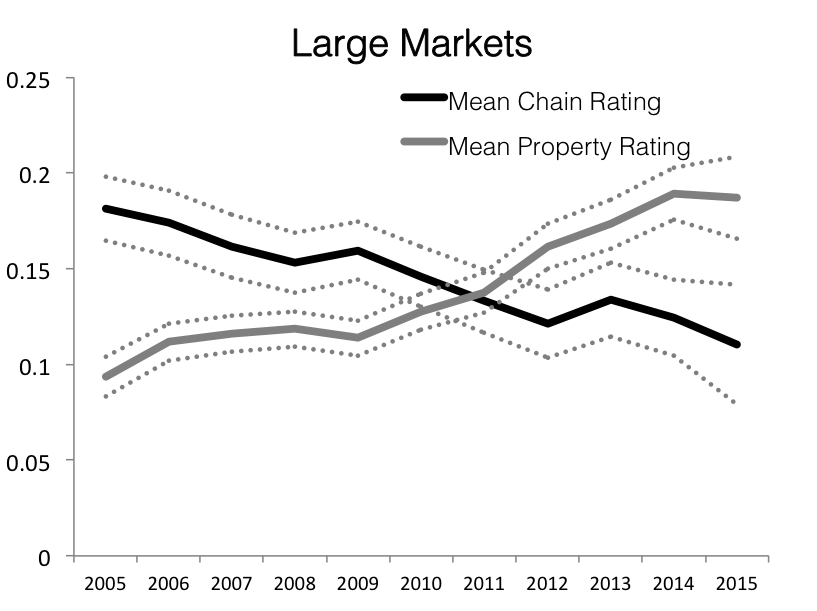 
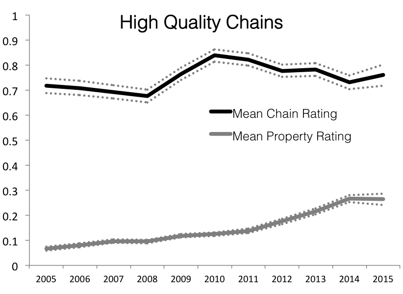 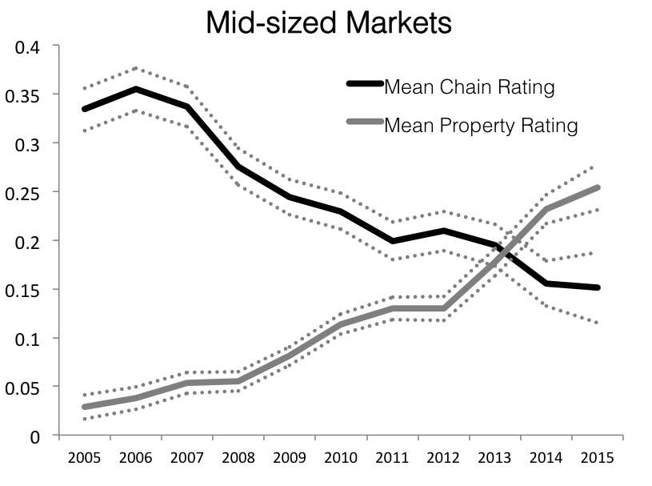 
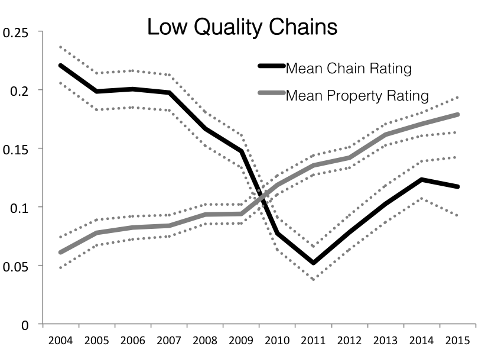 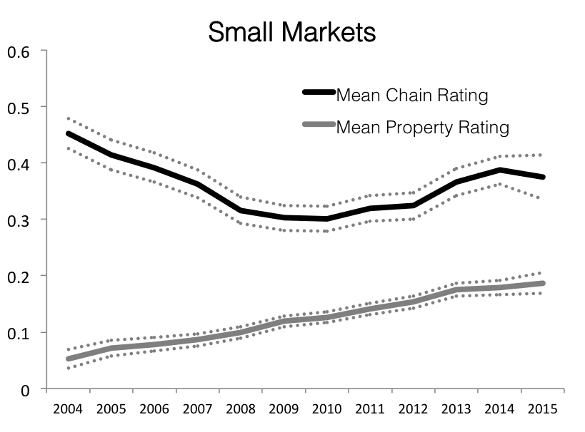 
 Note: This figure plots the coefficients from a regression of log(RevPar) on average chain-level ratings and outlet-level ratings interacted with year, along with firm and market characteristics and firm and time fixed effects. Low-quality chains are defined as those with 1 or 2 AAA stars, and high-quality chains as those with 3 or higher. 95% confidence intervals indicated with dotted lines.

<figcaption>Increasing Importance of Outlet Ratings</figcaption>
</figure>

::: {#hotelstats}
                                               Total        Std. Dev.
  -------------------------------------------- ------------ -----------
  **Number of Firms**                                       
  Chain                                        2,902        
  Independent                                  1,776        
                                                            
  ★                                   604          
  ★★                           740          
  ★★★                   1,499        
  ★★★★           89           
  ★★★★★   6            
                                                            
  Entrants 2000-2013                           2,112        
  Exits 2000-2013                              408          
                                                            
  **Mean RevPar - 2013**                                    
  Total                                        $\$$ 39.7    39.2
                                                            
  Chain                                        $\$$ 52.2    38.1
  Independent                                  $\$$ 28.8    44.6
                                                            
  ★                                   $\$$ 23.9    26.3
  ★★                           $\$$ 36.6    22.9
  ★★★                   $\$$ 66.9    34.9
  ★★★★           $\$$ 129.3   52.9
  ★★★★★   $\$$ 345.6   343.0

  : HOTEL REVENUE SUMMARY STATISTICS

::: tablenotes
Note: This table presents summary statistics on number of hotels by type in 2015 and average inflation-adjusted revenue per room per day (RevPar) by hotel type.

::: {#reviewstats}
  AAA Rating               ★   ★★   ★★★   ★★★★   ★★★★★
  ----------------------- ------------ -------------------- ---------------------------- ------------------------------------ --------------------------------------------
  **Chain**                                                                                                                   
  Share of Firms Listed       .85              .93                      .98                               1                                        1
  Mean $\#$ Reviews           19.3             44.9                     82.8                            452.7                                    521.8
  Average Rating              2.75             3.41                     4.01                             4.11                                     4.48
                                                                                                                              
  **Independent**                                                                                                             
  Share of Firms Listed       .49              .83                      .89                               1                                        1
  Mean $\#$ Reviews           14.9             44.1                    151.4                            475.3                                    244.8
  Average Rating              2.99             3.23                     3.85                             4.17                                     4.42

  : TRIPADVISOR.COM REVIEWS IN 2015

::: {#ldaoutput}
  Room        Service Issues   Business/Conference   General Quality   Location      Spanish
  ----------- ---------------- --------------------- ----------------- ------------- --------------
  bed         desk             marriott              stay              area          de
  night       would            guest                 staff             pool          la
  one         front            conference            great             small         e
  door        day              event                 clean             parking       el
  bathroom    stay             meeting               breakfast         floor         que
  floor       problem          team                  nice              riverwalk     en
  place       time             member                good              lobby         muy
  stay        one              attention             friendly          water         da
  didnt       service          westin                stayed            large         un
  shower      told             detail                location          tv            para
  front       back             staff                 area              walk          por
  desk        night            w                     would             nice          con
  dirty       check            property              comfortable       bar           al
  first       could            hilton                place             coffee        lo
  clean       called           banquet               service           river         und
  next        manager          expect                restaurant        view          del
  stayed      said             however               time              elevator      die
  wall        went             group                 helpful           lounge        se
  water       asked            used                  well              lot           bien
  dont        reservation      hyatt                 one               street        una
  old         experience       quality               bed               antonio       le
  towel       made             valet                 night             restaurant    los
  breakfast   go               need                  pool              free          der
  even        staff            outstanding           free              alamo         no
  work        call             level                 always            outside       desayuno
  good        checked          grand                 food              comfortable   excelente
  smell       minute           courtyard             excellent         flat          si
  carpet      never            driskill              recommend         valet         quarto
  air         didnt            ball                  really            door          todo
  ac          guest            fairmont              close             window        um
  bad         next             business              price             side          pero
  never       also             party                 best              food          este
  time        arrived          brother               enjoyed           night         mi
  sheet       customer         held                  day               across        uma
  people      took             function              again             modern        et
  back        know             interaction           family            little        esta
  need        make             stadium               definitely        well          war
  motel       another          work                  get               beautiful     personal
  looked      came             star                  like              balcony       ma
  toilet      booked           four                  inn               building      man
  lot         hour             competition           desk              table         zimmer
  hot         left             flag                  everything        park          habitaciones
  tv          first            year                  front             light         ist
  sleep       morning          incidental            little            size          im
  morning     charge           better                trip              noise         muito
  noise       phone            car                   back              huge          dia
  tub         card             concierge             quiet             drink         como
  problem     say              parking               need              hot           com
  better      two              facility              wonderful         much          den
  31.30$\%$   26.03$\%$        1.37$\%$              25.71$\%$         12.25$\%$     2.05$\%$

  : TOP WORDS ASSOCIATED WITH EACH TOPIC

::: tablenotes
Note: This table presents the top 50 words associated with each topic determined by the LDA topics analysis of all reviews. The bottom row shows the total share of reviews associated with that topic.

::: {#marketstats}
                                               Mean    Std Dev   Min       Max   Median Frequency   Unit of Obs.   Source
  -------------------------------------- ---------- ---------- ----- --------- -------- ----------- -------------- ---------------------------
  **Firm Variables**                                                                                               
                                                                                                                   
  RevPar                                      35.49      32.46     0     550.6    26.68 Monthly     Property       Texas Comptroller
  AAA Rating                                   2.27        .86     1         5        2 Annual      Property       AAA
  Chain Affiliation                             .58        .49     0         1        1 Monthly     Property       Combination of sources
  Capacity                                    86.05      91.48    20      1840       62 Monthly     Property       Texas Comptroller
  Age                                         10.40       7.05     0        56        9 Monthly     Property       Texas Comptroller
  Under Renovation                              .08        .27     0         1        0 Monthly     Property       TripAdvisor and Priceline
  Recently Renovated                            .36        .47     0         1        0 Monthly     Property       TripAdvisor and Priceline
                                                                                                                   
  **County Level Firms**                                                                                           
                                                                                                                   
  Chains                                      50.89      70.92     0       211       14 Monthly     County         Texas Comptroller
  Independents                                31.05      51.47     0       179        7 Monthly     County         Texas Comptroller
                                                                                                                   
  **TripAdvisor Data (2015)**                                                                                      
                                                                                                                   
  Mean Rating                                  3.56       .844     1         5     3.78 Monthly     Property       TripAdvisor
  Standard Deviation of Ratings                1.12        .31     0         2     1.15 Monthly     Property       TripAdvisor
  Number of Reviews                          101.41     205.96     0      3166       40 Monthly     Property       TripAdvisor
  Number of Characters                     62924.18   147068.7     0   2452923    23528 Monthly     Property       TripAdvisor
  Market Competitor Reviews                  189.24     263.42     0       797       50 Monthly     City           TripAdvisor
  Mean of Last 5 Ratings                       3.59        .95     1         5      3.8 Monthly     Property       TripAdvisor
                                                                                                                   
  **Priceline Data (2015)**                                                                                        
                                                                                                                   
  Mean Rating                                  7.19       1.65     1        10     7.61 Monthly     Property       Priceline
  Standard Deviation of Ratings                3.54        .73     0       4.5     3.75 Monthly     Property       Priceline
  Number of Reviews                           31.05      45.07     0       318       15 Monthly     Property       Priceline
  Number of Characters                        65317     957.33     0    676052    10556 Monthly     Property       Priceline
  Market Competitor Reviews                 3324.78    4783.11     0     14517      631 Monthly     City           Priceline
  Mean of Last 5 Ratings                       7.20       1.84     1        10     7.60 Monthly     Property       Priceline
  Mean of Last Month Ratings                   3.57       1.24     1         5        4 Monthly     Property       TripAdvisor and Priceline
  Unique Terms                              2097.92    2763.75     0     30333     1397 Monthly     Property       TripAdvisor and Priceline
  Recent Review                                 .29        .46     0         1        0 Monthly     Property       TripAdvisor and Priceline
  Number of Short Reviews                     57.30     110.48     0      2184       22 Monthly     Property       TripAdvisor and Priceline
  Number of Medium Reviews                    28.56      61.98     0       925       11 Monthly     Property       TripAdvisor and Priceline
  Number of Long Reviews                      12.27      32.26     0       571        3 Monthly     Property       TripAdvisor and Priceline
                                                                                                                   
  **Text Data (2015)**                                                                                             
                                                                                                                   
  Topic 1 Proportion (Room)                     .19        .06     0       .65      .19 Monthly     Property       TripAdvisor and Priceline
  Topic 2 Proportion (Service)                  .28        .16     0       .95      .24 Monthly     Property       TripAdvisor and Priceline
  Topic 3 Proportion (General)                  .32        .12     0       .66      .34 Monthly     Property       TripAdvisor and Priceline
  Topic 4 Proportion (Location)                 .09        .06     0       .45      .08 Monthly     Property       TripAdvisor and Priceline
  Topic 5 Proportion (Chain)                    .06        .06     0       .63      .04 Monthly     Property       TripAdvisor and Priceline
  Topic 6 Proportion (Spanish)                  .03        .06     0       .98      .01 Monthly     Property       TripAdvisor and Priceline
                                                                                                                   
  Topic 1 High Rating Share (Room)              .56        .27     0         1      .56 Monthly     Property       TripAdvisor and Priceline
  Topic 2 High Rating Share (Service)           .18        .19     0         1      .14 Monthly     Property       TripAdvisor and Priceline
  Topic 3 High Rating Share (General)           .90        .15     0         1      .95 Monthly     Property       TripAdvisor and Priceline
  Topic 4 High Rating Share (Location)          .95        .16     0         1        1 Monthly     Property       TripAdvisor and Priceline
  Topic 5 High Rating Share (Chain)             .88        .26     0         1        1 Monthly     Property       TripAdvisor and Priceline
  Topic 6 High Rating Share (Spanish)           .67        .37     0         1      .80 Monthly     Property       TripAdvisor and Priceline
                                                                                                                   

  : REGRESSOR SUMMARY STATISTICS

::: tablenotes
Note: This table presents summary statistics on market and firm characteristics, where market refers to county and firm refers to a property operated continually at a specific address. Statistics for TripAdvisor and Priceline data are from 2015 only.

|  | (1) | (2) | (3) | (4) |  |
| --- | --- | --- | --- | --- | --- |

**Table  -- continued from previous page**\
|  | (1) | (2) | (3) | (4) |  |

| Lagged $\#$ Reviews | -0.0000080 |  |  |  |  |
|  | (0.0001) |  |  |  |  |
| Lagged $\#$ Reviews X Independent | 0.0012$^{***}$ |  |  |  |  |
|  | (0.0003) |  |  |  |  |
| Lagged $\#$ Characters |  | -0.000000025 |  |  |  |
|  |  | (0.0000) |  |  |  |
| Lagged $\#$ Characters X Independent |  | 0.0000016$^{***}$ |  |  |  |
|  |  | (0.0000) |  |  |  |
| Lagged $\#$ Unique Words |  |  | -0.0000046 |  |  |
|  |  |  | (0.0000) |  |  |
| Lagged $\#$ Unique Words X Independent |  |  | 0.000037$^{**}$ |  |  |
|  |  |  | (0.0000) |  |  |
| Recent Review |  |  |  | 0.000075 |  |
|  |  |  |  | (0.0001) |  |
| Recent Review X Independent |  |  |  | 0.00030$^{*}$ |  |
|  |  |  |  | (0.0001) |  |
| Chain Affiliated | 0.069 | 0.070 | 0.070 | 0.069 |  |
|  | (0.0564) | (0.0564) | (0.0564) | (0.0564) |  |
| Independent Competitors | 0.0010$^{*}$ | 0.0010$^{*}$ | 0.0010$^{*}$ | 0.0010$^{*}$ |  |
|  | (0.0004) | (0.0004) | (0.0004) | (0.0004) |  |
| Chain Competitors | -0.00059 | -0.00059 | -0.00060 | -0.00059 |  |
|  | (0.0003) | (0.0003) | (0.0003) | (0.0003) |  |
| Age | -0.0065 | -0.0070$^{*}$ | -0.0071$^{*}$ | -0.0070$^{*}$ |  |
|  | (0.0035) | (0.0031) | (0.0030) | (0.0031) |  |
| log(Capacity) | -1.07$^{***}$ | -1.07$^{***}$ | -1.07$^{***}$ | -1.07$^{***}$ |  |
|  | (0.0675) | (0.0675) | (0.0675) | (0.0675) |  |
| Mean of Competitor RevPar | 0.0069$^{***}$ | 0.0069$^{***}$ | 0.0069$^{***}$ | 0.0069$^{***}$ |  |
|  | (0.0003) | (0.0003) | (0.0003) | (0.0003) |  |
| 1 AAA Star | -0.0074$^{*}$ | -0.0076$^{*}$ | -0.0079$^{*}$ | -0.0075$^{*}$ |  |
|  | (0.0033) | (0.0033) | (0.0033) | (0.0033) |  |
| 2 AAA Star | 0.018$^{***}$ | 0.018$^{***}$ | 0.018$^{***}$ | 0.018$^{***}$ |  |
|  | (0.0017) | (0.0017) | (0.0017) | (0.0017) |  |
| 3 AAA Star | 0.049$^{***}$ | 0.049$^{***}$ | 0.049$^{***}$ | 0.049$^{***}$ |  |
|  | (0.0019) | (0.0019) | (0.0019) | (0.0019) |  |
| 4 AAA Star | 0.085$^{***}$ | 0.085$^{***}$ | 0.087$^{***}$ | 0.083$^{***}$ |  |
|  | (0.0038) | (0.0038) | (0.0038) | (0.0038) |  |
| 5 AAA Star | 0.13$^{***}$ | 0.13$^{***}$ | 0.13$^{***}$ | 0.13$^{***}$ |  |
|  | (0.0099) | (0.0098) | (0.0098) | (0.0099) |  |
| TripAdvisor Rating | 0.013$^{***}$ | 0.013$^{***}$ | 0.013$^{***}$ | 0.013$^{***}$ |  |
|  | (0.0024) | (0.0024) | (0.0024) | (0.0024) |  |
| Priceline Rating | 0.0063$^{***}$ | 0.0063$^{***}$ | 0.0063$^{***}$ | 0.0063$^{***}$ |  |
|  | (0.0014) | (0.0014) | (0.0014) | (0.0014) |  |
| Mean of Last 5 on TA | -0.0069$^{***}$ | -0.0070$^{***}$ | -0.0070$^{***}$ | -0.0070$^{***}$ |  |
|  | (0.0019) | (0.0019) | (0.0019) | (0.0019) |  |
| Mean of Last 5 on PL | -0.0048$^{***}$ | -0.0048$^{***}$ | -0.0048$^{***}$ | -0.0048$^{***}$ |  |
|  | (0.0012) | (0.0012) | (0.0012) | (0.0012) |  |
| TripAdvisor Std Dev. | 0.0036 | 0.0037 | 0.0036 | 0.0037 |  |
|  | (0.0042) | (0.0042) | (0.0042) | (0.0042) |  |
| Priceline Std Dev. | 0.0036$^{**}$ | 0.0036$^{**}$ | 0.0036$^{**}$ | 0.0036$^{**}$ |  |
|  | (0.0014) | (0.0014) | (0.0014) | (0.0014) |  |
| Mean of Previous Month Ratings | -0.0017$^{*}$ | -0.0018$^{*}$ | -0.0018$^{*}$ | -0.0018$^{*}$ |  |
|  | (0.0007) | (0.0007) | (0.0007) | (0.0007) |  |
| Lagged Log(RevPar) | -0.095$^{***}$ | -0.095$^{***}$ | -0.094$^{***}$ | -0.095$^{***}$ |  |
|  | (0.0020) | (0.0020) | (0.0020) | (0.0020) |  |
| Topic 1 Proportion (Room) | -0.032 | -0.032 | -0.032 | -0.032 |  |
|  | (0.0184) | (0.0184) | (0.0184) | (0.0184) |  |
| Topic 2 Proportion (Service) | -0.024$^{*}$ | -0.024$^{*}$ | -0.024$^{*}$ | -0.023$^{*}$ |  |
|  | (0.0117) | (0.0117) | (0.0117) | (0.0117) |  |
| Topic 3 Proportion (General) | -0.035 | -0.035 | -0.035 | -0.035 |  |
|  | (0.0227) | (0.0227) | (0.0227) | (0.0227) |  |
| Topic 4 Proportion (Location) | -0.058 | -0.058 | -0.058 | -0.057 |  |
|  | (0.0391) | (0.0390) | (0.0391) | (0.0390) |  |
| Topic 5 Proportion (Business) | 0.089$^{*}$ | 0.089$^{*}$ | 0.090$^{*}$ | 0.089$^{*}$ |  |
|  | (0.0407) | (0.0407) | (0.0407) | (0.0407) |  |
| Topic 6 Proportion (Spanish) | 0.0038 | 0.0036 | 0.0039 | 0.0036 |  |
|  | (0.0494) | (0.0494) | (0.0494) | (0.0494) |  |
| Topic 1 High Rating Share (Room) | 0.028$^{***}$ | 0.028$^{***}$ | 0.028$^{***}$ | 0.028$^{***}$ |  |
|  | (0.0081) | (0.0081) | (0.0081) | (0.0081) |  |
| Topic 2 High Rating Share (Service) | 0.020$^{**}$ | 0.020$^{**}$ | 0.019$^{**}$ | 0.021$^{**}$ |  |
|  | (0.0073) | (0.0073) | (0.0073) | (0.0073) |  |
| Topic 3 High Rating Share (General) | 0.0056 | 0.0061 | 0.0062 | 0.0057 |  |
|  | (0.0082) | (0.0082) | (0.0082) | (0.0082) |  |
| Topic 4 High Rating Share (Location) | 0.010 | 0.011 | 0.0098 | 0.011 |  |
|  | (0.0109) | (0.0109) | (0.0110) | (0.0110) |  |
| Topic 5 High Rating Share (Business) | 0.016 | 0.017 | 0.017 | 0.017 |  |
|  | (0.0124) | (0.0124) | (0.0124) | (0.0124) |  |
| Topic 6 High Rating Share (Spanish) | 0.0052 | 0.0051 | 0.0049 | 0.0050 |  |
|  | (0.0115) | (0.0115) | (0.0115) | (0.0115) |  |
| Under Renovation | -0.016 | -0.015 | -0.014 | -0.014 |  |
|  | (0.0116) | (0.0100) | (0.0100) | (0.0100) |  |
| Recently Renovated | 0.0016 | 0.0022 | 0.0016 | 0.0026 |  |
|  | (0.0098) | (0.0098) | (0.0098) | (0.0098) |  |
| Month-Year FE | Yes | Yes | Yes | Yes |  |
| Property FE | Yes | Yes | Yes | Yes |  |
| Franchisee FE | Yes | Yes | Yes | Yes |  |
| Month X Market Type | Yes | Yes | Yes | Yes |  |
| Observations | 241418 | 241418 | 241418 | 241418 |  |
| $R^{2}$ | 0.268 | 0.268 | 0.268 | 0.268 |  |

Note: This table includes additional measures of information that incorporate the text of reviews. In every case the dependent variable is Log(RevPar). Column (1) is the primary specification from the paper and is included as a benchmark. Column (2) still includes the lagged number of reviews but adds the number of total characters for chain and independent hotels separately. Column (3) adds the total number of unique words posted in reviews. This specification excludes hotels with fewer than 5 reviews posted. Column (4) includes a dummy variable for whether or not the hotel had a review posted in the most recent month.

::: {#nboutput}
  Distinctive to Chain   Ratio         Distinctive to Independent   Ratio
  ---------------------- ------------- ---------------------------- -------
  shuttle                17.78         waterpark                    20.12
  I-20                   15.92         Texan                        19.03
  Marcos                 7.82          Fredericksburg               16.88
  airport                7.819999998   lodge                        12.62
  DFW                    7.6           resort                       12.51
  flight                 7.48          historic                     12.02
  I-35                   7.018666667   slides                       9.83
  Hair                   5.88          condo                        9.70
  Convenient             4.9           quaint                       8.64
  Airport                4.8           kitchen                      7.84
  accent                 4.54          Bend                         7.50
  Starbucks              4.54          trains                       7.48
  Lost                   4.24          charm                        7.34
  freeway                4.06          boardwalk                    7.33
  MOTEL                  3.86          Ranch                        7.30
  professionally         3.56          Main                         7.18
  terminal               3.44          fishing                      7.11
  mall                   3.44          slide                        6.92
  exercise               3.36          quest                        6.57
  rudely                 3.34          balcony                      6.50
  reliable               3.32          seawall                      6.48
  stored                 3.28          dinner                       6.12
  Mansion                3.18          fun                          5.98
  knowledge              3.14          Route 66                     5.73
  lacked                 3.1           Harbor                       5.70
  shaped                 2.98          Park                         5.59
  Desk                   2.94          baths                        5.51
  Patel                  2.74          beach                        5.38
  viewed                 2.68          horse                        5.34
  plane                  2.66          Lodge                        5.30
  Showers                2.66          ghost                        5.29
  grimy                  2.58          beautiful                    5.23
  nonsmoking             2.58          blast                        5.06
  laminate               2.56          railroad                     4.97
  Ikea                   2.56          Palomar                      4.96
  staffed                2.54          restaurant                   4.94
  Barbara                2.46          antique                      4.92
  shift                  2.46          bend                         4.86
  perks                  2.44          steak                        4.78
  Talk                   2.42          charming                     4.58
  bus                    2.4           fireplace                    4.32
  Needed                 2.4           fountain                     4.31
  leak                   2.32          relaxing                     4.30
  toaster                2.3           Restaurant                   4.29
  Interstate             2.2           park                         3.64
  layover                1.94          Owner                        3.63
  purposes               2.22          cruise                       3.53
  drawers                2.2           West                         3.53

  : TOP WORDS CLASSIFIED BY FIRM TYPE

::: tablenotes
This table presents the top 50 words distinctly associated with one firm type versus the other. The results come from a Naive Bayes Classification on the full set of hotel reviews where the outcome variable being matched is chain versus independent and AAA star rating is controlled for. The ratio presented is the average ratio across training runs of how much more frequently a word is associated with the given firm type. The analysis excludes brand names such as "Marriott" which would otherwise occupy a large share of Column 1.

|  | (1) | (2) | (3) | (4) | (5) | (6) | (7) | (8) |  |
| --- | --- | --- | --- | --- | --- | --- | --- | --- | --- |
|  | (All Firms) | (All Firms) | (Rural) | (Urban) | (Suburban) | (1 star) | (2 star) | (3 star) |  |

**Table  -- continued from previous page**\
|  | (1) | (2) | (3) | (4) | (5) | (6) | (7) | (8) |  |

| Chain Affiliated | 0.24$^{***}$ |  |  |  |  |  |  |  |  |
|  | (0.0052) |  |  |  |  |  |  |  |  |
| Chain Affiliated $\times$ 2000 |  | 0.32$^{***}$ | 0.26$^{***}$ | 0.34$^{***}$ | 0.33$^{***}$ | 0.28$^{***}$ | 0.15$^{***}$ | 0.27$^{***}$ |  |
|  |  | (0.0069) | (0.011) | (0.011) | (0.016) | (0.021) | (0.016) | (0.017) |  |
| Chain Affiliated $\times$ 2001 |  | 0.30$^{***}$ | 0.26$^{***}$ | 0.32$^{***}$ | 0.31$^{***}$ | 0.26$^{***}$ | 0.16$^{***}$ | 0.29$^{***}$ |  |
|  |  | (0.0068) | (0.011) | (0.011) | (0.015) | (0.021) | (0.017) | (0.017) |  |
| Chain Affiliated $\times$ 2002 |  | 0.31$^{***}$ | 0.31$^{***}$ | 0.34$^{***}$ | 0.27$^{***}$ | 0.33$^{***}$ | 0.17$^{***}$ | 0.29$^{***}$ |  |
|  |  | (0.0066) | (0.011) | (0.011) | (0.014) | (0.020) | (0.017) | (0.015) |  |
| Chain Affiliated $\times$ 2003 |  | 0.27$^{***}$ | 0.29$^{***}$ | 0.28$^{***}$ | 0.25$^{***}$ | 0.31$^{***}$ | 0.15$^{***}$ | 0.32$^{***}$ |  |
|  |  | (0.0065) | (0.011) | (0.010) | (0.014) | (0.021) | (0.017) | (0.015) |  |
| Chain Affiliated $\times$ 2004 |  | 0.26$^{***}$ | 0.26$^{***}$ | 0.23$^{***}$ | 0.28$^{***}$ | 0.27$^{***}$ | 0.14$^{***}$ | 0.30$^{***}$ |  |
|  |  | (0.0064) | (0.011) | (0.0099) | (0.014) | (0.021) | (0.015) | (0.017) |  |
| Chain Affiliated $\times$ 2005 |  | 0.27$^{***}$ | 0.24$^{***}$ | 0.28$^{***}$ | 0.31$^{***}$ | 0.25$^{***}$ | 0.17$^{***}$ | 0.28$^{***}$ |  |
|  |  | (0.0065) | (0.011) | (0.010) | (0.014) | (0.022) | (0.017) | (0.015) |  |
| Chain Affiliated $\times$ 2006 |  | 0.26$^{***}$ | 0.24$^{***}$ | 0.28$^{***}$ | 0.27$^{***}$ | 0.27$^{***}$ | 0.18$^{***}$ | 0.28$^{***}$ |  |
|  |  | (0.0063) | (0.010) | (0.0099) | (0.013) | (0.021) | (0.016) | (0.015) |  |
| Chain Affiliated $\times$ 2007 |  | 0.24$^{***}$ | 0.18$^{***}$ | 0.28$^{***}$ | 0.27$^{***}$ | 0.23$^{***}$ | 0.17$^{***}$ | 0.27$^{***}$ |  |
|  |  | (0.0063) | (0.010) | (0.0098) | (0.014) | (0.021) | (0.015) | (0.015) |  |
| Chain Affiliated $\times$ 2008 |  | 0.22$^{***}$ | 0.16$^{***}$ | 0.28$^{***}$ | 0.22$^{***}$ | 0.23$^{***}$ | 0.15$^{***}$ | 0.33$^{***}$ |  |
|  |  | (0.0065) | (0.011) | (0.010) | (0.014) | (0.022) | (0.015) | (0.020) |  |
| Chain Affiliated $\times$ 2009 |  | 0.19$^{***}$ | 0.15$^{***}$ | 0.21$^{***}$ | 0.17$^{***}$ | 0.24$^{***}$ | 0.12$^{***}$ | 0.31$^{***}$ |  |
|  |  | (0.0066) | (0.011) | (0.010) | (0.014) | (0.023) | (0.016) | (0.018) |  |
| Chain Affiliated $\times$ 2010 |  | 0.17$^{***}$ | 0.12$^{***}$ | 0.21$^{***}$ | 0.16$^{***}$ | 0.20$^{***}$ | 0.10$^{***}$ | 0.31$^{***}$ |  |
|  |  | (0.0065) | (0.011) | (0.0099) | (0.014) | (0.022) | (0.017) | (0.018) |  |
| Chain Affiliated $\times$ 2011 |  | 0.16$^{***}$ | 0.10$^{***}$ | 0.21$^{***}$ | 0.15$^{***}$ | 0.20$^{***}$ | 0.064$^{***}$ | 0.28$^{***}$ |  |
|  |  | (0.0067) | (0.011) | (0.0099) | (0.014) | (0.023) | (0.018) | (0.017) |  |
| Chain Affiliated $\times$ 2012 |  | 0.16$^{***}$ | 0.10$^{***}$ | 0.20$^{***}$ | 0.16$^{***}$ | 0.21$^{***}$ | 0.075$^{***}$ | 0.27$^{***}$ |  |
|  |  | (0.0068) | (0.012) | (0.0100) | (0.014) | (0.025) | (0.019) | (0.016) |  |
| Chain Affiliated $\times$ 2013 |  | 0.18$^{***}$ | 0.12$^{***}$ | 0.21$^{***}$ | 0.13$^{***}$ | 0.21$^{***}$ | 0.037$^{*}$ | 0.29$^{***}$ |  |
|  |  | (0.0068) | (0.012) | (0.010) | (0.014) | (0.026) | (0.018) | (0.016) |  |
| Chain Affiliated $\times$ 2014 |  | 0.16$^{***}$ | 0.073$^{***}$ | 0.21$^{***}$ | 0.13$^{***}$ | 0.23$^{***}$ | 0.017 | 0.31$^{***}$ |  |
|  |  | (0.0071) | (0.012) | (0.011) | (0.015) | (0.029) | (0.019) | (0.020) |  |
| Chain Affiliated $\times$ 2015 |  | 0.14$^{***}$ | 0.039$^{*}$ | 0.19$^{***}$ | 0.11$^{***}$ | 0.23$^{***}$ | 0.045 | 0.27$^{***}$ |  |
|  |  | (0.0097) | (0.017) | (0.014) | (0.021) | (0.036) | (0.031) | (0.023) |  |
| Independent Competitors | 0.00037$^{***}$ | 0.00014 | 0.015$^{***}$ | -0.00024 | -0.0024$^{***}$ | 0.0054$^{***}$ | 0.0017$^{***}$ | 0.00032 |  |
|  | (0.00010) | (0.00010) | (0.00099) | (0.00012) | (0.00069) | (0.0012) | (0.00029) | (0.00017) |  |
| Chain Competitors | -0.0013$^{***}$ | -0.0012$^{***}$ | -0.017$^{***}$ | -0.00092$^{***}$ | -0.0036$^{***}$ | -0.0039$^{***}$ | -0.0016$^{***}$ | -0.00058$^{***}$ |  |
|  | (0.000061) | (0.000060) | (0.00074) | (0.000077) | (0.00047) | (0.00047) | (0.00014) | (0.00010) |  |
| Age | 0.044$^{***}$ | 0.043$^{***}$ | -0.095$^{***}$ | 0.39$^{***}$ | 0.0062 | -0.099 | -0.12 | -0.0071 |  |
|  | (0.0069) | (0.0070) | (0.023) | (0.018) | (0.0064) | (0.073) | (0.10) | (0.029) |  |
| log(Capacity) | -0.80$^{***}$ | -0.80$^{***}$ | -0.77$^{***}$ | -0.93$^{***}$ | -0.75$^{***}$ | -0.98$^{***}$ | -0.73$^{***}$ | -0.86$^{***}$ |  |
|  | (0.012) | (0.011) | (0.016) | (0.012) | (0.021) | (0.020) | (0.019) | (0.019) |  |
| Mean of Competitor RevPar | 0.011$^{***}$ | 0.011$^{***}$ | 0.0088$^{***}$ | 0.017$^{***}$ | 0.0097$^{***}$ | 0.0081$^{***}$ | 0.011$^{***}$ | 0.011$^{***}$ |  |
|  | (0.00022) | (0.00022) | (0.00029) | (0.00014) | (0.00026) | (0.00041) | (0.00046) | (0.00035) |  |
| 1 Star | -0.90$^{***}$ | -0.90$^{***}$ | 0.53$^{***}$ |  |  |  |  |  |  |
|  | (0.14) | (0.14) | (0.14) |  |  |  |  |  |  |
| 2 Stars | -1.02$^{***}$ | -1.00$^{***}$ | 0.46$^{***}$ | -3.93$^{***}$ | -0.26 |  |  |  |  |
|  | (0.13) | (0.13) | (0.13) | (0.23) | (0.18) |  |  |  |  |
| 3 Stars | -0.98$^{***}$ | -0.97$^{***}$ | 0.57$^{***}$ | -4.16$^{***}$ | -0.041 |  |  |  |  |
|  | (0.13) | (0.13) | (0.13) | (0.22) | (0.16) |  |  |  |  |
| 4 Stars | -0.87$^{***}$ | -0.89$^{***}$ |  | -5.32$^{***}$ | -0.31 |  |  |  |  |
|  | (0.14) | (0.14) |  | (0.25) | (0.19) |  |  |  |  |
| TripAdvisor Rating | 0.015$^{***}$ | 0.016$^{***}$ | 0.0042 | 0.021$^{***}$ | 0.039$^{***}$ | -0.083$^{***}$ | -0.0024 | 0.030$^{***}$ |  |
|  | (0.0027) | (0.0027) | (0.0055) | (0.0038) | (0.0051) | (0.018) | (0.0051) | (0.0039) |  |
| Priceline Rating | 0.0021 | 0.0049$^{***}$ | 0.00013 | 0.0075$^{***}$ | 0.0018 | -0.013 | -0.0090$^{***}$ | 0.0062$^{***}$ |  |
|  | (0.0013) | (0.0013) | (0.0028) | (0.0018) | (0.0026) | (0.0092) | (0.0025) | (0.0018) |  |
| Mean of Last 5 on TA | 0.0053$^{**}$ | 0.0059$^{**}$ | 0.0015 | 0.0086$^{***}$ | 0.0037 | 0.076$^{***}$ | 0.0099$^{**}$ | -0.0016 |  |
|  | (0.0018) | (0.0018) | (0.0041) | (0.0023) | (0.0032) | (0.015) | (0.0038) | (0.0022) |  |
| Mean of Last 5 on PL | 0.0017 | 0.0014 | 0.0068$^{**}$ | -0.00062 | 0.00074 | 0.017 | 0.0092$^{***}$ | 0.00044 |  |
|  | (0.0012) | (0.0012) | (0.0027) | (0.0017) | (0.0025) | (0.0088) | (0.0024) | (0.0017) |  |
| TripAdvisor Std Dev. | -0.0055$^{**}$ | 0.0052$^{**}$ | 0.0040 | -0.00058 | 0.013$^{***}$ | -0.040$^{***}$ | 0.030$^{***}$ | 0.050$^{***}$ |  |
|  | (0.0018) | (0.0019) | (0.0035) | (0.0028) | (0.0034) | (0.0089) | (0.0036) | (0.0029) |  |
| Priceline Std Dev. | -0.0035$^{***}$ | -0.00017 | -0.00044 | -0.00084 | 0.000098 | -0.018$^{***}$ | 0.012$^{***}$ | 0.0053$^{***}$ |  |
|  | (0.00086) | (0.00086) | (0.0015) | (0.0014) | (0.0016) | (0.0051) | (0.0019) | (0.0011) |  |
| Mean of Previous Month Ratings | -0.0042$^{***}$ | -0.0042$^{***}$ | -0.0055$^{***}$ | -0.0032$^{**}$ | -0.0029$^{*}$ | -0.0054 | -0.0020 | -0.0017 |  |
|  | (0.00075) | (0.00075) | (0.0015) | (0.0011) | (0.0013) | (0.0042) | (0.0015) | (0.00097) |  |
| Listed Online | -1.42$^{***}$ | -1.48$^{***}$ | -0.97$^{**}$ | -2.08$^{***}$ | -0.65 | -6.70$^{***}$ | -0.57 | -2.98$^{***}$ |  |
|  | (0.19) | (0.19) | (0.31) | (0.31) | (0.35) | (0.78) | (0.38) | (0.29) |  |
| Lagged $\#$ Reviews | 0.000068$^{***}$ | 0.000089$^{***}$ | 0.00063$^{***}$ | 0.000038$^{**}$ | -0.0000018 | 0.00047$^{**}$ | 0.00061$^{***}$ | 0.000098$^{***}$ |  |
|  | (0.000011) | (0.000011) | (0.000041) | (0.000014) | (0.000021) | (0.00017) | (0.000040) | (0.000027) |  |
| Under Renovation | -0.077$^{***}$ | -0.077$^{***}$ | -0.042 | -0.079$^{***}$ | -0.027 | -0.12 | 0.036 | -0.068$^{***}$ |  |
|  | (0.014) | (0.014) | (0.047) | (0.014) | (0.028) | (0.096) | (0.036) | (0.015) |  |
| Topic 1 Proportion (Room) | 1.46$^{***}$ | 1.55$^{***}$ | 1.05$^{***}$ | 2.19$^{***}$ | 0.60 | 6.74$^{***}$ | 0.64 | 3.02$^{***}$ |  |
|  | (0.19) | (0.19) | (0.31) | (0.32) | (0.35) | (0.78) | (0.39) | (0.29) |  |
| Topic 2 Proportion (Service) | 1.37$^{***}$ | 1.45$^{***}$ | 1.03$^{**}$ | 1.97$^{***}$ | 0.55 | 6.80$^{***}$ | 0.50 | 3.01$^{***}$ |  |
|  | (0.19) | (0.19) | (0.31) | (0.32) | (0.35) | (0.79) | (0.39) | (0.29) |  |
| Topic 3 Proportion (General) | 1.45$^{***}$ | 1.53$^{***}$ | 1.08$^{***}$ | 2.12$^{***}$ | 0.61 | 7.05$^{***}$ | 0.58 | 3.09$^{***}$ |  |
|  | (0.19) | (0.19) | (0.32) | (0.32) | (0.35) | (0.79) | (0.39) | (0.30) |  |
| Topic 4 Proportion (Location) | 1.49$^{***}$ | 1.54$^{***}$ | 1.12$^{***}$ | 2.13$^{***}$ | 0.61 | 7.14$^{***}$ | 0.56 | 3.02$^{***}$ |  |
|  | (0.19) | (0.19) | (0.31) | (0.31) | (0.35) | (0.79) | (0.39) | (0.29) |  |
| Topic 5 Proportion (Business) | 1.56$^{***}$ | 1.56$^{***}$ | 1.03$^{***}$ | 2.22$^{***}$ | 0.59 | 6.74$^{***}$ | 0.71 | 2.93$^{***}$ |  |
|  | (0.19) | (0.19) | (0.31) | (0.32) | (0.35) | (0.78) | (0.38) | (0.29) |  |
| Topic 6 Proportion (Spanish) | 1.20$^{***}$ | 1.27$^{***}$ | 0.91$^{**}$ | 2.02$^{***}$ | 0.45 | 6.99$^{***}$ | 0.52 | 2.96$^{***}$ |  |
|  | (0.19) | (0.19) | (0.32) | (0.32) | (0.35) | (0.80) | (0.39) | (0.30) |  |
| Topic 1 High Rating Share (Room) | 0.095$^{***}$ | 0.091$^{***}$ | 0.068$^{***}$ | 0.092$^{***}$ | 0.11$^{***}$ | -0.033 | 0.050$^{***}$ | 0.099$^{***}$ |  |
|  | (0.0032) | (0.0032) | (0.0059) | (0.0047) | (0.0063) | (0.018) | (0.0060) | (0.0045) |  |
| Topic 2 High Rating Share (Service) | 0.011$^{**}$ | 0.0071 | 0.069$^{***}$ | -0.027$^{***}$ | -0.057$^{***}$ | 0.050$^{*}$ | 0.029$^{***}$ | 0.0059 |  |
|  | (0.0041) | (0.0041) | (0.0075) | (0.0063) | (0.0078) | (0.024) | (0.0083) | (0.0052) |  |
| Topic 3 High Rating Share (General) | 0.023$^{***}$ | 0.023$^{***}$ | -0.0042 | 0.061$^{***}$ | -0.016$^{*}$ | -0.082$^{***}$ | -0.026$^{***}$ | 0.051$^{***}$ |  |
|  | (0.0042) | (0.0042) | (0.0080) | (0.0064) | (0.0076) | (0.020) | (0.0074) | (0.0065) |  |
| Topic 4 High Rating Share (Location) | 0.070$^{***}$ | 0.085$^{***}$ | 0.089$^{***}$ | 0.042$^{***}$ | 0.076$^{***}$ | 0.019 | 0.098$^{***}$ | 0.071$^{***}$ |  |
|  | (0.0047) | (0.0048) | (0.0094) | (0.0066) | (0.010) | (0.037) | (0.012) | (0.0062) |  |
| Topic 5 High Rating Share (Business) | 0.078$^{***}$ | 0.080$^{***}$ | 0.039$^{**}$ | 0.096$^{***}$ | 0.040$^{***}$ | 0.100$^{*}$ | 0.023$^{*}$ | 0.076$^{***}$ |  |
|  | (0.0050) | (0.0050) | (0.012) | (0.0066) | (0.0092) | (0.043) | (0.011) | (0.0064) |  |
| Topic 6 High Rating Share (Spanish) | 0.046$^{***}$ | 0.048$^{***}$ | 0.022$^{*}$ | 0.037$^{***}$ | 0.067$^{***}$ | -0.11$^{**}$ | -0.0047 | 0.054$^{***}$ |  |
|  | (0.0045) | (0.0045) | (0.010) | (0.0057) | (0.0098) | (0.040) | (0.0093) | (0.0058) |  |
| Recently Renovated | 0.015$^{*}$ | 0.0098 | 0.037$^{*}$ | -0.0082 | 0.038$^{**}$ | 0.084$^{*}$ | 0.057$^{***}$ | -0.013 |  |
|  | (0.0061) | (0.0061) | (0.014) | (0.0078) | (0.014) | (0.039) | (0.014) | (0.0082) |  |
| Property FE | Y | Y | Y | Y | Y | Y | Y | Y |  |
| Owner FE | Y | Y | Y | Y | Y | Y | Y | Y |  |
| Year FE | Y | Y | Y | Y | Y | Y | Y | Y |  |
| Month FE | Y | Y | Y | Y | Y | Y | Y | Y |  |
| Observations | 723793 | 723793 | 272168 | 261344 | 156044 | 100713 | 121138 | 190101 |  |
| $R^{2}$ | 0.791 | 0.791 | 0.743 | 0.840 | 0.805 | 0.649 | 0.681 | 0.686 |  |

Note: This table presents estimates of the chain premium as a percent of firm revenue, interacted with year, by firm type and market type. In all columns the dependent variable is log(RevPar). Standard errors are robust and clustered at the property-level.

[^1]: Brett Hollenbeck is assistant professor of Marketing, UCLA Anderson School of Management (e-mail: brett.hollenbeck@anderson.ucla.edu). I wish to thank the Morrison Family Center for Marketing Research for generous funding.

[^2]: The potential impacts of have been hypothesized at length in [@absolutevalue] and in the popular press ([@surowiecki]).

[^3]: For an overview of the role of quality reputation in chain firms, see [@blairlafontainebook].

[^4]: According to the Local Consumer Review Survey 2012, $85\%$ of consumers checked online reviews before making purchasing decisions in 2012.

[^5]: The organizational structure of chain affiliated hotels can vary. In some cases, the chain both owns and operates the property; in other cases a franchisee owns the property but the chain has a contract to manage it. While I do observe these contracts, in nearly all firms in this sample, the chain neither owns nor operates the property. Instead, these roles are taken by local franchisees and the chain simply licenses its branding and provides the franchisee with a operating manual.

[^6]: There are 7 large markets in the data: Austin, Arlington, Dallas, El Paso, Fort Worth, Houston, and San Antonio.

[^7]: In what follows, they are mostly kept separate but when it is necessary to combine ratings onto a common scale the Priceline rating is simply divided in half to match the TripAdvisor scale.

[^8]: I use symmetric priors for the two hyperparameters used in the LDA analysis $\alpha$ and $\eta$. For $\alpha$, the parameter governing the prior for the distribution of number of topics in each review I have also estimated a fully flexible distribution and found little evidence of asymmetry affecting any of the main results.

[^9]: TripAdvisor places these reviews in a separate part of the website. In parts of Texas a large share of the population speaks Spanish and many reviews contain mixes of Spanish and English, this last group is kept in the analysis and should be captured by inclusion of the "Spanish" topic.

[^10]: Using average star ratings as a proxy for quality has been done by a number of previous studies, including @dellarocasjmis, [@mcdevitt], @zervasairbnb, [@santosebooks], @hollenbeckadsratings, and [@lucaminwage]. [@glaeserbigdata] also cites the use of TripAdvisor reviews to measure firm quality as a promising prospect for future research.

[^11]: These variables are lagged because many hotel stays are booked in advance and to avoid simultaneity in shocks to both demand and reviews. If this omitted demand shock was serially correlated, however, using lagged values may not be sufficient. Fortunately, this condition is testable and I present results of this test in the web appendix.

[^12]: This list also includes the city name Fredericksburg, a town which has banned chain businesses.

[^13]: Roughly twice as many hotels add a chain affiliation as drop it.

[^14]: This identification strategy is the same as that of @chintaguntarebranding and [@hollenbeckjmp], who also study branding in the hotel industry, and an extensive set of robustness checks on this strategy is presented in the companion appendix. @chintaguntarebranding study the consequences of rebranding in the hotel industry, including decomposing the effect into brand effects and property-brand effects. [@hollenbeckjmp] also examines chain affiliation incentives in the hotel industry, with a focus on a potential cost advantage associated with chain organization. The paper estimates firm costs in a structural dynamic model, part of the first stage of which is a reduced-form revenue analysis.

[^15]: Along with the superficial changes in branding, joining a chain requires following a set of standardized operating procedures. Each chain maintains an operating manual that is lent to the franchisee upon opening or converting a new hotel. This document is confidential, but if a property is found to be deficient in some way, they may be charged a fee by the franchisor or may be required to correct the deficiency.

[^16]: This result does not appear to be caused by increasing numbers of chain competitors, as it is robust to different specifications that include the number of chain firms in each market, the share of chain firms, and the full type distribution in revenue estimates.
